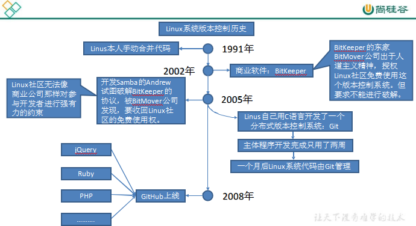
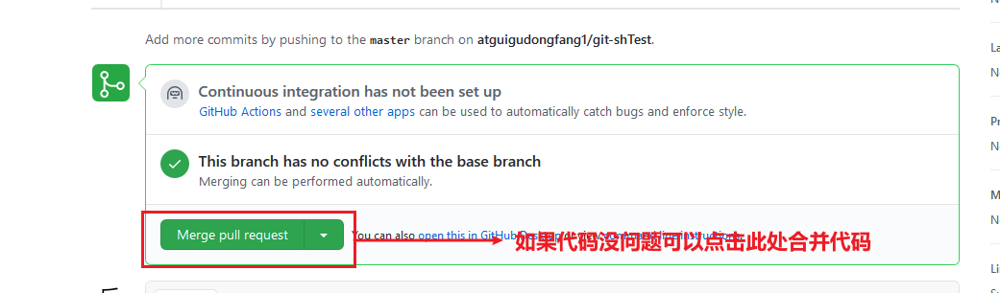
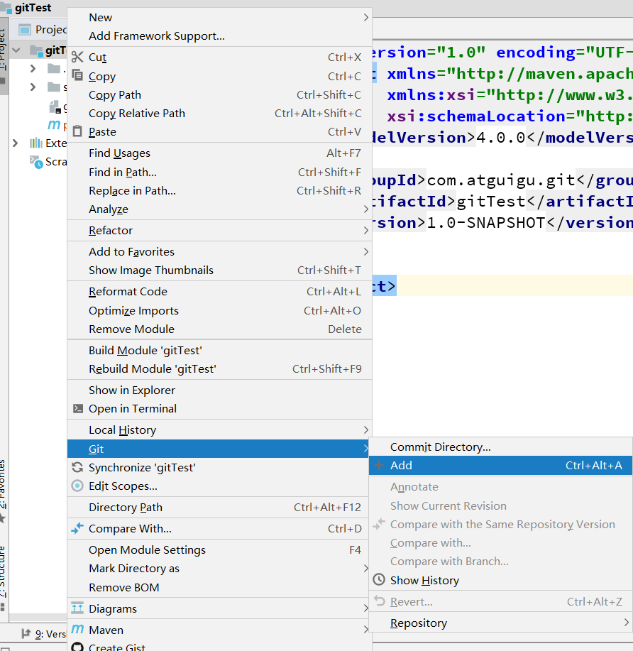
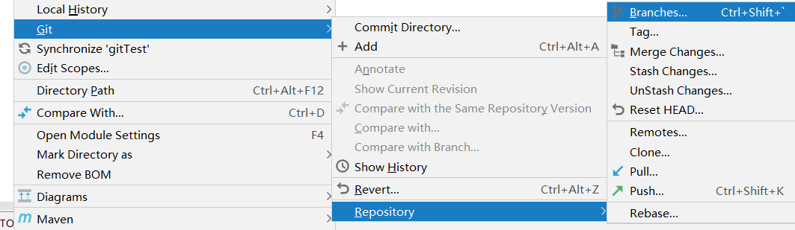
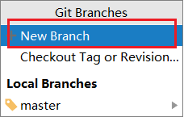
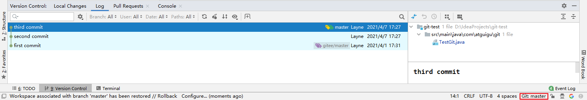
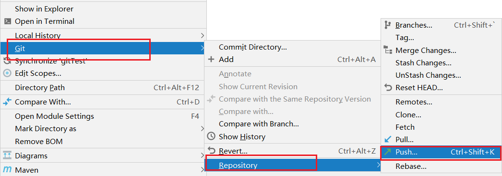
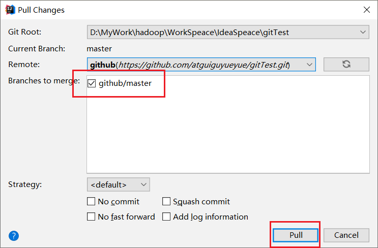

# Git概述

## **1.1** **何为版本控制**

版本控制是一种记录文件内容变化，以便将来查阅特定版本修订情况的系统。

版本控制其实最重要的是可以记录文件修改历史记录，从而让用户能够查看历史版本， 方便版本切换。


## **1.2** **为什么需要版本控制**

个人开发过渡到团队协作。


## **1.3 版本控制工具**

CVS、SVN(Subversion)、VSS……

集中化的版本控制系统诸如 CVS、SVN 等，都有一个单一的集中管理的服务器，保存所有文件的修订版本，而协同工作的人们都通过客户端连到这台服务器，取出最新的文件或者提交更新。多年以来，这已成为版本控制系统的标准做法。

这种做法带来了许多好处，每个人都可以在一定程度上看到项目中的其他人正在做些什么。而管理员也可以轻松掌控每个开发者的权限，并且管理一个集中化的版本控制系统，要远比在各个客户端上维护本地数据库来得轻松容易。

事分两面，有好有坏。这么做显而易见的缺点是中央服务器的单点故障。如果服务器宕机一小时，那么在这一小时内，谁都无法提交更新，也就无法协同工作。


## **1.4 Git简史**




## **1.5 Git工作机制**

  

## **1.6 Git 和代码托管中心**

代码托管中心是基于网络服务器的远程代码仓库，一般我们简单称为远程库。

局域网: Gitlab

互联网: Github(外网),Gitee(国内网站)

# Git安装

官网地址： https://git-scm.com/

查看GNU 协议，可以直接点击下一步。


选择Git 安装位置，要求是非中文并且没有空格的目录，然后下一步。


Git 选项配置，推荐默认设置，然后下一步


Git 安装目录名，不用修改，直接点击下一步


Git 的默认编辑器，建议使用默认的 Vim 编辑器，然后点击下一步


默认分支名设置，选择让Git 决定，分支名默认为 master，下一步


修改Git 的环境变量，选第一个，不修改环境变量，只在Git Bash 里使用Git


选择后台客户端连接协议，选默认值 OpenSSL，然后下一步


配置 Git 文件的行末换行符，Windows 使用 CRLF，Linux 使用 LF，选择第一个自动转换，然后继续下一步


选择Git 终端类型，选择默认的Git Bash 终端，然后继续下一步


选择Git pull 合并的模式，选择默认，然后下一步


选择Git 的凭据管理器，选择默认的跨平台的凭据管理器，然后下一步


其他配置，选择默认设置，然后下一步


实验室功能，技术还不成熟，有已知的 bug，不要勾选，然后点击右下角的 Install按钮，开始安装Git


点击 Finsh 按钮，Git 安装成功


右键任意位置，在右键菜单里选择Git Bash Here 即可打开 Git Bash 命令行终端


在 Git Bash 终端里输入 git --version 查看 git 版本，如图所示，说明Git 安装成功


# Git常用命令

| **命令名称**                         | **作用**       |
| ------------------------------------ | -------------- |
| git config --global user.name 用户名 | 设置用户签名   |
| git config --global user.email 邮箱  | 设置用户签名   |
| git init                             | 初始化本地库   |
| git status                           | 查看本地库状态 |
| git add 文件名                       | 添加到暂存区   |
| git commit -m "日志信息" 文件名      | 提交到本地库   |
| git reflog                           | 查看历史记录   |
| git reset --hard 版本号              | 版本穿梭       |

## **3.1 设置用户签名**

1. 基本语法

   ```shell
   git config --global user.name 用户名
   
   git config --global user.email 邮箱
   ```

   

2. 案例实操

```shell
pi'ka'chu@PIKACHU MINGW32 /d/GitSpace
$ git config --global user.name pika

pi'ka'chu@PIKACHU MINGW32 /d/GitSpace
$ git config --global user.email pika@pika.com

pi'ka'chu@PIKACHU MINGW32 /d/GitSpace
$ cat ~/.gitconfig
[user]
        name = pika
        email = pika@pika.com
[core]
        excludesfile = C:/Users/pi'ka'chu/git.ignore
```


说明：

签名的作用是区分不同操作者身份。用户的签名信息在每一个版本的提交信息中能够看到，以此确认本次提交是谁做的。Git 首次安装必须设置一下用户签名，否则无法提交代码。

**※注意：**这里设置用户签名和将来登录 GitHub（或其他代码托管中心）的账号没有任何关系


## **3.2 初始化本地库**

1. 基本语法

   ```shell
   git init
   ```

   

2. 案例实操

   ```shell
   pi'ka'chu@PIKACHU MINGW32 /d/GitSpace/demo01
   $ git init
   Initialized empty Git repository in D:/GitSpace/demo01/.git/
   
   pi'ka'chu@PIKACHU MINGW32 /d/GitSpace/demo01 (master)
   $ ls -la
   total 12
   drwxr-xr-x 1 pi'ka'chu 197609 0 Sep 25 22:48 ./
   drwxr-xr-x 1 pi'ka'chu 197609 0 Sep 25 22:47 ../
   drwxr-xr-x 1 pi'ka'chu 197609 0 Sep 25 22:48 .git/
   ```

   

3. 结果查看

   

## **3.3 查看本地库状态**

1. 基本语法

   ```shell
   git status
   ```

   

2. 案例实操

   1. 首次查看(工作区没有任何文件)

      ```shell
      pi'ka'chu@PIKACHU MINGW32 /d/GitSpace/demo01 (master)
      $ git status
      On branch master
      No commits yet
      nothing to commit (create/copy files and use "git add" to track)
      ```

      

   2. 新增文件(hello.txt)

      ```shell
      pi'ka'chu@PIKACHU MINGW32 /d/GitSpace/demo01 (master)
      $ vi hello.txt
      
      pi'ka'chu@PIKACHU MINGW32 /d/GitSpace/demo01 (master)
      $ cat hello.txt
      Hello Git
      hello Git
      hello Git
      hello Git
      hello Git
      hello Git
      hello Git
      ```

      

   3. 再次查看(检测到为追踪的文件)

      ```shell
      pi'ka'chu@PIKACHU MINGW32 /d/GitSpace/demo01 (master)
      $ git status
      On branch master
      
      No commits yet
      
      Untracked files:
        (use "git add <file>..." to include in what will be committed)
              hello.txt
      
      nothing added to commit but untracked files present (use "git add" to track)
      ```

## **3.4 添加暂存区**

1. 将工作区的文件添加到暂存区

   1. 基本语法

      ```shell
      git add 文件名
      ```

   2. 案例实操

      ```shell
      $ git add hello.txt
      warning: LF will be replaced by CRLF in hello.txt.
      The file will have its original line endings in your working directory
      ```

2. 查看状态

   ```shell
   $ git status
   On branch master
   
   No commits yet
   
   Changes to be committed:
     (use "git rm --cached <file>..." to unstage)
           new file:   hello.txt
   ```

## **3.5 提交本地库**

1. 基本语法

   ```shell
   git commit -m "日志信息" 文件名
   ```

2. 案例实操

   ```shell
   $ git commit -m "my first commit" hello.txt
   warning: LF will be replaced by CRLF in hello.txt.
   The file will have its original line endings in your working directory
   [master (root-commit) 6f4950f] my first commit
    1 file changed, 8 insertions(+)
    create mode 100644 hello.txt
   ```

   

3. 查看状态

   ```shell
   $ git status
   On branch master
   nothing to commit, working tree clean
   ```

   

## **3.6 修改文件**

```shell
$ vi hello.txt

pi'ka'chu@PIKACHU MINGW32 /d/GitSpace/demo01 (master)
$ cat hello.txt
Hello Git
hello Git
hello Git
hello Git
hello Git
hello Git
hello Git
hello Git
new add
```

1. 查看状态

   ```shell
   $ git status
   On branch master
   Changes not staged for commit:
     (use "git add <file>..." to update what will be committed)
     (use "git restore <file>..." to discard changes in working directory)
           modified:   hello.txt
   
   no changes added to commit (use "git add" and/or "git commit -a")
   ```

   

2. 将修改的文件再次添加暂存区

   ```shell
   $ git add hello.txt
   warning: LF will be replaced by CRLF in hello.txt.
   The file will have its original line endings in your working directory
   ```

   

3. 查看状态(工作区的修改添加到了暂存区)

   ```shell
   $ git status
   On branch master
   Changes to be committed:
     (use "git restore --staged <file>..." to unstage)
           modified:   hello.txt
   ```


## **3.7 历史版本**

1. 查看历史版本

   1. 基本语法

      ```shell
      git reflog 查看版本信息
      git log 查看版本详细信息
      ```

      

   2. 案例实操

      ```shell
      $ git reflog
      dfb9e74 (HEAD -> master) HEAD@{0}: commit: third commit
      3d87e2c HEAD@{1}: commit: second commit
      6f4950f HEAD@{2}: commit (initial): my first commit
      ```
      
      

2. 版本穿梭

   1. 基本语法
   
      ```shell
      git reset --hard 版本号
      ```
   
      
   
   2. 案例实操
   
      ```shell
      pi'ka'chu@PIKACHU MINGW32 /d/GitSpace/demo01 (master)
      $ git reset --hard 3d87e2c
      HEAD is now at 3d87e2c second commit
      
      pi'ka'chu@PIKACHU MINGW32 /d/GitSpace/demo01 (master)
      $ git reflog
      3d87e2c (HEAD -> master) HEAD@{0}: reset: moving to 3d87e2c
      dfb9e74 HEAD@{1}: commit: third commit
      3d87e2c (HEAD -> master) HEAD@{2}: commit: second commit
      6f4950f HEAD@{3}: commit (initial): my first commit
      
      pi'ka'chu@PIKACHU MINGW32 /d/GitSpace/demo01 (master)
      $ cat hello.txt
      Hello Git
      hello Git
      hello Git
      hello Git
      hello Git
      hello Git
      hello Git
      hello Git
      new add
      
      pi'ka'chu@PIKACHU MINGW32 /d/GitSpace/demo01 (master)
      $ git reset --hard 6f4950f
      HEAD is now at 6f4950f my first commit
      
      pi'ka'chu@PIKACHU MINGW32 /d/GitSpace/demo01 (master)
      $ cat hello.txt
      Hello Git
      hello Git
      hello Git
      hello Git
      hello Git
      hello Git
      hello Git
      hello Git
      ```
   
      Git 切换版本，底层其实是移动的 HEAD 指针，具体原理如下图所示:
   
      
   
      

# Git分支操作


### 什么是分支

> 在版本控制过程中，同时推进多个任务，为每个任务，我们就可以创建每个任务的单独
>
> 分支。使用分支意味着程序员可以把自己的工作从开发主线上分离开来，开发自己分支的时
>
> 候，不会影响主线分支的运行。对于初学者而言，分支可以简单理解为副本，一个分支就是一个单独的副本。（分支底层其实也是指针的引用）  


## 分支的好处

同时并行推进多个功能开发，提高开发效率。

各个分支在开发过程中，如果某一个分支开发失败，不会对其他分支有任何影响。失败的分支删除重新开始即可。

## 分支的操作

| **命令名称**        | **作用**                     |
| ------------------- | ---------------------------- |
| git branch 分支名   | 创建分支                     |
| git branch -v       | 查看分支                     |
| git checkout 分支名 | 切换分支                     |
| git merge 分支名    | 把指定的分支合并到当前分支上 |

1. 查看分支

   (1)基本语法

```shell
git branch -v
```

​	   (2)案例实操

```shell
$ git branch -v
* master 6f4950f my first commit
```


2. 创建分支

   (1)基本语法

```shell
git branch 分支名
```

​		(2)案例实操

```shell
$ git branch hot-fix

pi'ka'chu@PIKACHU MINGW32 /d/GitSpace/demo01 (master)
$ git branch -v
  hot-fix 6f4950f my first commit
* master  6f4950f my first commit
```


3. 修改分支

修改master分支hello.txt

```shell
$ vi hello.txt

pi'ka'chu@PIKACHU MINGW32 /d/GitSpace/demo01 (master)
$ cat hello.txt
Hello Git
hello Git
hello Git
hello Git
hello Git
hello Git
hello Git
hello Git
master
```


添加暂存区

```shell
$ git add hello.txt
```


提交本地库

```shell
$ git commit -m "forth commit" hello.txt
[master a69ffeb] forth commit
 1 file changed, 1 insertion(+)
```


查看分支

```shell
$ git branch -v
  hot-fix 6f4950f my first commit
* master  a69ffeb forth commit
```

4. 切换分支

   (1)基本语法

```shell
git checkout 分支名
```

​		(2)案例实操

```shell
$ git checkout hot-fix
Switched to branch 'hot-fix'
```

发现当先分支已由 master 改为 hot-fix


```shell
$ cat hello.txt
Hello Git
hello Git
hello Git
hello Git
hello Git
hello Git
hello Git
hello Git
```

查看 hot-fix 分支上的文件内容发现与 master 分支上的内容不同


```shell
$ vi hello.txt

pi'ka'chu@PIKACHU MINGW32 /d/GitSpace/demo01 (hot-fix)
$ cat hello.txt
Hello Git
hello Git
hello Git
hello Git
hello Git
hello Git
hello Git
hello Git
hot-fix
```

在hot-fix分支上做修改


```shell
$ git add hello.txt
```

添加暂存区


```shell
$ git commit -m "hot-fix commit" hello.txt
[hot-fix b3cbaef] hot-fix commit
 1 file changed, 1 insertion(+)
```

提交本地库


5. 合并分支

   (1)基本语法

```shell
git merge 分支名
```


​		(2)案例实操

切换回master

```shell
pi'ka'chu@PIKACHU MINGW32 /d/GitSpace/demo01 (hot-fix)
$ git checkout master
Switched to branch 'master'

pi'ka'chu@PIKACHU MINGW32 /d/GitSpace/demo01 (master)
```

在master上合并hox-fix分支

```shell
$ git merge hot-fix
Auto-merging hello.txt
CONFLICT (content): Merge conflict in hello.txt
Automatic merge failed; fix conflicts and then commit the result.
```


6. 产生冲突

冲突产生的表现：后面状态为 MERGING

```shell
$ cat hello.txt
Hello Git
hello Git
hello Git
hello Git
hello Git
hello Git
hello Git
hello Git
<<<<<<< HEAD
master
=======
hot-fix
>>>>>>> hot-fix
```

冲突产生的原因：

合并分支时，两个分支在**同一个文件的同一个位置**有两套完全不同的修改。Git 无法替我们决定使用哪一个。必须**人为决定**新代码内容。

查看状态（检测到有文件有两处修改)

```shell
$ git status
On branch master
You have unmerged paths.
  (fix conflicts and run "git commit")
  (use "git merge --abort" to abort the merge)

Unmerged paths:
  (use "git add <file>..." to mark resolution)
        both modified:   hello.txt

no changes added to commit (use "git add" and/or "git commit -a")
```


7. 解决冲突

   (1)编辑有冲突的文件,删除特殊符号,决定要使用的内容

特殊符号:

<<<<<<< HEAD 

当前分支代码

=\====\==

合并过来的代码

\>\>\>\>\>\>\> hot-fix

```shell
$ vi hello.txt

pi'ka'chu@PIKACHU MINGW32 /d/GitSpace/demo01 (master|MERGING)
$ cat hello.txt
Hello Git
hello Git
hello Git
hello Git
hello Git
hello Git
hello Git
hello Git
master
hot-fix
```

添加暂存区:

```shell
$ git add hello.txt
```

提交本地库(不能带文件名):

带文件名会报错:

```shell
$ git commit -m "merge" hello.txt
fatal: cannot do a partial commit during a merge.
```

正确提交方式:

```shell
pi'ka'chu@PIKACHU MINGW32 /d/GitSpace/demo01 (master|MERGING)
$ git commit -m "merge"
[master adb2029] merge

pi'ka'chu@PIKACHU MINGW32 /d/GitSpace/demo01 (master)
```

提交后MERGING消失


1. 创建分支与切换分支图解

   

   master、hot-fix 其实都是指向具体版本记录的指针。当前所在的分支，其实是由 HEAD决定的。所以创建分支的本质就是多创建一个指针。

   HEAD 如果指向 master，那么我们现在就在master 分支上。

   HEAD 如果执行 hotfix，那么我们现在就在hotfix 分支上。

   所以切换分支的本质就是移动HEAD 指针。

# Git团队协作机制

## 团队内协作


## 跨团队协作


# Github操作

GitHub 网址：https://github.com/

Ps:全球最大同性交友网站，技术宅男的天堂，新世界的大门，你还在等什么?

| 账号               | 姓名     | 验证邮箱                                                     |
| ------------------ | -------- | ------------------------------------------------------------ |
| atguiguyueyue      | 岳不群   | [atguiguyueyue@aliyun.com](mailto:atguiguyueyue@aliyun.com)  |
| atguigulinghuchong | 令狐冲   | [atguigulinghuchong@163.com](mailto:atguigulinghuchong@163.com) |
| atguigudongfang1   | 东方不败 | [atguigudongfang@163.com](mailto:atguigudongfang@163.com)    |

注:此三个账号为讲师使用账号，同学请自行注册，然后三个同学为一组进行团队协作！

## 创建远程仓库


## 远程仓库操作

| **命令名称**                       | **作用**                                                 |
| ---------------------------------- | -------------------------------------------------------- |
| git remote -v                      | 查看当前所有远程地址别名                                 |
| git remote add 别名 远程地址       | 起别名                                                   |
| git push 别名 分支                 | 推送本地分支上的内容到远程仓库                           |
| git clone 远程地址                 | 将远程仓库的内容克隆到本地                               |
| git pull 远程库地址别名 远程分支名 | 将远程仓库对于分支最新内容拉下来后与当前本地分支直接合并 |

1. 创建远程库别名

   (1)基本语法

```shell
git remote -v 查看当前所有远程地址别名
git remote add 别名 远程地址
```

​		(2)案例实操

```shell
Layne@LAPTOP-Layne MINGW64 /d/Git-Space/SH0720 (master)
$ git remote -v
Layne@LAPTOP-Layne MINGW64 /d/Git-Space/SH0720 (master)
$ git remote add ori https://github.com/atguiguyueyue/git-shTest.git

Layne@LAPTOP-Layne MINGW64 /d/Git-Space/SH0720 (master)
$ git remote -v
ori	https://github.com/atguiguyueyue/git-shTest.git (fetch) ori	https://github.com/atguiguyueyue/git-shTest.git (push)
```

**https://github.com/atguiguyueyue/git-shTest.git**

**这个地址在创建完远程仓库后生成的连接，如图所示红框中**


   


2. 推送本地分支到远程仓库

   (1)基本语法

```shell
git push 别名 分支
```

​		(2)案例实操

```shell
Layne@LAPTOP-Layne MINGW64 /d/Git-Space/SH0720 (master)
$ git push ori master
Logon failed, use ctrl+c to cancel basic credential prompt. Username for 'https://github.com': atguiguyueyue
Counting objects: 3, done.
Delta compression using up to 12 threads. Compressing objects: 100% (2/2), done.
Writing objects: 100% (3/3), 276 bytes | 276.00 KiB/s, done. Total 3 (delta 0), reused 0 (delta 0)
To https://github.com/atguiguyueyue/git-shTest.git
* [new branch]	master -> master
```

此时发现已将我们master 分支上的内容推送到GitHub 创建的远程仓库。


3. 克隆远程仓库到本地

   (1)基本语法

```shell
git clone 远程地址
```

​		(2)案例实操

```shell
Layne@LAPTOP-Layne MINGW64 /d/Git-Space/pro-linghuchong
$ git clone https://github.com/atguiguyueyue/git-shTest.git
Cloning into 'git-shTest'...
remote: Enumerating objects: 3, done. remote: Counting objects: 100% (3/3), done.
remote: Compressing objects: 100% (2/2), done.
remote: Total 3 (delta 0), reused 3 (delta 0), pack-reused 0 Unpacking objects: 100% (3/3), done.
```

**https://github.com/atguiguyueyue/git-shTest.git**

 

这个地址为远程仓库地址，克隆结果：初始化本地仓库


小结：clone 会做如下操作。

1、拉取代码。

2、初始化本地仓库。

3、创建别名

4. 邀请加入团队

   (1)选择邀请合作者

   

   (2)填入想要合作的人

   

   (3) 复 制 地 址 并 通 过 微 信 钉 钉 等 方 式 发 送 给 该 用 户 ， 复 制 内 容 如 下 ：

   **https://github.com/atguiguyueyue/git-shTest/invitations**

   

   (4) 在 **atguigulinghuchong** 这个账号中的地址栏复制收到邀请的链接，点击接受邀请。

   

   (5)成功之后可以在 **atguigulinghuchong** 这个账号上看到 **git-Test **的远程仓库。

   

   (6)**令狐冲可以修改内容并** **push** 到远程仓库

   ```shell
   --编辑 clone 下来的文件
   Layne@LAPTOP-Layne MINGW64 /d/Git-Space/pro-linghuchong/git-shTest
   (master)
   $ vim hello.txt
   Layne@LAPTOP-Layne MINGW64 /d/Git-Space/pro-linghuchong/git-shTest
   (master)
   $ cat hello.txt
   hello git! hello atguigu! 2222222222222
   hello git! hello atguigu! 33333333333333
   hello git! hello atguigu!
   hello git! hello atguigu!
   hello git! hello atguigu! 我是最帅的，比岳不群还帅
   hello git! hello atguigu!
   hello git! hello atguigu!
   hello git! hello atguigu!
   hello git! hello atguigu!
   hello git! hello atguigu!
   hello git! hello atguigu!
   hello git! hello atguigu!
   hello git! hello atguigu!
   hello git! hello atguigu!
   hello git! hello atguigu! master test
   hello git! hello atguigu! hot-fix test
   --将编辑好的文件添加到暂存区
   Layne@LAPTOP-Layne MINGW64 /d/Git-Space/pro-linghuchong/git-shTest
   (master)
   $ git add hello.txt
   --将暂存区的文件上传到本地库
   Layne@LAPTOP-Layne MINGW64 /d/Git-Space/pro-linghuchong/git-shTest
   (master)
   $ git commit -m "lhc commit" hello.txt
   [master 5dabe6b] lhc commit
   1 file changed, 1 insertion(+), 1 deletion(-)
   --将本地库的内容 push 到远程仓库
   Layne@LAPTOP-Layne MINGW64 /d/Git-Space/pro-linghuchong/git-shTest
   (master)
   $ git push origin master
   Logon failed, use ctrl+c to cancel basic credential prompt.
   Username for 'https://github.com': atguigulinghuchong
   Counting objects: 3, done.
   Delta compression using up to 12 threads.
   Compressing objects: 100% (2/2), done.
   Writing objects: 100% (3/3), 309 bytes | 309.00 KiB/s, done.
   Total 3 (delta 1), reused 0 (delta 0)
   remote: Resolving deltas: 100% (1/1), completed with 1 local object.
   To https://github.com/atguiguyueyue/git-shTest.git
    7cb4d02..5dabe6b master -> master
   ```

   (7)**回到** **atguiguyueyue** **的** **GitHub** **远程仓库中可以看到，最后一次是** **lhc** **提交的。**

   

   

   5. 拉取远程库内容

      (1)基本语法

      ```shell
      git pull 远程库地址别名 远程分支名
      ```

      

      (2)案例实操

      ```shell
      --将远程仓库对于分支最新内容拉下来后与当前本地分支直接合并
      Layne@LAPTOP-Layne MINGW64 /d/Git-Space/SH0720 (master)
      $ git pull ori master
      remote: Enumerating objects: 5, done.
      remote: Counting objects: 100% (5/5), done.
      remote: Compressing objects: 100% (1/1), done.
      remote: Total 3 (delta 1), reused 3 (delta 1), pack-reused 0
      Unpacking objects: 100% (3/3), done.
      From https://github.com/atguiguyueyue/git-shTest
      * branch master -> FETCH_HEAD
       7cb4d02..5dabe6b master -> ori/master
      Updating 7cb4d02..5dabe6b
      Fast-forward
      hello.txt | 2 +-
      1 file changed, 1 insertion(+), 1 deletion(-)
      Layne@LAPTOP-Layne MINGW64 /d/Git-Space/SH0720 (master)
      $ cat hello.txt
      hello git! hello atguigu! 2222222222222
      hello git! hello atguigu! 33333333333333
      hello git! hello atguigu!
      hello git! hello atguigu!
      hello git! hello atguigu! 我是最帅的，比岳不群还帅
      hello git! hello atguigu!
      hello git! hello atguigu!
      hello git! hello atguigu!
      hello git! hello atguigu!
      hello git! hello atguigu!
      hello git! hello atguigu!
      hello git! hello atguigu!
      hello git! hello atguigu!
      hello git! hello atguigu!
      hello git! hello atguigu! master test
      hello git! hello atguigu! hot-fix test
      ```

## 跨团队协作

**1**）将远程仓库的地址复制发给邀请跨团队协作的人，比如东方不败。


**2）在东方不败的GitHub 账号里的地址栏复制收到的链接，然后点击Fork将项目叉到自己的本地仓库。**


叉入中...


**叉成功后可以看到当前仓库信息。**


**3)东方不败就可以在线编辑叉取过来的文件**


**4)编辑完毕后，填写描述信息并点击左下角绿色按钮提交**


**5）接下来点击上方的 Pull请求，并创建一个新的请求。**


**6)回到岳岳** **GitHub** **账号可以看到有一个** **Pull request** **请求。**


**进入到聊天室，可以讨论代码相关内容。**


**6)如果代码没有问题，可以点击** **Merge pull reque** **合并代码。**




## SSH免密登录

我们可以看到远程仓库中还有一个 SSH 的地址，因此我们也可以使用 SSH 进行访问。


具体操作如下：

```shell
--进入当前用户的家目录
Layne@LAPTOP-Layne MINGW64 /d/Git-Space/SH0720 (master)
$ cd
--删除.ssh 目录
Layne@LAPTOP-Layne MINGW64 ~
$ rm -rvf .ssh
removed '.ssh/known_hosts'
removed directory '.ssh'
--运行命令生成.ssh 秘钥目录[注意：这里-C 这个参数是大写的 C]
Layne@LAPTOP-Layne MINGW64 ~
$ ssh-keygen -t rsa -C atguiguyueyue@aliyun.com
Generating public/private rsa key pair.
Enter file in which to save the key (/c/Users/Layne/.ssh/id_rsa):
Created directory '/c/Users/Layne/.ssh'.
Enter passphrase (empty for no passphrase):
Enter same passphrase again:
Your identification has been saved in /c/Users/Layne/.ssh/id_rsa.
Your public key has been saved in /c/Users/Layne/.ssh/id_rsa.pub.
The key fingerprint is:
SHA256:7CPfRLITKcYDhaqpEDeok7Atvwh2reRmpxxOC6dkY44 
atguiguyueyue@aliyun.com
The key's randomart image is:
+---[RSA 2048]----+
| .. |
| .. |
| . .. |
|+ + o . . |
|oO . = S . |
|X . .. + = |
|+@ * .. = . |
|X.&o+. o = |
|Eo+Oo . . |
+----[SHA256]-----+
--进入.ssh 目录查看文件列表
Layne@LAPTOP-Layne MINGW64 ~
$ cd .ssh
Layne@LAPTOP-Layne MINGW64 ~/.ssh
$ ll -a
total 21
drwxr-xr-x 1 Layne 197609 0 11 月 25 19:27 ./
drwxr-xr-x 1 Layne 197609 0 11 月 25 19:27 ../ -rw-r--r-- 1 Layne 197609 1679 11 月 25 19:27 id_rsa
-rw-r--r-- 1 Layne 197609 406 11 月 25 19:27 id_rsa.pub
--查看 id_rsa.pub 文件内容
Layne@LAPTOP-Layne MINGW64 ~/.ssh
$ cat id_rsa.pub
ssh-rsa 
AAAAB3NzaC1yc2EAAAADAQABAAABAQDRXRsk9Ohtg1AXLltsuNRAGBsx3ypE1O1Rkdzpm
l1woa6y6G62lZri3XtCH0F7GQvnMvQtPISJFXXWo+jFHZmqYQa/6kOIMv2sszcoj2Qtwl
lGXTPn/4T2h/cHjSHfc+ks8OYP7OWOOefpOCbYY/7DWYrl89k7nQlfd+A1FV/vQmcsa1L
P5ihqjpjms2CoUUen8kZHbjwHBAHQHWRE+Vc371MG/dwINvCi8n7ibI86o2k0dW0+8SL+
svPV/Y0G9m+RAqgec8b9U6DcSSAMH5uq4UWfnAcUNagb/aJQLytrH0pLa8nMv3XdSGNNo
AGBFeW2+K81XrmkP27FrLI6lDef atguiguyueyue@aliyun.com
```

复制 id_rsa.pub 文件内容，登录 GitHub，点击用户头像→Settings→SSH and GPG keys


接下来再往远程仓库 push 东西的时候使用 SSH 连接就不需要登录了。

# IDEA集成Git

## **7.1 配置Git忽略文件**

#### **1）Eclipse特定文件**

  


**2）IDEA特定文件**


**3)Maven工程的target目录**


**问题1 : 为什么要忽略他们**

答：与项目的实际功能无关，不参与服务器上部署运行。把它们忽略掉能够屏蔽 IDE 工具之间的差异。

**问题2 : 怎么忽略?**

1） 创建忽略规则文件xxxx.ignore（前缀名随便起，建议是 git.ignore）

这个文件的存放位置原则上在哪里都可以，为了便于让~/.gitconfig 文件引用，建议也放在用户家目录下

git.ignore 文件模版内容如下：

```shell
# Compiled class file
*.class
# Log file
*.log
# BlueJ files
*.ctxt
# Mobile Tools for Java (J2ME)
.mtj.tmp/
# Package Files #
*.jar
*.war
*.nar
*.ear
*.zip
*.tar.gz
*.rar
# virtual machine crash logs, see 
http://www.java.com/en/download/help/error_hotspot.xml
hs_err_pid*
.classpath
.project
.settings
target
.idea
*.iml
```

2）在.gitconfig 文件中引用忽略配置文件（此文件在 Windows 的家目录中）

```shell
[user]
name = Layne
email = Layne@atguigu.com
[core]
excludesfile = C:/Users/asus/git.ignore
注意：这里要使用“正斜线（/）”，不要使用“反斜线（\）”
```

**7.2** **定位** **Git** **程序**


**7.3** **初始化本地库**


选择要创建 Git 本地仓库的工程。


**7.4** **添加到暂存区**

右键点击项目选择 Git -> Add 将项目添加到暂存区。



**7.5提交到本地库**


**7.6** **切换版本**

在 IDEA 的左下角，点击 Version Control，然后点击 Log 查看版本


右键选择要切换的版本，然后在菜单里点击 Checkout Revision。


**7.7** **创建分支**

选择 Git，在 Repository 里面，点击 Branches 按钮。



在弹出的 Git Branches 框里，点击 New Branch 按钮



填写分支名称，创建 hot-fix 分支


然后再 IDEA 的右下角看到 hot-fix，说明分支创建成功，并且当前已经切换成 hot-fix 分支


**7.8** **切换分支**

在 IDEA 窗口的右下角，切换到 master 分支


然后在 IDEA 窗口的右下角看到了 master，说明 master 分支切换成功



**7.9** **合并分支**

在 IDEA 窗口的右下角，将 hot-fix 分支合并到当前 master 分支。


如果代码没有冲突，分支直接合并成功，分支合并成功以后，代码自动提交，无需手动提交本地库


**7.10** **解决冲突**

如图所示，如果 master 分支和 hot-fix 分支都修改了代码，在合并分支的时候就会发生冲突


我们现在站在 master 分支上合并 hot-fix 分支，就会发生代码冲突。


点击 Conflicts 框里的 Merge 按钮，进行手动合并代码。


手动合并完代码以后，点击右下角的 Apply 按钮。


代码冲突解决，自动提交本地库。


# IDEA 集成Github

**8.1** **设置** **GitHub** **账号**


如果出现 401 等情况连接不上的，是因为网络原因，可以使用以下方式连接：


然后去 GitHub 账户上设置 token。


点击生成 token。


复制红框中的字符串到 idea 中。


点击登录。


**8.2** **分享工程到** **GitHub**


来到 GitHub 中发现已经帮我们创建好了 gitTest 的远程仓库。


**8.3 push** **推送本地库到远程库**

右键点击项目，可以将当前分支的内容 push 到 GitHub 的远程仓库中。




注意：push 是将本地库代码推送到远程库，如果本地库代码跟远程库代码版本不一致，

push 的操作是会被拒绝的。也就是说，要想 push 成功，一定要保证本地库的版本要比远程

库的版本高！因此一个成熟的程序员在动手改本地代码之前，一定会先检查下远程库跟本地

代码的区别！如果本地的代码版本已经落后，切记要先 pull 拉取一下远程库的代码，将本地

代码更新到最新以后，然后再修改，提交，推送！

**8.4 pull** **拉取远程库到本地库**

右键点击项目，可以将远程仓库的内容 pull 到本地仓库。




注意：pull 是拉取远端仓库代码到本地，如果远程库代码和本地库代码不一致，会自动合并，如果自动合并失败，还会涉及到手动解决冲突的问题。

**8.5 clone** **克隆远程库到本地**


为 clone 下来的项目创建一个工程，然后点击 Next。


# Gitee码云


# Git Lab

**10.1 GitLab** **简介**

GitLab 是由 GitLabInc.开发，使用 MIT 许可证的基于网络的 Git 仓库管理工具，且具有wiki 和 issue 跟踪功能。使用 Git 作为代码管理工具，并在此基础上搭建起来的 web 服务。

GitLab 由乌克兰程序员 DmitriyZaporozhets 和 ValerySizov 开发，它使用 Ruby 语言写成。后来，一些部分用 Go 语言重写。截止 2018 年 5 月，该公司约有 290 名团队成员，以及 2000 多名开源贡献者。GitLab 被 IBM，Sony，JülichResearchCenter，NASA，Alibaba，Invincea，O’ReillyMedia，Leibniz-Rechenzentrum(LRZ)，CERN，SpaceX 等组织使用。

**10.2 GitLab** **官网地址**

官网地址：https://about.gitlab.com/

安装说明：https://about.gitlab.com/installation/

**10.3 GitLab** **安装**

**10.3.1** **服务器准备**

准备一个系统为 CentOS7 以上版本的服务器，要求内存 4G，磁盘 50G。

关闭防火墙，并且配置好主机名和 IP，保证服务器可以上网。

此教程使用虚拟机：主机名：gitlab-server IP 地址：192.168.6.200

**10.3.2** **安装包准备**

Yum 在线安装 gitlab- ce 时，需要下载几百 M 的安装文件，非常耗时，所以最好提前把

所需 RPM 包下载到本地，然后使用离线 rpm 的方式安装。

下载地址：

https://packages.gitlab.com/gitlab/gitlab-ce/packages/el/7/gitlab-ce-13.10.2-ce.0.el7.x86_64.rpm

注：资料里提供了此 rpm 包，直接将此包上传到服务器/opt/module 目录下即可。

**10.3.3** **编写安装脚本**

安装 gitlab 步骤比较繁琐，因此我们可以参考官网编写 gitlab 的安装脚本:

```shell
vi gitlab-install.sh
```


```shell
sudo rpm -ivh /opt/module/gitlab-ce-13.10.2-ce.0.el7.x86_64.rpm
sudo yum install -y curl policycoreutils-python openssh-server cronie
sudo lokkit -s http -s ssh
sudo yum install -y postfix
sudo service postfix start
sudo chkconfig postfix on
curl https://packages.gitlab.com/install/repositories/gitlab/gitlab-ce/script.rpm.sh | sudo bash
sudo EXTERNAL_URL="http://gitlab.example.com" yum -y install gitlab-ce
```

给脚本增加执行权限:

```shell
chmod +x gitlab-install.sh
```

然后执行该脚本，开始安装 gitlab-ce。注意一定要保证服务器可以上网。

```shell
 ./gitlab-install.sh
```

**10.3.4** **初始化** **GitLab** **服务**

执行以下命令初始化 GitLab 服务，过程大概需要几分钟，耐心等待…

```shell
gitlab-ctl reconfigure
```

**10.3.5** **启动** **GitLab** **服务**

执行以下命令启动 GitLab 服务，如需停止，执行 gitlab-ctl stop

```shell
gitlab-ctl start
```

**10.3.6** **使用浏览器访问** **GitLab**

使用主机名或者 IP 地址即可访问 GitLab 服务。需要提前配一下 windows 的 hosts 文件


首次登陆之前，需要修改下 GitLab 提供的 root 账户的密码，要求 8 位以上，包含大小写子母和特殊符号。因此我们修改密码为 Atguigu.123456

然后使用修改后的密码登录 GitLab。


 

## **10.1.1 创建远程库**


**10.1.1** **IDEA** **集成** **GitLab**

 1）安装 GitLab 插件


2）设置GitLab 插件


 3）push 本地代码到GitLab 远程库


自定义远程连接


注意：gitlab 网页上复制过来的连接是：http://gitlab.example.com/root/git-test.git， 需要手动修改为：http://gitlab-server/root/git-test.git

选择 gitlab 远程连接，进行 push。


首次向连接 gitlab，需要登录帐号和密码，用 root 帐号和我们修改的密码登录即可。


只要 GitLab 的远程库连接定义好以后，对 GitLab 远程库进行 pull 和 clone 的操作和Github 和码云一致，此处不再赘述。