# Nginx

## 安装部署

### **版本区别**

常用版本分为四大阵营

Nginx开源版

http://nginx.org/

Nginx plus 商业版

https://www.nginx.com

openresty

http://openresty.org/cn/

Tengine

http://tengine.taobao.org/

### **编译安装**

```shell
# ./configure --prefix 安装位置
./configure --prefix=/usr/local/nginx  
```


**如果出现警告或报错**

提示

```shell
checking for OS + Linux 3.10.0-693.el7.x86_64 x86_64 checking for C compiler ... not found ./configure: error: C compiler cc is not found
```

安装gcc

```shell
yum install -y gcc
```


提示：

```shell
./configure: error: the HTTP rewrite module requires the PCRE library. 

You can either disable the module by using --without-http_rewrite_module 

option, or install the PCRE library into the system, or build the PCRE library 

statically from the source with nginx by using --with-pcre=<path> option.
```


安装perl库 

```shell
yum install -y pcre pcre-devel
```


提示：

```shell
./configure: error: the HTTP gzip module requires the zlib library. 

You can either disable the module by using --without-http_gzip_module 

option, or install the zlib library into the system, or build the zlib library 

statically from the source with nginx by using --with-zlib=<path> option.
```


安装zlib库 

```shell
yum install -y zlib zlib-devel
```

接下来执行

```shell
make && make install
```

### 启动Nginx

进入安装好的目录 /usr/local/nginx/sbin 

```shell
./nginx #启动 
./nginx -s stop #快速停止 
./nginx -s quit #优雅关闭，在退出前完成已经接受的连接请求 
./nginx -s reload #重新加载配置
```


### **关于防火墙**

```shell
#关闭防火墙
systemctl stop firewalld.service

#禁止防火墙开机启动
systemctl disable firewalld.service

#放行端口
firewall-cmd --zone=public --add-port=80/tcp --permanent

#重启防火墙
firewall-cmd --reload
```


### **安装成系统服务**

创建服务脚本

```shell
vi /usr/lib/systemd/system/nginx.service
```

服务脚本内容

```shell
[Unit] 

Description=nginx - web server 

After=network.target remote-fs.target nss-lookup.target 

[Service] 

Type=forking 

PIDFile=/usr/local/nginx/logs/nginx.pid 

ExecStartPre=/usr/local/nginx/sbin/nginx -t -c /usr/local/nginx/conf/nginx.conf 

ExecStart=/usr/local/nginx/sbin/nginx -c /usr/local/nginx/conf/nginx.conf 

ExecReload=/usr/local/nginx/sbin/nginx -s reload 

ExecStop=/usr/local/nginx/sbin/nginx -s stop 

ExecQuit=/usr/local/nginx/sbin/nginx -s quit 

PrivateTmp=true 

[Install] 
WantedBy=multi-user.target
```


```
#重新加载系统服务
systemctl daemon-reload

#启动服务
systemctl start nginx.service

#开机启动
systemctl enable nginx.service
```


## 基本使用

### **目录结构**

进入Nginx的主目录我们可以看到这些文件夹

```shell
client_body_temp conf fastcgi_temp html logs proxy_temp sbin scgi_temp uwsgi_temp 
```


其中这几个文件夹在刚安装后是没有的，主要用来存放运行过程中的临时文件

```shell
client_body_temp fastcgi_temp proxy_temp scgi_temp
```


**conf**

用来存放配置文件相关

**html**

用来存放静态文件的默认目录 html、css等

**sbin**

nginx的主程序

### **基本运行原理**

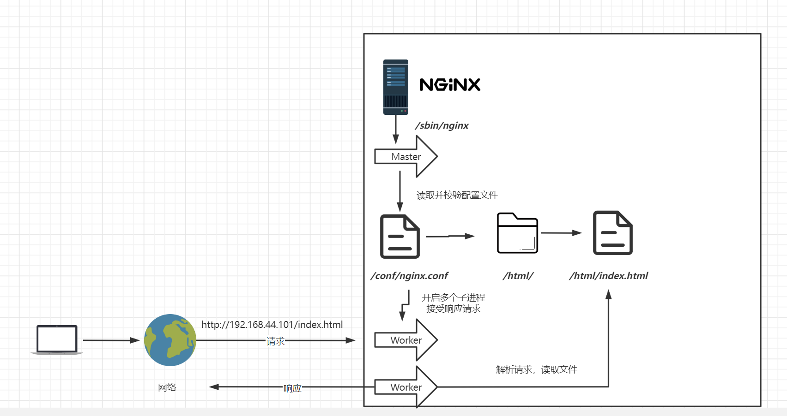


### **Nginx配置**

####  **文件结构**

```json
...              #全局块

events {         #events块
   ...
}

http      #http块
{
    ...   #http全局块
    server        #server块
    { 
        ...       #server全局块
        location [PATTERN]   #location块
        {
            ...
        }
        location [PATTERN] 
        {
            ...
        }
    }
    server
    {
      ...
    }
    ...     #http全局块
}
```

-  1、**全局块**：配置影响nginx全局的指令。一般有运行nginx服务器的用户组，nginx进程pid存放路径，日志存放路径，配置文件引入，允许生成worker process数等。
-  2、**events块**：配置影响nginx服务器或与用户的网络连接。有每个进程的最大连接数，选取哪种事件驱动模型处理连接请求，是否允许同时接受多个网路连接，开启多个网络连接序列化等。
-  3、**http块**：可以嵌套多个server，配置代理，缓存，日志定义等绝大多数功能和第三方模块的配置。如文件引入，mime-type定义，日志自定义，是否使用sendfile传输文件，连接超时时间，单连接请求数等。
-  4、**server块**：配置虚拟主机的相关参数，一个http中可以有多个server。
-  5、**location块**：配置请求的路由，以及各种页面的处理情况。

下面给大家上一个配置文件，作为理解。

```json
########### 每个指令必须有分号结束。#################
#user administrator administrators;  #配置用户或者组，默认为nobody nobody。
#worker_processes 2;  #允许生成的进程数，默认为1
#pid /nginx/pid/nginx.pid;   #指定nginx进程运行文件存放地址
error_log log/error.log debug;  #制定日志路径，级别。这个设置可以放入全局块，http块，server块，级别以此为：debug|info|notice|warn|error|crit|alert|emerg
events {
    accept_mutex on;   #设置网路连接序列化，防止惊群现象发生，默认为on
    multi_accept on;  #设置一个进程是否同时接受多个网络连接，默认为off
    #use epoll;      #事件驱动模型，select|poll|kqueue|epoll|resig|/dev/poll|eventport
    worker_connections  1024;    #最大连接数，默认为512
}
http {
    include       mime.types;   #文件扩展名与文件类型映射表
    default_type  application/octet-stream; #默认文件类型，默认为text/plain
    #access_log off; #取消服务日志    
    log_format myFormat '$remote_addr–$remote_user [$time_local] $request $status $body_bytes_sent $http_referer $http_user_agent $http_x_forwarded_for'; #自定义格式
    access_log log/access.log myFormat;  #combined为日志格式的默认值
    sendfile on;   #允许sendfile方式传输文件，默认为off，可以在http块，server块，location块。
    sendfile_max_chunk 100k;  #每个进程每次调用传输数量不能大于设定的值，默认为0，即不设上限。
    keepalive_timeout 65;  #连接超时时间，默认为75s，可以在http，server，location块。

    upstream mysvr {   
      server 127.0.0.1:7878;
      server 192.168.10.121:3333 backup;  #热备
    }
    error_page 404 https://www.baidu.com; #错误页
    server {
        keepalive_requests 120; #单连接请求上限次数。
        listen       4545;   #监听端口
        server_name  127.0.0.1;   #监听地址       
        location  ~*^.+$ {       #请求的url过滤，正则匹配，~为区分大小写，~*为不区分大小写。
           #root path;  #根目录
           #index vv.txt;  #设置默认页
           proxy_pass  http://mysvr;  #请求转向mysvr 定义的服务器列表
           deny 127.0.0.1;  #拒绝的ip
           allow 172.18.5.54; #允许的ip           
        } 
    }
}
```

上面是nginx的基本配置，需要注意的有以下几点：

1、几个常见配置项：

- 1. \$remote_addr 与 $http_x_forwarded_for 用以记录客户端的ip地址；
- 2. $remote_user ：用来记录客户端用户名称；
- 3. $time_local ： 用来记录访问时间与时区；
- 4. $request ： 用来记录请求的url与http协议；
- 5. $status ： 用来记录请求状态；成功是200；
- 6. $body_bytes_s ent ：记录发送给客户端文件主体内容大小；
- 7. $http_referer ：用来记录从那个页面链接访问过来的；
- 8. $http_user_agent ：记录客户端浏览器的相关信息；

2、惊群现象：一个网路连接到来，多个睡眠的进程被同事叫醒，但只有一个进程能获得链接，这样会影响系统性能。

3、每个指令必须有分号结束。

#### 语法

##### servername

servername 匹配规则

我们需要注意的是servername匹配分先后顺序，写在前面的匹配上就不会继续往下匹配了。


**完整匹配**

我们可以在同一servername中匹配多个域名

```json
server_name vod.mmban.com www1.mmban.com;
```

**通配符匹配**

```json
server_name vod.*;
```

**通配符结束匹配**

```json
server_name ~^[0-9]+\.mmban\.com$;
```

**正则匹配**

```json
server_name ~^[0-9]+\.mmban\.com$;
```


##### location

语法规则： `location [=|~|~*|^~] /uri/ { … }`

- `=` 开头表示精确匹配
- `^~` 开头表示uri以某个常规字符串开头，理解为匹配 url路径即可。nginx不对url做编码，因此请求为/static/20%/aa，可以被规则^~ /static/ /aa匹配到（注意是空格）。以xx开头
- `~` 开头表示区分大小写的正则匹配           以xx结尾
- `~*` 开头表示不区分大小写的正则匹配        以xx结尾
- `!~`和`!~*`分别为区分大小写不匹配及不区分大小写不匹配 的正则
- `/` 通用匹配，任何请求都会匹配到。

多个location配置的情况下匹配顺序为（参考资料而来，还未实际验证，试试就知道了，不必拘泥，仅供参考）：


1. 首先精确匹配 =

   ```json
   		location = /admin/ {
   			root /www/admin;
   			index index.html;
   		}
   ```

   此时访问http://nginx02/admin/ , 会报404,erro日志如下

   ```shell
   2022/10/10 16:27:21 [error] 127219#0: *4127 "/www/admin/admin/index.html" is not found (2: No such file or directory), client: 192.168.10.1, server: localhost, request: "GET /admin/ HTTP/1.1", host: "nginx02
   ```

   

   

2. 其次以xx开头匹配^~

3. 然后是按文件中顺序的正则匹配

4. 最后是交给 / 通用匹配。

5. 当有匹配成功时候，停止匹配，按当前匹配规则处理请求。

例子，有如下匹配规则：

```json
location = / {
   #规则A
}
location = /login {
   #规则B
}
location ^~ /static/ {
   #规则C
}
location ~ \.(gif|jpg|png|js|css)$ {
   #规则D，注意：是根据括号内的大小写进行匹配。括号内全是小写，只匹配小写
}
location ~* \.png$ {
   #规则E
}
location !~ \.xhtml$ {
   #规则F
}
location !~* \.xhtml$ {
   #规则G
}
location / {
   #规则H
}
```

那么产生的效果如下：

访问根目录/， 比如http://localhost/ 将匹配规则A

访问 http://localhost/login 将匹配规则B，http://localhost/register 则匹配规则H

访问 http://localhost/static/a.html 将匹配规则C

访问 http://localhost/a.gif, http://localhost/b.jpg 将匹配规则D和规则E，但是规则D顺序优先，规则E不起作用， 而 http://localhost/static/c.png 则优先匹配到 规则C

访问 http://localhost/a.PNG 则匹配规则E， 而不会匹配规则D，因为规则E不区分大小写。

访问 http://localhost/a.xhtml 不会匹配规则F和规则G，

http://localhost/a.XHTML不会匹配规则G，（因为!）。规则F，规则G属于排除法，符合匹配规则也不会匹配到，所以想想看实际应用中哪里会用到。

访问 http://localhost/category/id/1111 则最终匹配到规则H，因为以上规则都不匹配，这个时候nginx转发请求给后端应用服务器，比如FastCGI（php），tomcat（jsp），nginx作为方向代理服务器存在。

所以实际使用中，个人觉得至少有三个匹配规则定义，如下：

```json
#直接匹配网站根，通过域名访问网站首页比较频繁，使用这个会加速处理，官网如是说。
#这里是直接转发给后端应用服务器了，也可以是一个静态首页
# 第一个必选规则
location = / {
    proxy_pass http://tomcat:8080/index
}
 
# 第二个必选规则是处理静态文件请求，这是nginx作为http服务器的强项
# 有两种配置模式，目录匹配或后缀匹配,任选其一或搭配使用
location ^~ /static/ {                              //以xx开头
    root /webroot/static/;
}
location ~* \.(gif|jpg|jpeg|png|css|js|ico)$ {     //以xx结尾
    root /webroot/res/;
}
 
#第三个规则就是通用规则，用来转发动态请求到后端应用服务器
#非静态文件请求就默认是动态请求，自己根据实际把握
location / {
    proxy_pass http://tomcat:8080/;
}
```

注意事项:

见配置，摘自nginx.conf 里的server 段：

```json
server {
	listen 80;
    
	server_name abc.163.com ;	
    
	location / {
		proxy_pass http://ent.163.com/ ;
	}

	location /star/ {
		proxy_pass http://ent.163.com ;
	}
}
```

里面有两个location，我先说第一个，/ 。其实这里有两种写法，分别是：

```json
	location / {
		proxy_pass http://ent.163.com/ ;
	}
	location / {
		proxy_pass http://ent.163.com ;
	}
```

出来的效果都一样的。

第二个location，/star/。同样两种写法都有，都出来的结果，就不一样了。

```json
	location /star/ {
		proxy_pass http://ent.163.com ;
	}
```

当访问 http://abc.163.com/star/ 的时候，nginx 会代理访问到 http://ent.163.com/star/ ，并返回给我们。

```json
	location /star/ {
		proxy_pass http://ent.163.com/ ;
	}
```

当访问 http://abc.163.com/star/ 的时候，nginx 会代理访问到 http://ent.163.com/ ，并返回给我们。

这两段配置，分别在于， proxy_pass http://ent.163.com/ ; 这个”/”，令到出来的结果完全不同。

前者，相当于告诉nginx，我这个location，是代理访问到http://ent.163.com 这个server的，我的location是什么，nginx 就把location 加在proxy_pass 的 server 后面，这里是/star/，所以就相当于 http://ent.163.com/star/。如果是location /blog/ ，就是代理访问到 http://ent.163.com/blog/。

后者，相当于告诉nginx，我这个location，是代理访问到http://ent.163.com/的，http://abc.163.com/star/ == http://ent.163.com/ ，可以这样理解。改变location，并不能改变返回的内容，返回的内容始终是http://ent.163.com/ 。 如果是location /blog/ ，那就是 http://abc.163.com/blog/ == http://ent.163.com/ 。

这样，也可以解释了上面那个location / 的例子，/ 嘛，加在server 的后面，仍然是 / ，所以，两种写法出来的结果是一样的。

PS: 如果是 location ~* ^/start/(.*)\.html 这种正则的location，是不能写”/”上去的，nginx -t 也会报错的了。因为，路径都需要正则匹配了嘛，并不是一个相对固定的locatin了，必然要代理到一个server。


##### reWrite

`last` – 基本上都用这个Flag。
`break` – 中止Rewirte，不在继续匹配
`redirect` – 返回临时重定向的HTTP状态302
`permanent` – 返回永久重定向的HTTP状态301

1、下面是可以用来判断的表达式：

`-f`和`!-f`用来判断是否存在文件
`-d`和`!-d`用来判断是否存在目录
`-e`和`!-e`用来判断是否存在文件或目录
`-x`和`!-x`用来判断文件是否可执行

2、下面是可以用作判断的全局变量

例：http://localhost:88/test1/test2/test.php

```json
$host：localhost
$server_port：88
$request_uri：http://localhost:88/test1/test2/test.php
$document_uri：/test1/test2/test.php
$document_root：D:\nginx/html
$request_filename：D:\nginx/html/test1/test2/test.php
```

附：一些可用的全局变量

```json
$args
$content_length
$content_type
$document_root
$document_uri
$host
$http_user_agent
$http_cookie
$limit_rate
$request_body_file
$request_method
$remote_addr
$remote_port
$remote_user
$request_filename
$request_uri
$query
```


#### 应用场景

**sendfifile on;**

sendfile on; 使用linux的 sendfile(socket, file, len) 高效网络传输，也就是数据0拷贝。

未开启sendfifile

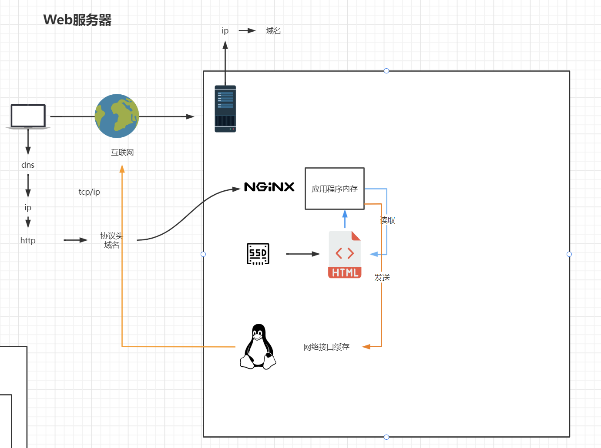


开启后**keepalive_timeout 65;**

keepalive_timeout 65;

**server**

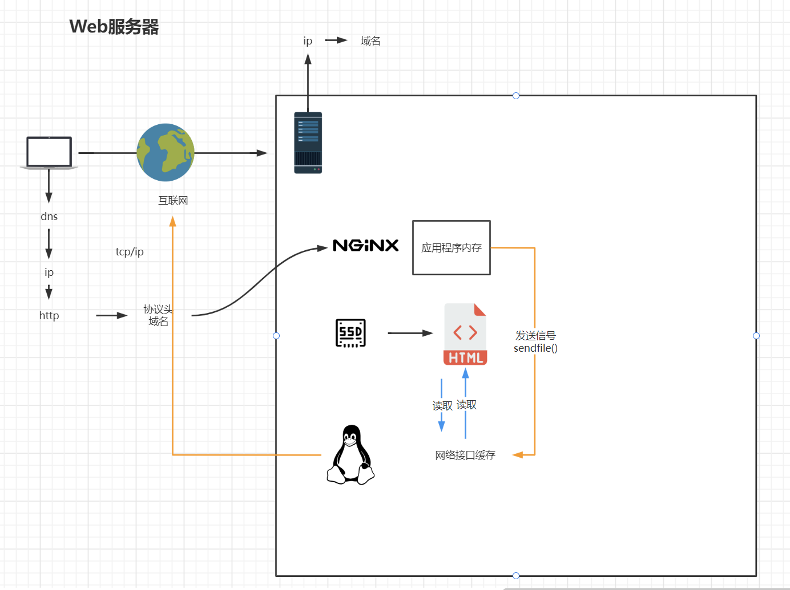


##### 代理服务

1、设置 404 页面导向地址

```
error_page 404 https://www.runnob.com; #错误页
proxy_intercept_errors on;    #如果被代理服务器返回的状态码为400或者大于400，设置的error_page配置起作用。默认为off。
```

2、如果我们的代理只允许接受get，post请求方法的一种

```
proxy_method get;    #支持客户端的请求方法。post/get；
```

3、设置支持的http协议版本

```
proxy_http_version 1.0 ; #Nginx服务器提供代理服务的http协议版本1.0，1.1，默认设置为1.0版本
```

4、如果你的nginx服务器给2台web服务器做代理，负载均衡算法采用轮询，那么当你的一台机器web程序iis关闭，也就是说web不能访问，那么nginx服务器分发请求还是会给这台不能访问的web服务器，如果这里的响应连接时间过长，就会导致客户端的页面一直在等待响应，对用户来说体验就打打折扣，这里我们怎么避免这样的情况发生呢。这里我配张图来说明下问题。


如果负载均衡中其中web2发生这样的情况，nginx首先会去web1请求，但是nginx在配置不当的情况下会继续分发请求道web2，然后等待web2响应，直到我们的响应时间超时，才会把请求重新分发给web1，这里的响应时间如果过长，用户等待的时间就会越长。

下面的配置是解决方案之一。

```
proxy_connect_timeout 1;   #nginx服务器与被代理的服务器建立连接的超时时间，默认60秒
proxy_read_timeout 1; #nginx服务器想被代理服务器组发出read请求后，等待响应的超时间，默认为60秒。
proxy_send_timeout 1; #nginx服务器想被代理服务器组发出write请求后，等待响应的超时间，默认为60秒。
proxy_ignore_client_abort on;  #客户端断网时，nginx服务器是否终端对被代理服务器的请求。默认为off。
```

5、如果使用upstream指令配置啦一组服务器作为被代理服务器，服务器中的访问算法遵循配置的负载均衡规则，同时可以使用该指令配置在发生哪些异常情况时，将请求顺次交由下一组服务器处理。

```
proxy_next_upstream timeout;  #反向代理upstream中设置的服务器组，出现故障时，被代理服务器返回的状态值。
```

状态值可以是：error|timeout|invalid_header|http_500|http_502|http_503|http_504|http_404|off

- error：建立连接或向被代理的服务器发送请求或读取响应信息时服务器发生错误。
- timeout：建立连接，想被代理服务器发送请求或读取响应信息时服务器发生超时。
- invalid_header:被代理服务器返回的响应头异常。
- off:无法将请求分发给被代理的服务器。
- http_400，....:被代理服务器返回的状态码为400，500，502，等。

6、如果你想通过http获取客户的真实ip而不是获取代理服务器的ip地址，那么要做如下的设置。

```
proxy_set_header Host $host; #只要用户在浏览器中访问的域名绑定了 VIP VIP 下面有RS；则就用$host ；host是访问URL中的域名和端口  www.taobao.com:80
proxy_set_header X-Real-IP $remote_addr;  #把源IP 【$remote_addr,建立HTTP连接header里面的信息】赋值给X-Real-IP;这样在代码中 $X-Real-IP来获取 源IP
proxy_set_header X-Forwarded-For $proxy_add_x_forwarded_for;#在nginx 作为代理服务器时，设置的IP列表，会把经过的机器ip，代理机器ip都记录下来，用 【，】隔开；代码中用 echo $x-forwarded-for |awk -F, '{print $1}' 来作为源IP
```

关于X-Forwarded-For与X-Real-IP的一些相关文章可以查看：[HTTP 请求头中的 X-Forwarded-For](https://www.runoob.com/w3cnote/http-x-forwarded-for.html) 。

7、下面是我的一个关于代理配置的配置文件部分，仅供参考。

```
include       mime.types;   #文件扩展名与文件类型映射表
default_type  application/octet-stream; #默认文件类型，默认为text/plain
#access_log off; #取消服务日志    
log_format myFormat ' $remote_addr–$remote_user [$time_local] $request $status $body_bytes_sent $http_referer $http_user_agent $http_x_forwarded_for'; #自定义格式
access_log log/access.log myFormat;  #combined为日志格式的默认值
sendfile on;   #允许sendfile方式传输文件，默认为off，可以在http块，server块，location块。
sendfile_max_chunk 100k;  #每个进程每次调用传输数量不能大于设定的值，默认为0，即不设上限。
keepalive_timeout 65;  #连接超时时间，默认为75s，可以在http，server，location块。
proxy_connect_timeout 1;   #nginx服务器与被代理的服务器建立连接的超时时间，默认60秒
proxy_read_timeout 1; #nginx服务器想被代理服务器组发出read请求后，等待响应的超时间，默认为60秒。
proxy_send_timeout 1; #nginx服务器想被代理服务器组发出write请求后，等待响应的超时间，默认为60秒。
proxy_http_version 1.0 ; #Nginx服务器提供代理服务的http协议版本1.0，1.1，默认设置为1.0版本。
#proxy_method get;    #支持客户端的请求方法。post/get；
proxy_ignore_client_abort on;  #客户端断网时，nginx服务器是否终端对被代理服务器的请求。默认为off。
proxy_ignore_headers "Expires" "Set-Cookie";  #Nginx服务器不处理设置的http相应投中的头域，这里空格隔开可以设置多个。
proxy_intercept_errors on;    #如果被代理服务器返回的状态码为400或者大于400，设置的error_page配置起作用。默认为off。
proxy_headers_hash_max_size 1024; #存放http报文头的哈希表容量上限，默认为512个字符。
proxy_headers_hash_bucket_size 128; #nginx服务器申请存放http报文头的哈希表容量大小。默认为64个字符。
proxy_next_upstream timeout;  #反向代理upstream中设置的服务器组，出现故障时，被代理服务器返回的状态值。error|timeout|invalid_header|http_500|http_502|http_503|http_504|http_404|off
#proxy_ssl_session_reuse on; 默认为on，如果我们在错误日志中发现“SSL3_GET_FINSHED:digest check failed”的情况时，可以将该指令设置为off。
```

------

##### 负载均衡详解

在文章[Nginx 配置详解](https://www.runoob.com/w3cnote/nginx-setup-intro.html)中我说啦nginx有哪些中负载均衡算法。这一结我就给如何操作配置的给大家做详细说明下。

首先给大家说下upstream这个配置的，这个配置是写一组被代理的服务器地址，然后配置负载均衡的算法。这里的被代理服务器地址有两种写法。

```
upstream mysvr { 
    server 192.168.10.121:3333;
    server 192.168.10.122:3333;
}
server {
    ....
    location  ~*^.+$ {         
        proxy_pass  http://mysvr;  #请求转向mysvr 定义的服务器列表         
    }
}
```

然后，就来点实战的东西。

1、热备：如果你有2台服务器，当一台服务器发生事故时，才启用第二台服务器给提供服务。服务器处理请求的顺序：AAAAAA突然A挂啦，BBBBBBBBBBBBBB.....

```
upstream mysvr { 
    server 127.0.0.1:7878; 
    server 192.168.10.121:3333 backup;  #热备     
}
```

2、轮询：nginx默认就是轮询其权重都默认为1，服务器处理请求的顺序：ABABABABAB....

```
upstream mysvr { 
    server 127.0.0.1:7878;
    server 192.168.10.121:3333;       
}
```

3、加权轮询：跟据配置的权重的大小而分发给不同服务器不同数量的请求。如果不设置，则默认为1。下面服务器的请求顺序为：ABBABBABBABBABB....

```
upstream mysvr { 
    server 127.0.0.1:7878 weight=1;
    server 192.168.10.121:3333 weight=2;
}
```

4、ip_hash:nginx会让相同的客户端ip请求相同的服务器。

```
upstream mysvr { 
    server 127.0.0.1:7878; 
    server 192.168.10.121:3333;
    ip_hash;
}
```

5、如果你对上面4种均衡算法不是很理解，可以查看[Nginx 配置详解](https://www.runoob.com/w3cnote/nginx-setup-intro.html)，可能会更加容易理解点。

到这里你是不是感觉nginx的负载均衡配置特别简单与强大，那么还没完，咱们继续哈，这里扯下蛋。

关于nginx负载均衡配置的几个状态参数讲解。

- down，表示当前的server暂时不参与负载均衡。
- backup，预留的备份机器。当其他所有的非backup机器出现故障或者忙的时候，才会请求backup机器，因此这台机器的压力最轻。
- max_fails，允许请求失败的次数，默认为1。当超过最大次数时，返回proxy_next_upstream 模块定义的错误。
- fail_timeout，在经历了max_fails次失败后，暂停服务的时间。max_fails可以和fail_timeout一起使用。

```
upstream mysvr { 
    server 127.0.0.1:7878 weight=2 max_fails=2 fail_timeout=2;
    server 192.168.10.121:3333 weight=1 max_fails=2 fail_timeout=1;    
}
```


##### Keepalived

安装keepalived

```shell
yum install -y keepalived
```

Nginx01(主机)编辑配置文件

```shell
vi /etc/keepalived/keepalived.conf
```

```yaml
! Configuration File for keepalived

global_defs {
   router_id nginx01
}

vrrp_instance VI_1 {
    state MASTER
	#网卡
    interface ens33
    virtual_router_id 51
    priority 100
    advert_int 1
    authentication {
        auth_type PASS
        auth_pass 1111
    }
    virtual_ipaddress {
		#虚拟的ip地址
        192.168.10.200
    }
}

```


启动keepalived

```shell
systemctl start keepalived
```

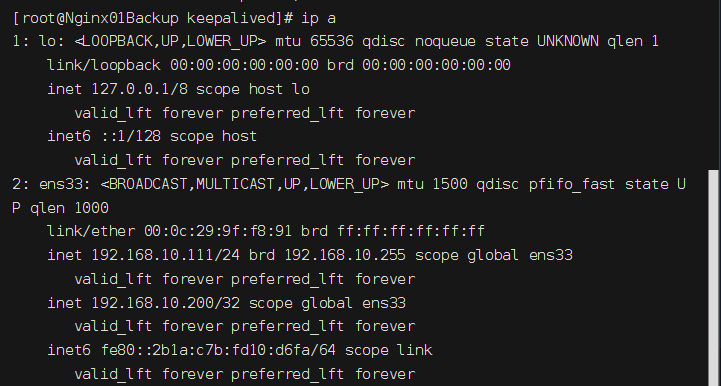

可以看到多了一个ip:192.168.10.200

Nginx01 Backup(备用机),配置:

```json
! Configuration File for keepalived

global_defs {
   router_id nginx01_backup
}

vrrp_instance VI_1 {
    state BACKUP
	#网卡
    interface ens33
    virtual_router_id 51
    priority 50
    advert_int 1
    authentication {
        auth_type PASS
        auth_pass 1111
    }
    virtual_ipaddress {
		#虚拟的ip地址
        192.168.10.200
    }
}

```

在Nginx01 Backup上启动keepalived后查看ip,没有发现192.168.10.200

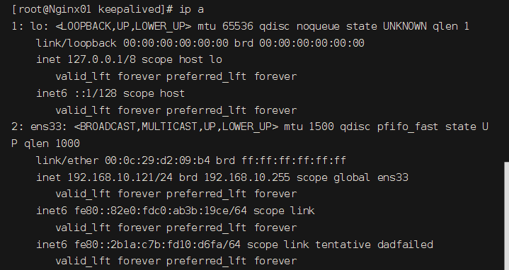

windows下ping 192.168.10.200

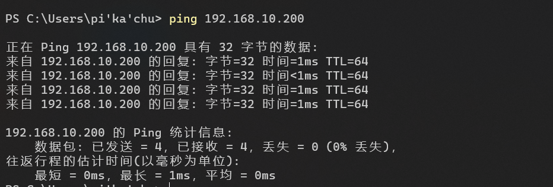

关闭Nginx01后再次查看Nginx01 Backup的 ip

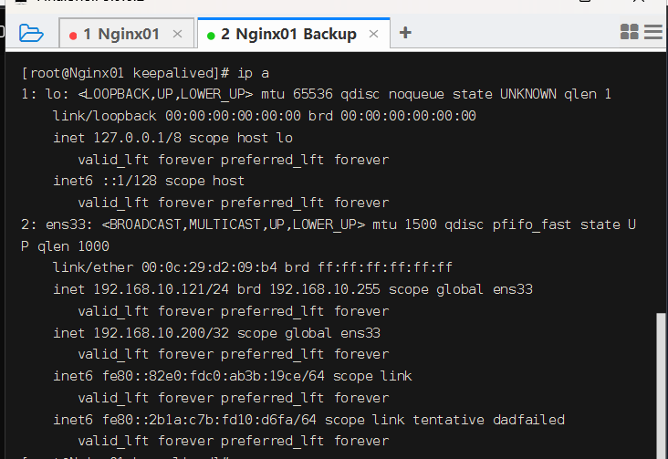


访问 http://192.168.10.200

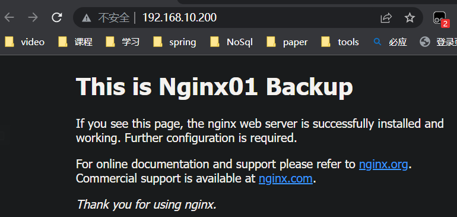


##### 一些常用的配置

###### 1、普通的（静态的）http服务器

这样如果访问http://localhost 就会默认访问到/www/root目录下面的index.html，如果一个网站只是静态页面的话，那么就可以通过这种方式来实现部署。

 

```perl
server {
    listen       80;                                                         
    server_name  localhost;                                               
    client_max_body_size 1024M;
 
 
    location / {                
           root   /www/root;            //思路：通过/将所有的请求，转发给root处理
           index  index.html;
       }
}
```

 

###### 2、反向代理

 

localhost 的时候，就相当于访问localhost:8080了

```php
server {  
    listen       80;                                                         
    server_name  localhost;                                               
    client_max_body_size 1024M;

    location / {
        proxy_pass http://localhost:8080;   
        proxy_set_header Host $host:$server_port;    //思路：通过/，将所有的请求，转发给第3方处理
    }
}
```

既然服务器可以直接HTTP访问，为什么要在中间加上一个反向代理，不是多此一举吗？反向代理有什么作用？

负载均衡、虚拟主机等，都基于反向代理实现，当然反向代理的功能也不仅仅是这些。

###### 3、Redirect（重定向）语法

 rewrite是实现URL重写的关键指令，根据regex (正则表达式)部分内容， 

重定向到replacement，结尾是flag标记。 

```json
rewrite <regex> <replacement> [flag]; 
```

关键字 正则 替代内容 flag标记 

关键字：其中关键字error_log不能改变

正则：perl兼容正则表达式语句进行规则匹配 

替代内容：将正则匹配的内容替换成replacement 

flag标记：rewrite支持的flag标记 

rewrite参数的标签段位置： 

server,location,if 

flag标记说明： 

```json
last #本条规则匹配完成后，继续向下匹配新的location URI规则 

break #本条规则匹配完成即终止，不再匹配后面的任何规则 

redirect #返回302临时重定向，浏览器地址会显示跳转后的URL地址 

permanent #返回301永久重定向，浏览器地址栏会显示跳转后的URL地址
```

实例:

场景:在nginx03,nginx04上运行Tomcat应用程序,测试访问路径为: http://nginx/page?pageNum=666

nginx01配置(访问/page开头的uri会转发到 httpd 中的服务主机nginx03,nginx04):

rewrite: 将访问模式为 /page开头 + 任意数字 + .html 结尾的uri 重写为 /page/数字.html

如: http://nginx01/666.html  重写转发为 http://httpd/page?pageNum=666

```json
#定义变量
upstream httpd{
server 192.168.10.113:8080 weight=5;
server 192.168.10.114:8080 weight=1;
}
server {
        listen       80;
        server_name  ~^[0-9]+\.pikachuvirtual\.top localhost;
		
		location / {
			root html;
			index index.html;
		}
		
        location ^~ /page {
			rewrite ^/page/([0-9]+).html$ /page?pageNum=$1 break;
			proxy_pass http://httpd;
        }

        error_page   500 502 503 504  /50x.html;
        location = /50x.html {
            root   html;
        }
    }
```

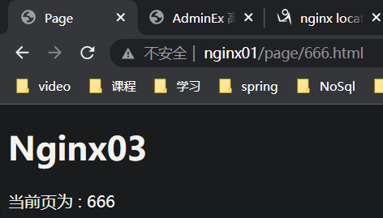


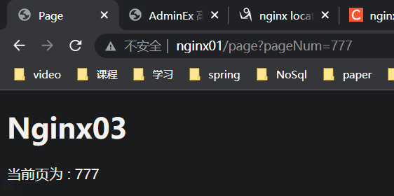

重定向到 https

```json
return 301 https//$server_name$request_uri;
```


 

###### 4、防盗链

```json
valid_referers none | blocked | server_names | strings ....;
```

none， 检测 Referer 头域不存在的情况。

blocked，检测 Referer 头域的值被防火墙或者代理服务器删除或伪装的情况。这种情况该头域的值不以“http://” 或 “https://” 开头。

server_names ，设置一个或多个 URL ，检测 Referer 头域的值是否是这些 URL 中的某一个。

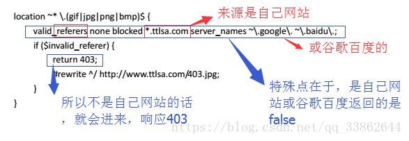


实例:

配置前:

访问http://nginx01/admin 和 http://nginx02/admin 均正常显示

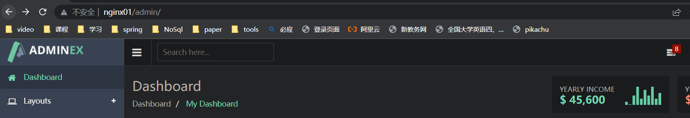


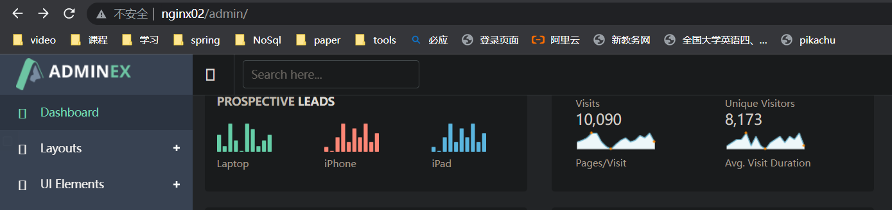

配置后

```json
server {
        listen       80;
        server_name  ~^[0-9]+\.pikachuvirtual\.top localhost;
		
		location / {
			root html;
			index index.html;
		}
		
        location ^~ /page {
			rewrite ^/page/([0-9]+).html$ /page?pageNum=$1 break;
			proxy_pass http://httpd;
            #root   html;
            #index  index.html index.htm;
        }
		
		location = /admin/ {
			proxy_pass http://192.168.10.112;
		}
		#动静分离
		location ~* /admin/(images|js|fonts|img|css)/*\w+ {
			#防盗链,当referer为http://nginx01/admin/js/xxx 时,nginx不会将nginx01映射为					192.168.10.111,因此2个都要写进去.
			valid_referers none blocked 192.168.10.111 nginx01;
			if ($invalid_referer){
				return 403;
			}
			root /www/;
		}

        error_page   500 502 503 504  /50x.html;
        location = /50x.html {
            root   html;
        }
    }
```

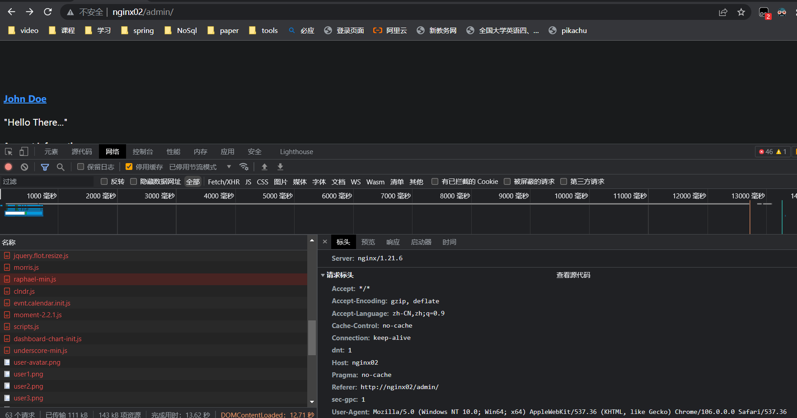

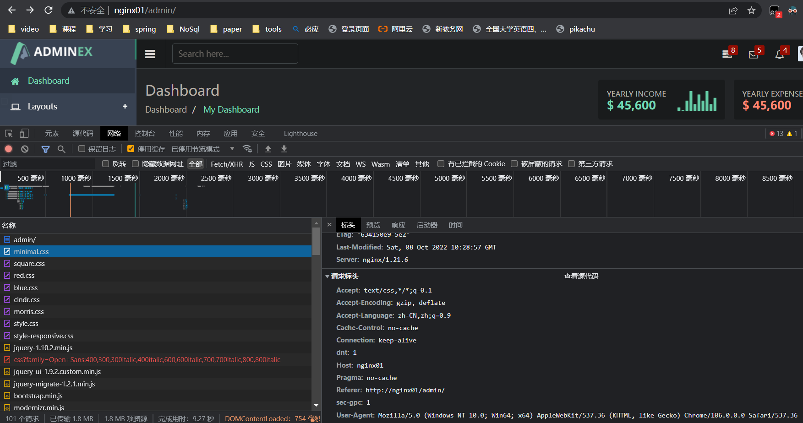

**使用curl测试**

```json
curl -I http://192.168.44.101/img/logo.png
```

**带引用(referer)**

```json
curl -e "http://baidu.com" -I http://192.168.44.101/img/logo.png
```


###### 5、根据文件类型设置过期时间

配置前:

```shell
 curl -I http://nginx01/admin/js/easypiechart/jquery.easypiechart.js
```

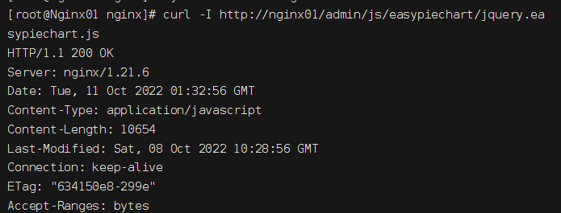


```json
location ~* \.(js|css|jpg|jpeg|gif|png|swf)$ {
	#只能是文件，因为这用-f判断了
    if (-f $request_filename) {     
        expires 1d;
        break;
    }
}
```

配置后:

```shell
 curl -I http://nginx01/admin/js/easypiechart/jquery.easypiechart.js
```


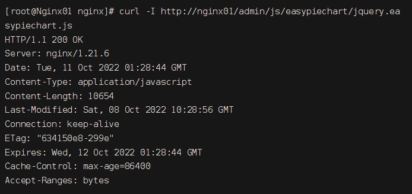


 

###### 6、设置图片缓存（过期）时间


###### 7、禁止访问某个目录

```html
		location / {
			#所有用户禁止访问该目录
			root html;
			index index.html;
			deny all;
		}
```

配置前:

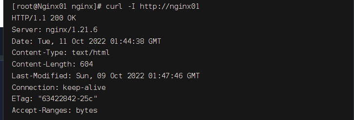

配置后:

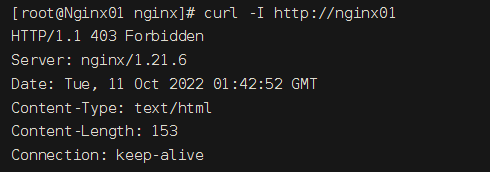


 

###### 8、隐藏版本号的作用

通过你所用的版本，找其漏洞，进行攻击你

在http中添加该配置：server_tokens off;


配置前:

 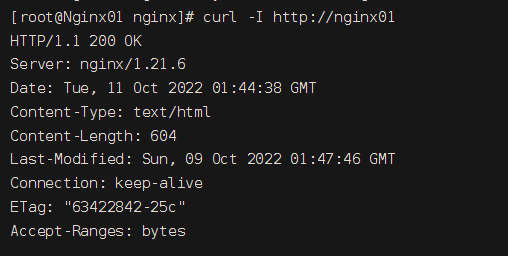

配置后:

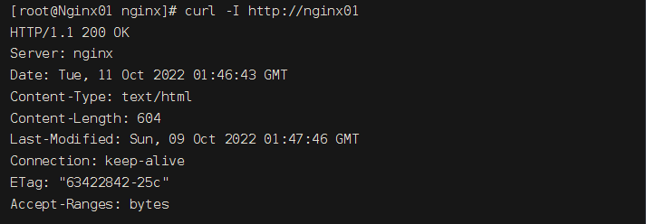


###### 9、配置https

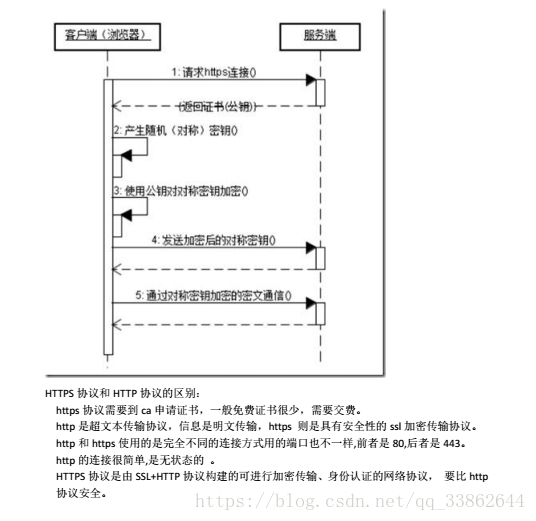

 

1、去阿里云/腾讯云申请免费的

2、下载证书

3、证书放到/usr/local/nginx目录下（就是和conf同级，nginx.conf默认的配置文件的上一级）

4、在vhost目录下加入配置文件

```perl
server {
 listen 443;
 server_name lampol.edu0532.cn; #改域名
 ssl on;
 root /home/www/xcxtp5/public; #改项目路径
 ssl_certificate ../certbo/1523694051089.pem;    #改证书路径
 ssl_certificate_key ../certbo/1523694051089.key; #改私钥路径
 ssl_session_timeout 5m;
 ssl_ciphers ECDHE-RSA-AES128-GCM-SHA256:ECDHE:ECDH:AES:HIGH:!NULL:!aNULL:!MD5:!ADH:!RC4;
 ssl_protocols TLSv1 TLSv1.1 TLSv1.2;
 ssl_prefer_server_ciphers on;
        location / {
            index  index.html index.htm index.php;
            autoindex  on;
            # 伪静态配置  
            if (!-e $request_filename) {
                rewrite  ^(.*)$  /index.php?s=$1  last;
                break;
            }
        }

        location ~ \.php$ {
            fastcgi_pass   127.0.0.1:9000;
            fastcgi_index  index.php;
            include        fastcgi.conf;
        }

}
```

###### 10、动静分离

场景: 将所有静态资源存放在nginx01服务器上,Web服务器运行在nginx02上,而nginx02

上的应用需要引用nginx01上的静态文件.

其中Web服务器要访问的 url 为: http://nginx02/admin/xxxxx

思路：动、静态的文件，请求时匹配不同的目录

当访问gif,css,js等静态文件时 转发到nginx01

nginx01 的 nginx.conf文件server块配置如下:

```json
server {
        listen       80;
        server_name   localhost;
		
		location / {
			root html;
			index index.html;
		}
		
		
		location = /admin/ {
			proxy_pass http://192.168.10.112;
		}
		#动静分离
		location ~* /admin/(images|js|fonts|img|css)/*\w+ {
			root /www/;
		}

        error_page   500 502 503 504  /50x.html;
        location = /50x.html {
            root   html;
        }
    }
```

nginx02 的 nginx.conf文件server块配置如下:

```json
server {
        listen       80;
        server_name  localhost;

        #charset koi8-r;

        #access_log  logs/host.access.log  main;

		location / {
			root html;
			index index.html;
		}
		#匹配主页面
		location /admin {
			root /www;
			index index.html;
		}
		
		location ~* .*\.(css|js|png|jpg|gif)$ {
			proxy_pass http://192.168.10.111:80;
		}
		
        error_page   500 502 503 504  /50x.html;
        location = /50x.html {
            root   html;
        }

    }
```

正则含义:将 uri为 /admin/images(或js,fonts,imgcss)/xxx 转发到http://192.168.10.111:80服务器.

如访问http://nginx02/admin/js/calendar/moment-2.2.1.js时,

nginx02会代理返回 http://192.168.10.111:80/admin/js/calendar/moment-2.2.1.js

```json
		location ~* /admin/(images|js|fonts|img|css)/*\w+ {
			proxy_pass http://192.168.10.111:80; 
		}
```

正则含义:将所有以.css , .jpg等结尾的 uri 转发到http://192.168.10.111:80服务器.

```json
		location ~* .*\.(css|js|png|jpg|gif)$ {
			proxy_pass http://192.168.10.111:80;
		}
```


###### 11、错误页

```json
		location ~* /admin/(images|js|fonts|img|css)/*\w+ {
			#防盗链
			valid_referers blocked 192.168.10.111 nginx01;
			if ($invalid_referer){
				return 401;
			}
			#只能是文件，因为这用-f判断了
			if (-f $request_filename) {    
				expires 1d;
				break;
			}
			root /www/;
		}
		location /401.html {
			root html;
		}
```


###### 12、安装CA证书

**不安全的http协议**

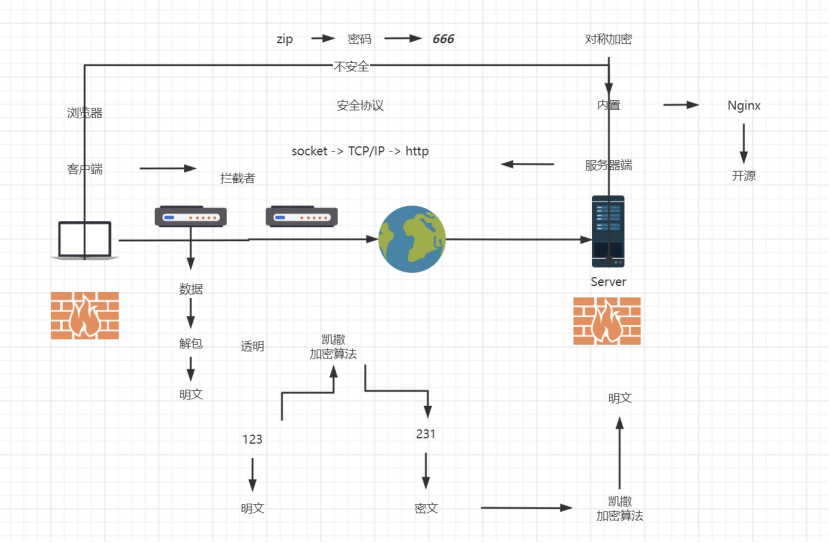


防火墙的作用：
1）.过滤进出网络的数据
2）.管理进出访问网络的行为（限制他人进入内部网络，过滤掉不安全服务和非法用户）
3）.封堵某些禁止业务（不让你看的网站你看不了）
4）.记录通过防火墙信息内容和活动（你看了啥网站，传送了啥文件都有记录）
5）.对网络攻击检测和告警

**防火墙不能保护在网络传输中的数据，而HTTP 又是明文传输，HTTPS应运而生。**

HTTP(Hyper Text Transfer Protocol)协议是超文本传输协议的缩写，它是从WEB服务器传输超文本标记语言(HTML)到本地浏览器的传送协议。设计HTTP最初的目的是为了提供一种发布和接收HTML页面的方法。HTPP有多个版本，目前广泛使用的是HTTP/1.1版本。
HTTP 默认工作在 TCP 协议 80 端口，用户访问网站 http:// 打头的都是标准 HTTP 服务。

HTTP 协议以明文方式发送内容，不提供任何方式的数据加密，如果攻击者截取了Web浏览器和网站服务器之间的传输报文，就可以直接读懂其中的信息，因此，HTTP协议不适合传输一些敏感信息。

**一般http中存在如下问题：容易被窃取篡改冒充**
请求信息明文传输，容易被窃听截取。
数据的完整性未校验，容易被篡改。
没有验证对方身份，存在冒充危险。

HTTPS 协议（HyperText Transfer Protocol over Secure Socket Layer）：一般理解为HTTP+SSL/TLS，通过 SSL证书来验证服务器的身份，并为浏览器和服务器之间的通信进行加密。HTTPS 开发的主要目的，是提供对网站服务器的身份认证，保护交换数据的隐私与完整性。HTTPS 默认工作在 TCP 协议443端口。

**HTTP 与 HTTPS 区别**
HTTP 明文传输，数据都是未加密的，安全性较差，HTTPS（SSL+HTTP） 数据传输过程是加密的，安全性较好。
使用 HTTPS 协议需要到 CA（Certificate Authority，数字证书认证机构） 申请证书，一般免费证书较少，因而需要一定费用。证书颁发机构如：Symantec、Comodo、GoDaddy 和 GlobalSign 等。
HTTP 页面响应速度比 HTTPS 快，主要是因为 HTTP 使用 TCP 三次握手建立连接，客户端和服务器需要交换 3 个包，而 HTTPS除了 TCP 的三个包，还要加上 ssl 握手需要的 9 个包，所以一共是 12 个包。
http 和 https 使用的是完全不同的连接方式，用的端口也不一样，前者是 80，后者是 443。
HTTPS 其实就是建构在 SSL/TLS 之上的 HTTP 协议，所以，要比较 HTTPS 比 HTTP 要更耗费服务器资源


实例:

去申请证书,上传到服务器


编辑 nginx.conf

```json
  server {
	listen 443 ssl;
	server_name localhost;
	#证书路径
	ssl_certificate /www/ca/nginx/jna8604835_host.pikachuvirtual.top.pem;
	#证书密钥路径
	ssl_certificate_key /www/ca/nginx/jna8604835_host.pikachuvirtual.top.key;
  }
```

reload前访问 http://host.pikachuvirtual.top


reload后访问 https://host.pikachuvirtual.top


###### 13、安装部署Discuz

1. 下载Discuz https://gitee.com/Discuz/DiscuzX/releases

2. 上传到服务器并解压

   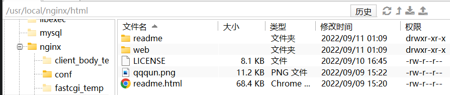

   仅作测试,为了方便修改777权限

   ```shell
    chmod -R 777 ./
   ```

   

3. 访问安装界面,开始安装(前提: php,mysql)

4. 效果


