## CAP原则

### 一、概述

CAP原则又称CAP定理，指的是在一个[分布式](https://so.csdn.net/so/search?q=分布式&spm=1001.2101.3001.7020)系统中，**一致性**（Consistency）、**可用性**（Availability）、**分区容错性**（Partition tolerance）。

CAP原则的精髓就是要么AP，要么CP，要么AC，但是不存在CAP。

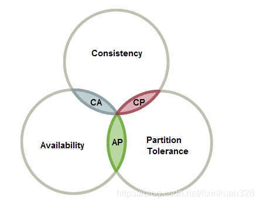

​                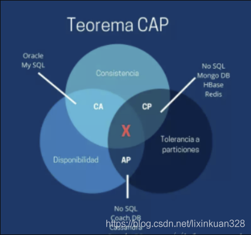

> *It states, that though its desirable to have Consistency, High-Availability and Partition-tolerance in every system, unfortunately no system can achieve all three at the same time.*
> **在分布式系统的设计中，没有一种设计可以同时满足一致性，可用性，分区容错性 3个特性** 

1998年，加州大学的计算机科学家 Eric Brewer 提出，分布式系统有三个指标。

1. **一致性（C）**：在分布式系统中的所有数据备份，在同一时刻是否同样的值，**即写操作之后的读操作，必须返回该值**。（分为弱一致性、强一致性和最终一致性）
2. **可用性（**A）：在集群中一部分节点故障后，集群整体是否还能响应客户端的读写请求。（对数据更新具备高可用性）
3. **分区容忍性（P）**：以实际效果而言，分区相当于对通信的时限要求。系统如果不能在时限内达成数据一致性，就意味着发生了分区的情况，必须就当前操作在C和A之间做出选择。

### 二、取舍策略

CAP三个特性只能满足其中两个，那么取舍的策略就共有三种：

**2.1、CA without P：**如果不要求P（不允许分区），则C（强一致性）和A（可用性）是可以保证的。但放弃P的同时也就意味着放弃了系统的扩展性，也就是分布式节点受限，没办法部署子节点，这是违背分布式系统设计的初衷的。传统的关系型数据库RDBMS：Oracle、MySQL就是CA。

**2.2、CP without A：**如果不要求A（可用），相当于每个请求都需要在服务器之间保持强一致，而P（分区）会导致同步时间无限延长(也就是等待数据同步完才能正常访问服务)，一旦发生网络故障或者消息丢失等情况，就要牺牲用户的体验，等待所有数据全部一致了之后再让用户访问系统。设计成CP的系统其实不少，最典型的就是分布式数据库，如Redis、HBase等。对于这些分布式数据库来说，数据的一致性是最基本的要求，因为如果连这个标准都达不到，那么直接采用关系型数据库就好，没必要再浪费资源来部署分布式数据库。

**2.3、 AP wihtout C：**要高可用并允许分区，则需放弃一致性。一旦分区发生，节点之间可能会失去联系，为了高可用，每个节点只能用本地数据提供服务，而这样会导致全局数据的不一致性。典型的应用就如某米的抢购手机场景，可能前几秒你浏览商品的时候页面提示是有库存的，当你选择完商品准备下单的时候，系统提示你下单失败，商品已售完。这其实就是先在 A（可用性）方面保证系统可以正常的服务，然后在数据的一致性方面做了些牺牲，虽然多少会影响一些用户体验，但也不至于造成用户购物流程的严重阻塞。

### 三、主要矛盾-Consistency和Availability


CAP理论就是说在分布式存储系统中，最多只能实现上面的两点。而由于网络硬件肯定会出现延迟丢包等问题，所以分区容错性是我们必须需要实现的。所以我们只能在一致性和可用性之间进行权衡，没有NoSQL系统能同时保证这三点。对于web2.0网站来说，关系数据库的很多主要特性却往往无用武之地

1. 数据库事务一致性需求 —— 很多web实时系统并不要求严格的数据库事务，对读一致性的要求很低，有些场合对写一致性要求并不高。允许实现最终一致性。
2. 数据库的写实时性和读实时性需求 —— 对关系数据库来说，插入一条数据之后立刻查询，是肯定可以读出来这条数据的，但是对于很多web应用来说，并不要求这么高的实时性，比方说发一条消息之 后，过几秒乃至十几秒之后，我的订阅者才看到这条动态是完全可以接受的。
3. 对复杂的SQL查询，特别是多表关联查询的需求 —— 任何大数据量的web系统，都非常忌讳多个大表的关联查询，以及复杂的数据分析类型的报表查询，特别是SNS类型的网站，从需求以及产品设计角 度，就避免了这种情况的产生。往往更多的只是单表的主键查询，以及单表的简单条件分页查询，SQL的功能被极大的弱化了。


> **与数据库的关系**
>
> 传统的关系型数据库（CA）在功能支持上通常很宽泛，从简单的键值查询，到复杂的多表联合查询再到事务机制的支持。而与之不同的是，NoSQL系统通常注重性能和扩展性，而非事务机制（事务就是强一致性的体现）。
> 　　传统的SQL数据库的事务通常都是支持ACID的强事务机制。A代表原子性，即在事务中执行多个操作是原子性的，要么事务中的操作全部执行，要么一个都不执行；C代表一致性，即保证进行事务的过程中整个数据库的状态是一致的，不会出现数据花掉的情况;I代表隔离性，即两个事务不会相互影响，覆盖彼此数据等；D表示持久化，即事务一旦完成，那么数据应该是被写到安全的，持久化存储的设备上（比如磁盘）。
> 　　NoSQL系统仅提供对行级别的原子性保证，也就是说同时对同一个Key下的数据进行的两个操作，在实际执行的时候是会串行的执行，保证了每一个Key-Value对不会被破坏。


### 四、解决方案——BASE

BASE是Basically Available（基本可用）、Soft state（软状态）和Eventually consistent（最终一致性）三个短语的简写，BASE是对CAP中一致性和可用性权衡的结果。

**核心思想：**即使无法做到强一致性（Strong consistency），但每个应用都可以根据自身的业务特点，采用适当的方式来使系统达到最终一致性（Eventual consistency）。

**4.1、基本可用**Basically Available

基本可用是指分布式系统在出现不可预知故障的时候，允许损失部分可用性——但请注意，这绝不等价于系统不可用，以下两个就是“基本可用”的典型例子。

- 响应时间上的损失：正常情况下，一个在线搜索引擎需要0.5秒内返回给用户相应的查询结果，但由于出现异常（比如系统部分机房发生断电或断网故障），查询结果的响应时间增加到了1~2秒。
- 功能上的损失：正常情况下，在一个电子商务网站上进行购物，消费者几乎能够顺利地完成每一笔订单，但是在一些节日大促购物高峰的时候，由于消费者的购物行为激增，为了保护购物系统的稳定性，部分消费者可能会被引导到一个降级页面。

**4.2、软状态**Soft state

软状态也称弱状态，和硬状态相对，是指允许系统中的数据存在中间状态，并认为该中间状态的存在不会影响系统的整体可用性，即**允许系统在不同节点的数据副本之间进行数据同步的过程存在延时**。

**4.3、最终一致性**Eventually consistent

最终一致性强调的是系统中所有的数据副本，在经过一段时间的同步后，最终能够达到一个一致的状态。因此，最终一致性的本质是需要系统保证最终数据能够达到一致，而不需要实时保证系统数据的强一致性。

> 亚马逊首席技术官Werner Vogels在于2008年发表的一篇文章中对最终一致性进行了非常详细的介绍。他认为最终一致性时一种特殊的弱一致性：系统能够保证在没有其他新的更新操作的情况下，数据最终一定能够达到一致的状态，因此所有客户端对系统的数据访问都能够胡渠道最新的值。同时，在没有发生故障的前提下，数据达到一致状态的时间延迟，取决于网络延迟，系统负载和数据复制方案设计等因素。
>
> 在实际工程实践中，最终一致性存在以下五类主要变种。
>
> **因果一致性：**
>
> ​    因果一致性是指，如果进程A在更新完某个数据项后通知了进程B，那么进程B之后对该数据项的访问都应该能够获取到进程A更新后的最新值，并且如果进程B要对该数据项进行更新操作的话，务必基于进程A更新后的最新值，即不能发生丢失更新情况。与此同时，与进程A无因果关系的进程C的数据访问则没有这样的限制。
>
> **读己之所写：**
>
> ​    读己之所写是指，进程A更新一个数据项之后，它自己总是能够访问到更新过的最新值，而不会看到旧值。也就是说，对于单个数据获取者而言，其读取到的数据一定不会比自己上次写入的值旧。因此，读己之所写也可以看作是一种特殊的因果一致性。
>
> **会话一致性：**
>
> ​    会话一致性将对系统数据的访问过程框定在了一个会话当中：系统能保证在同一个有效的会话中实现“读己之所写”的一致性，也就是说，执行更新操作之后，客户端能够在同一个会话中始终读取到该数据项的最新值。
>
> **单调读一致性：**
>
> ​    单调读一致性是指如果一个进程从系统中读取出一个数据项的某个值后，那么系统对于该进程后续的任何数据访问都不应该返回更旧的值。
>
> **单调写一致性：**
>
> ​     单调写一致性是指，一个系统需要能够保证来自同一个进程的写操作被顺序地执行。

以上就是最终一致性的五类常见的变种，在时间系统实践中，可以将其中的若干个变种互相结合起来，以构建一个具有最终一致性的分布式系统。事实上，可以将其中的若干个变种相互结合起来，以构建一个具有最终一致性特性的分布式系统。事实上，最终一致性并不是只有那些大型分布式系统才设计的特性，许多现代的关系型数据库都采用了最终一致性模型。

在现代关系型数据库中，大多都会采用同步和异步方式来实现主备数据复制技术。在同步方式中，数据的复制通常是更新事务的一部分，因此在事务完成后，主备数据库的数据就会达到一致。而在异步方式中，备库的更新往往存在延时，这取决于事务日志在主备数据库之间传输的时间长短，如果传输时间过长或者甚至在日志传输过程中出现异常导致无法及时将事务应用到备库上，那么很显然，从备库中读取的的数据将是旧的，因此就出现了不一致的情况。当然，无论是采用多次重试还是认为数据订正，关系型数据库还是能搞保证最终数据达到一致——这就是系统提供最终一致性保证的经典案例。

总的来说，BASE理论面向的是大型高可用可扩展的分布式系统，和传统事务的ACID特性使相反的，它完全不同于ACID的强一致性模型，而是提出通过牺牲强一致性来获得可用性，并允许数据在一段时间内是不一致的，但最终达到一致状态。但同时，在实际的分布式场景中，不同业务单元和组件对数据一致性的要求是不同的，因此在具体的分布式系统架构设计过程中，ACID特性与BASE理论往往又会结合在一起使用。

**小结：计算机系统从集中式向分布式的变革随着包括分布式网络、分布式事务和分布式数据一致性等在内的一系列问题与挑战，同时也催生了一大批诸如ACID、CAP和BASE等经典理论的快速发展。**


## RPC

### 1. 基本的RPC模型

主要介绍RPC是什么，基本的RPC代码，RPC与REST的区别，gRPC的使用

#### 1.1 基本概念

- RPC（Remote Procedure Call）远程过程调用，简单的理解是一个节点请求另一个节点提供的服务
- 本地过程调用：如果需要将本地student对象的age+1，可以实现一个addAge()方法，将student对象传入，对年龄进行更新之后返回即可，本地方法调用的函数体通过函数指针来指定。
- 远程过程调用：上述操作的过程中，如果addAge()这个方法在服务端，执行函数的函数体在远程机器上，如何告诉机器需要调用这个方法呢？

1. 首先客户端需要告诉服务器，需要调用的函数，这里函数和进程ID存在一个映射，客户端远程调用时，需要查一下函数，找到对应的ID，然后执行函数的代码。
2. 客户端需要把本地参数传给远程函数，本地调用的过程中，直接压栈即可，但是在远程调用过程中不再同一个内存里，无法直接传递函数的参数，因此需要客户端把参数转换成字节流，传给服务端，然后服务端将字节流转换成自身能读取的格式，是一个序列化和反序列化的过程。
    3.数据准备好了之后，如何进行传输？网络传输层需要把调用的ID和序列化后的参数传给服务端，然后把计算好的结果序列化传给客户端，因此TCP层即可完成上述过程，gRPC中采用的是HTTP2协议。
    总结一下上述过程：


```csharp
// Client端 
//    Student student = Call(ServerAddr, addAge, student)
1. 将这个调用映射为Call ID。
2. 将Call ID，student（params）序列化，以二进制形式打包
3. 把2中得到的数据包发送给ServerAddr，这需要使用网络传输层
4. 等待服务器返回结果
5. 如果服务器调用成功，那么就将结果反序列化，并赋给student，年龄更新

// Server端
1. 在本地维护一个Call ID到函数指针的映射call_id_map，可以用Map<String, Method> callIdMap
2. 等待客户端请求
3. 得到一个请求后，将其数据包反序列化，得到Call ID
4. 通过在callIdMap中查找，得到相应的函数指针
5. 将student（params）反序列化后，在本地调用addAge()函数，得到结果
6. 将student结果序列化后通过网络返回给Client
```


- 在微服务的设计中，一个服务A如果访问另一个Module下的服务B，可以采用HTTP REST传输数据，并在两个服务之间进行序列化和反序列化操作，服务B把执行结果返回过来。

  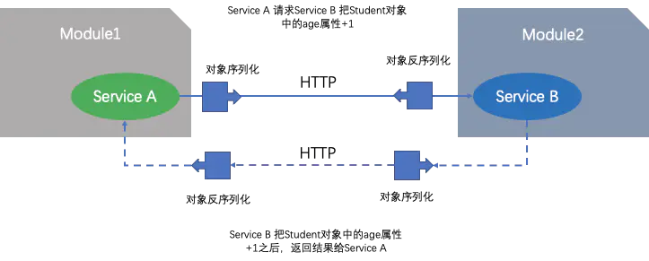

- 由于HTTP在应用层中完成，整个通信的代价较高，远程过程调用中直接基于TCP进行远程调用，数据传输在传输层TCP层完成，更适合对效率要求比较高的场景，RPC主要依赖于客户端和服务端之间建立Socket链接进行，底层实现比REST更复杂。

#### 1.2 rpc demo

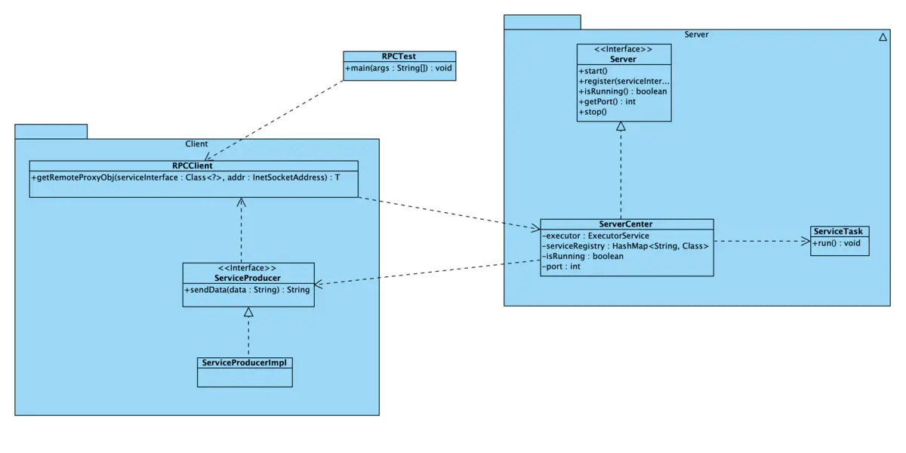

系统类图

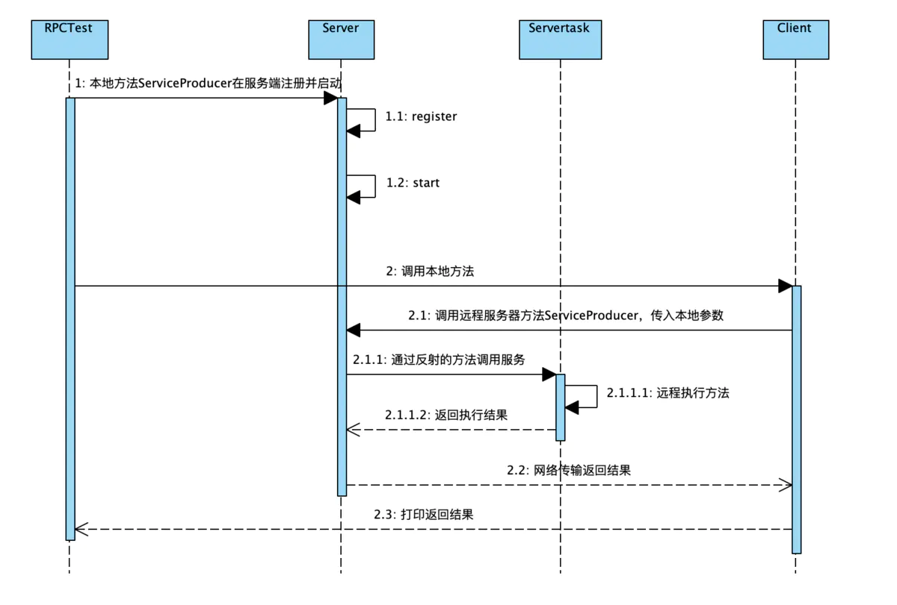

系统调用过程

客户端：


```java
public class RPCClient<T> {
    public static <T> T getRemoteProxyObj(final Class<?> serviceInterface, final InetSocketAddress addr) {
        // 1.将本地的接口调用转换成JDK的动态代理，在动态代理中实现接口的远程调用
        return (T) Proxy.newProxyInstance(serviceInterface.getClassLoader(), new Class<?>[]{serviceInterface},
                new InvocationHandler() {
                    @Override
                    public Object invoke(Object proxy, Method method, Object[] args) throws Throwable {
                        Socket socket = null;
                        ObjectOutputStream output = null;
                        ObjectInputStream input = null;
                        try{
                            // 2.创建Socket客户端，根据指定地址连接远程服务提供者
                            socket = new Socket();
                            socket.connect(addr);

                            // 3.将远程服务调用所需的接口类、方法名、参数列表等编码后发送给服务提供者
                            output = new ObjectOutputStream(socket.getOutputStream());
                            output.writeUTF(serviceInterface.getName());
                            output.writeUTF(method.getName());
                            output.writeObject(method.getParameterTypes());
                            output.writeObject(args);

                            // 4.同步阻塞等待服务器返回应答，获取应答后返回
                            input = new ObjectInputStream(socket.getInputStream());
                            return input.readObject();
                        }finally {
                            if (socket != null){
                                socket.close();
                            }
                            if (output != null){
                                output.close();
                            }
                            if (input != null){
                                input.close();
                            }
                        }
                    }
                });
    }
}
```

服务端：


```java
public class ServiceCenter implements Server {

    private static ExecutorService executor = Executors.newFixedThreadPool(Runtime.getRuntime().availableProcessors());

    private static final HashMap<String, Class> serviceRegistry = new HashMap<String, Class>();

    private static boolean isRunning = false;

    private static int port;


    public ServiceCenter(int port){
        ServiceCenter.port = port;
    }


    @Override
    public void start() throws IOException {
        ServerSocket server = new ServerSocket();
        server.bind(new InetSocketAddress(port));
        System.out.println("Server Start .....");
        try{
            while(true){
                executor.execute(new ServiceTask(server.accept()));
            }
        }finally {
            server.close();
        }
    }

    @Override
    public void register(Class serviceInterface, Class impl) {
        serviceRegistry.put(serviceInterface.getName(), impl);
    }

    @Override
    public boolean isRunning() {
        return isRunning;
    }

    @Override
    public int getPort() {
        return port;
    }

    @Override
    public void stop() {
        isRunning = false;
        executor.shutdown();
    }
   private static class ServiceTask implements Runnable {
        Socket client = null;

        public ServiceTask(Socket client) {
            this.client = client;
        }

        @Override
        public void run() {
            ObjectInputStream input = null;
            ObjectOutputStream output = null;
            try{
                input = new ObjectInputStream(client.getInputStream());
                String serviceName = input.readUTF();
                String methodName = input.readUTF();
                Class<?>[] parameterTypes = (Class<?>[]) input.readObject();
                Object[] arguments = (Object[]) input.readObject();
                Class serviceClass = serviceRegistry.get(serviceName);
                if(serviceClass == null){
                    throw new ClassNotFoundException(serviceName + "not found!");
                }
                Method method = serviceClass.getMethod(methodName, parameterTypes);
                Object result = method.invoke(serviceClass.newInstance(), arguments);

                output = new ObjectOutputStream(client.getOutputStream());
                output.writeObject(result);
            }catch (Exception e){
                e.printStackTrace();
            }finally {
                if(output!=null){
                    try{
                        output.close();
                    }catch (IOException e){
                        e.printStackTrace();
                    }
                }
                if (input != null) {
                    try {
                        input.close();
                    } catch (IOException e) {
                        e.printStackTrace();
                    }
                }
                if (client != null) {
                    try {
                        client.close();
                    } catch (IOException e) {
                        e.printStackTrace();
                    }
                }
            }
        }
    }
}
```


```java
public class ServiceProducerImpl implements ServiceProducer{
    @Override
    public String sendData(String data) {
        return "I am service producer!!!, the data is "+ data;
    }
}
```


```cpp
public class RPCTest {
    public static void main(String[] args) throws IOException {
        new Thread(new Runnable() {
            @Override
            public void run() {
                try {
                    Server serviceServer = new ServiceCenter(8088);
                    serviceServer.register(ServiceProducer.class, ServiceProducerImpl.class);
                    serviceServer.start();
                } catch (IOException e) {
                    e.printStackTrace();
                }
            }
        }).start();
        ServiceProducer service = RPCClient.getRemoteProxyObj(ServiceProducer.class, new InetSocketAddress("localhost", 8088));
        System.out.println(service.sendData("test"));
    }
}
```

#### 1.3 完整源码

[RPCdemo](https://links.jianshu.com/go?to=https%3A%2F%2Fgithub.com%2Fguangxush%2Fwheel%2Ftree%2Fmaster%2FRPC%2Fsrc)

#### 1.4 分析

这里客户端只需要知道Server端的接口ServiceProducer即可，服务端在执行的时候，会根据具体实例调用实际的方法ServiceProducerImpl，符合面向对象过程中父类引用指向子类对象。

### 2. gRPC的使用

#### 2.1. gRPC与REST

- REST通常以业务为导向，将业务对象上执行的操作映射到HTTP动词，格式非常简单，可以使用浏览器进行扩展和传输，通过JSON数据完成客户端和服务端之间的消息通信，直接支持请求/响应方式的通信。不需要中间的代理，简化了系统的架构，不同系统之间只需要对JSON进行解析和序列化即可完成数据的传递。

- 但是REST也存在一些弊端，比如只支持请求/响应这种单一的通信方式，对象和字符串之间的序列化操作也会影响消息传递速度，客户端需要通过服务发现的方式，知道服务实例的位置，在单个请求获取多个资源时存在着挑战，而且有时候很难将所有的动作都映射到HTTP动词。

- 正是因为REST面临一些问题，因此可以采用gRPC作为一种替代方案，gRPC 是一种基于二进制流的消息协议，可以采用基于Protocol Buffer的IDL定义grpc API,这是Google公司用于序列化结构化数据提供的一套语言中立的序列化机制，客户端和服务端使用HTTP/2以Protocol Buffer格式交换二进制消息。

- gRPC的优势是，设计复杂更新操作的API非常简单，具有高效紧凑的进程通信机制，在交换大量消息时效率高，远程过程调用和消息传递时可以采用双向的流式消息方式，同时客户端和服务端支持多种语言编写，互操作性强；不过gRPC的缺点是不方便与JavaScript集成，某些防火墙不支持该协议。

- 注册中心：当项目中有很多服务时，可以把所有的服务在启动的时候注册到一个注册中心里面，用于维护服务和服务器之间的列表，当注册中心接收到客户端请求时，去找到该服务是否远程可以调用，如果可以调用需要提供服务地址返回给客户端，客户端根据返回的地址和端口，去调用远程服务端的方法，执行完成之后将结果返回给客户端。这样在服务端加新功能的时候，客户端不需要直接感知服务端的方法，服务端将更新之后的结果在注册中心注册即可，而且当修改了服务端某些方法的时候，或者服务降级服务多机部署想实现负载均衡的时候，我们只需要更新注册中心的服务群即可。

  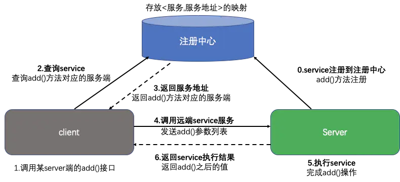

  RPC调用过程

#### 2.2. gRPC与Spring Boot

这里使用SpringBoot+gRPC的形式实现RPC调用过程
 项目结构分为三部分：client、grpc、server


项目结构

##### 2.2.2 grpc

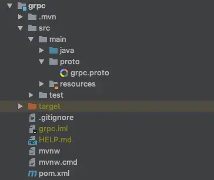


pom.xml中引入依赖：


```xml
<dependency>
      <groupId>io.grpc</groupId>
      <artifactId>grpc-all</artifactId>
       <version>1.12.0</version>
 </dependency>
```

引入bulid


```xml
<build>
        <extensions>
            <extension>
                <groupId>kr.motd.maven</groupId>
                <artifactId>os-maven-plugin</artifactId>
                <version>1.4.1.Final</version>
            </extension>
        </extensions>
        <plugins>
            <plugin>
                <groupId>org.xolstice.maven.plugins</groupId>
                <artifactId>protobuf-maven-plugin</artifactId>
                <version>0.5.0</version>
                <configuration>
                    <pluginId>grpc-java</pluginId>
                    <protocArtifact>com.google.protobuf:protoc:3.0.2:exe:${os.detected.classifier}</protocArtifact>
                    <pluginArtifact>io.grpc:protoc-gen-grpc-java:1.2.0:exe:${os.detected.classifier}</pluginArtifact>
                </configuration>
                <executions>
                    <execution>
                        <goals>
                            <goal>compile</goal>
                            <goal>compile-custom</goal>
                        </goals>
                    </execution>
                </executions>
            </plugin>
        </plugins>
    </build>
```

创建.proto文件


```cpp
syntax = "proto3";   // 语法版本

// stub选项
option java_package = "com.shgx.grpc.api";
option java_outer_classname = "RPCDateServiceApi";
option java_multiple_files = true;

// 定义包名
package com.shgx.grpc.api;

// 服务接口定义，服务端和客户端都要遵守该接口进行通信
service RPCDateService {
    rpc getDate (RPCDateRequest) returns (RPCDateResponse) {}
}

// 定义消息（请求）
message RPCDateRequest {
    string userName = 1;
}

// 定义消息（响应）
message RPCDateResponse {
    string serverDate = 1;
}
```

mvn complie


生成代码：


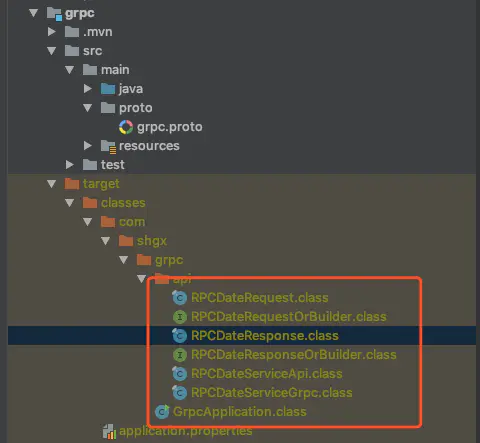

##### 2.2.3 client

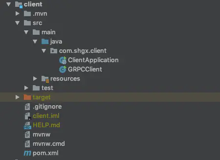


根据gRPC中的项目配置在client和server两个Module的pom.xml添加依赖


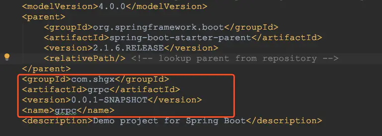


```xml
        <dependency>
            <groupId>com.shgx</groupId>
            <artifactId>grpc</artifactId>
            <version>0.0.1-SNAPSHOT</version>
            <scope>compile</scope>
        </dependency>
```

编写GRPCClient


```java
public class GRPCClient {
    private static final String host = "localhost";
    private static final int serverPort = 9999;

    public static void main( String[] args ) throws Exception {
        ManagedChannel managedChannel = ManagedChannelBuilder.forAddress( host, serverPort ).usePlaintext().build();
        try {
            RPCDateServiceGrpc.RPCDateServiceBlockingStub rpcDateService = RPCDateServiceGrpc.newBlockingStub( managedChannel );
            RPCDateRequest rpcDateRequest = RPCDateRequest
                    .newBuilder()
                    .setUserName("shgx")
                    .build();
            RPCDateResponse rpcDateResponse = rpcDateService.getDate( rpcDateRequest );
            System.out.println( rpcDateResponse.getServerDate() );
        } finally {
            managedChannel.shutdown();
        }
    }
}
```

##### 2.2.4 server

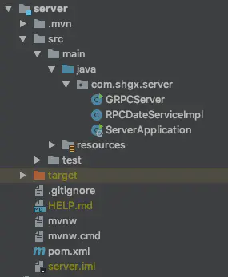


按照2.2.3 client的方式添加依赖
 创建RPCDateServiceImpl


```java
public class RPCDateServiceImpl extends RPCDateServiceGrpc.RPCDateServiceImplBase{
    @Override
    public void getDate(RPCDateRequest request, StreamObserver<RPCDateResponse> responseObserver) {
        RPCDateResponse rpcDateResponse = null;
        Date now=new Date();
        SimpleDateFormat simpleDateFormat = new SimpleDateFormat("今天是"+"yyyy年MM月dd日 E kk点mm分");
        String nowTime = simpleDateFormat.format( now );
        try {
            rpcDateResponse = RPCDateResponse
                    .newBuilder()
                    .setServerDate( "Welcome " + request.getUserName()  + ", " + nowTime )
                    .build();
        } catch (Exception e) {
            responseObserver.onError(e);
        } finally {
            responseObserver.onNext( rpcDateResponse );
        }
        responseObserver.onCompleted();
    }
}
```

创建GRPCServer


```java
public class GRPCServer {
   private static final int port = 9999;
   public static void main( String[] args ) throws Exception {
       Server server = ServerBuilder.
               forPort(port)
               .addService( new RPCDateServiceImpl() )
               .build().start();
       System.out.println( "grpc服务端启动成功, 端口=" + port );
       server.awaitTermination();
   }
}
```

#### 2.3. 完整源码

[源码参考](https://links.jianshu.com/go?to=https%3A%2F%2Fgithub.com%2Fguangxush%2FSpringBoot_GRPC)

### 3. 参考文章

- [gRPC - Spring Boot 示例](https://www.jianshu.com/p/80f7929199fd)
- [RPC框架解释](https://links.jianshu.com/go?to=https%3A%2F%2Fwww.zhihu.com%2Fquestion%2F25536695)
- [什么是RPC](https://www.jianshu.com/p/eb66b0c4113d)

