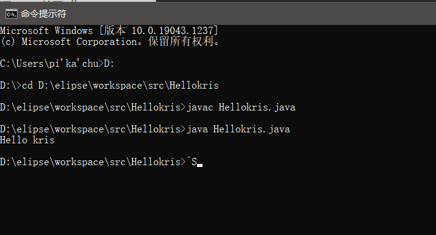
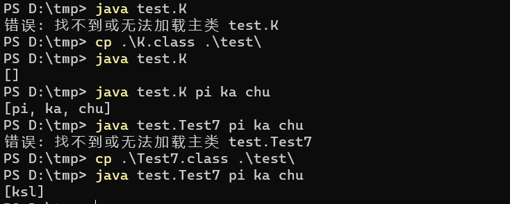
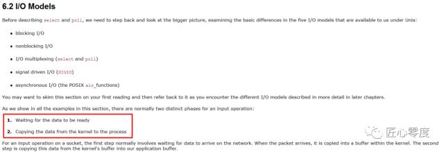
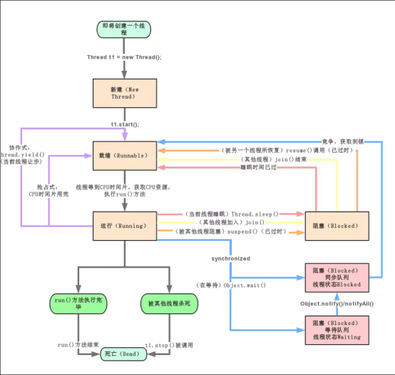

# JAVA

## java开发环境配置

### DOS命令

看到了**DOS**窗口，那就让我这个菜鸟介绍几个使用的**DOS**操作吧。

DOS命令操作

1.快捷键：**windows+R**  呼出**DOS**窗口。

2.输入**cmd**(大小写不用区分)回车，打开**DOS**窗口。

常见的命令（基本都不区分大小写）

1.切换盘符：  盘符（就是电脑的C,D,E..盘） ： （如 ：  **D :**  )

2.查看文件或者文件夹：  **dir**

3.进入某个文件夹：   **cd** 文件夹名

4.返回上一级目录：   **cd..**

5.清屏：  **cls**

6.删除某个文件：  **del**  文件名

7.删除某个文件夹： **rd** 文件夹名

8.退出**DOS**窗口： **exit**

例如：



### cmd命令编译运行.java文件

#### 编译

*K.java文件在D:\tmp目录*

```java
package test;

import java.util.Arrays;

/**
 * Desc:
 *
 * @author pikachu
 * @date: 2022/8/31 19:56
 */
public class K {
    public static void main(String[] args) {
        System.out.println(Arrays.toString(args));
    }
}

class Test7 {
    public static void main(String[] args) {
        K.main(new String[]{"ksl"});
    }
}
```


编译生成2个class文件：K.class和 Test7.class


#### 运行

*运行时要指定主类，即要运行的 main方法所在类的全类名，执行命令时，class文件要处于与包相应的目录结构下(如：类K的全限定名为test.K,那么K.class文件应在 /test/K.class),执行命令时应与顶级包名同目录，即 /tmp目录。同时向main方法传参*




## java基础语法

### java的八种基本类型

boolean  布尔型  1个字节 8bit（8位）

byte   字节类型  1个字节

char   字符类型  2个字节

short   短整型   2个字节

int     整型    4个字节

float   浮点型（单精度）4个字节

long   长整型   8个字节

double  双精度类型 8个字节

Java中默认的整数类型是int，如果要定义为long ，则要在数值后加上L或者l

默认的浮点型是双精度浮点，如果要定义float，则要在数值后面加上f或者F

一个字节等于8位，1个字节等于256个数。2^8

一个英文字母或者阿拉伯数字占一个字节

一个汉字占2个字节

### java标识符

标识符可以用来标识变量名、类名、类中的方法名和文件名等。

**命名规则：**

- (1) 由字母、数字、下划线、$组成，不能以数字开头。
- (2) 大小写敏感。
- (3) 不得使用java中的关键字和保留字。

关键字：都是小写的，jdk1.2多了strictfp(经准浮点型)，关键字 jdk1.4多了assert(断言)关键字，jdk1.5多了enum(枚举) 关键字。

true、false、null 严格说不应该算关键字，应称其为保留字更合适。

**习惯：**

- (1) 标识符要符合语义信息。
- (2) 包名所有字母小写。
- (3) 类名每个单词首字母大写，其它小写，如：TarenaStudent。
- (4) 变量和方法：第一个单词小写，从第二个单词开始首字母大写，如：tarenaStudent。
- (5) 常量：所有字母大写，每个单词之间用 _ 连接。

**常用的转义字符：**

```java
"\b" (退格)
"\f" (换页)
"\n" (换行)
"\r" (回车)
"\t" (水平制表符(到下一个tab位置))
"\' " (单引号)
"\" " (双引号) 
"\\" (反斜杠)
```


###  **java关键字**


下面列出了 Java 关键字。这些保留字不能用于常量、变量、和任何标识符的名称。

| 类别                 | 关键字       | 说明                           |
| -------------------- | ------------ | ------------------------------ |
| 访问控制             | private      | 私有的                         |
|                      | protected    | 受保护的                       |
|                      | public       | 公共的                         |
|                      | default      | 默认                           |
| 类、方法和变量修饰符 | abstact      | 声明抽象                       |
|                      | class        | 类                             |
|                      | extends      | 扩充,继承                      |
|                      | final        | 最终值,不可改变的              |
|                      | implements   | 实现（接口）                   |
|                      | interface    | 接口                           |
|                      | native       | 本地，原生方法（非 Java 实现） |
|                      | new          | 新,创建                        |
|                      | static       | 静态                           |
|                      | strictfp     | 严格,精准                      |
|                      | synchronized | 线程,同步                      |
|                      | transient    | 短暂                           |
|                      | volatile     | 易失                           |
| 程序控制语句         | break        | 跳出循环                       |
|                      | case         | 定义一个值以供 switch 选择     |
|                      | continue     | 继续                           |
|                      | default      | 默认                           |
|                      | do           | 运行                           |
|                      | else         | 否则                           |
|                      | for          | 循环                           |
|                      | if           | 如果                           |
|                      | instanceof   | 实例                           |
|                      | return       | 返回                           |
|                      | switch       | 根据值选择执行                 |
|                      | while        | 循环                           |
| 错误处理             | assert       | 断言表达式是否为真             |
|                      | catch        | 捕捉异常                       |
|                      | finally      | 有没有异常都执行               |
|                      | throw        | 抛出一个异常对象               |
|                      | throws       | 声明一个异常可能被抛出         |
|                      | try          | 捕获异常                       |
| 包相关               | import       | 引入                           |
|                      | package      | 包                             |
| 基本类型             | boolean      | 布尔型                         |
|                      | byte         | 字节型                         |
|                      | char         | 字符型                         |
|                      | double       | 双精度浮点                     |
|                      | float        | 单精度浮点                     |
|                      | int          | 整型                           |
|                      | long         | 长整型                         |
|                      | short        | 短整型                         |
| 变量引用             | super        | 父类，超类                     |
|                      | this         | 本类                           |
|                      | void         | 无返回值                       |
| 保留关键字           | goto         | 是关键字，单不能引用           |
|                      | const        | 是关键字，但不能使用           |
|                      | null         | 空                             |

####　transient关键字

> 　transient关键字是开发中用的比较少的一个关键字，它在序列化和反序列化中比较重要，通常面试时会考察它的作用和它的使用场景，还有它在什么情况下会失效。

##### 　transient 的作用

作为Java基础知识的一个点，transient的作用大家都知道是用来防止属性被序列化。因此它出现的场景都会同时有 Serializable 接口。 它的使用场景比较容易理解，比方当我们在序列化并以本地文件或其他持久化数据形式存储用户资料时，像用户的密码这样的字段我们是不希望存储的，这样的字段就需要用 transient 来修饰了。 比如下面的代码

```javascript
import java.io.Serializable;

public class UserBean implements Serializable {
  private String name;
  private transient String password;

  public String getName(){
    return name;
  }

  public String getPassword(){
    return password;
  }

  public void setName(String name) {
    this.name = name;
  }

  public void setPassword(String password){
    this.password = password;
  }

  public String toString() {
    return "name: " + this.name + " psw: " + this.password;
  }
}
```

复制

我们定义了个UserBean类，然后再用另外一个类来持久化用户数据，观察在序列化和反序列化的过程中数据发生了什么变化。下面是主代码

```javascript
import java.io.FileOutputStream;
import java.io.ObjectOutputStream;
import java.io.FileInputStream;
import java.io.ObjectInputStream;

public class TransientDemo {

  public static void main(String[] args) {

    UserBean user = new UserBean();
    user.setName("Jackson");
    user.setPassword("password123");

    System.out.println("User: " + user.toString());

    //begin serializing
    try {
      ObjectOutputStream fos = new ObjectOutputStream(new FileOutputStream("bean.txt"));
      fos.writeObject(user);
      fos.flush();
      fos.close();
      System.out.println("local serialized done");
    } catch (Exception e) {}

    System.out.println("de-serialzing...");
     try {
       ObjectInputStream fis = new ObjectInputStream(new FileInputStream("bean.txt"));
       user = (UserBean) fis.readObject();
       fis.close();
       System.out.println("User de-serialzed: " + user.toString());
     } catch(Exception e){}
  }
}
```

复制

输出

> User: name: Jackson psw: password123 local serialized done de-serialzing… User de-serialzed: name: Jackson `psw: null`

对比 name和password字段，被 transient修饰的密码字段在序列化后就没有被持久化了。

##### **transient的局限**

transient能作用的场景只能是和 Serializable接口搭配使用，而另外一个序列化接口， Externalizable却不能对它起效。 仔细思考就明白原因，Serializable是JVM自动进行序列化的，而 Externalizable需要我们通过 readExternal和 writeExternal 两个方法自己定义序列化和反序列化的实现方式，因此即使被 transient修饰也和能否被序列化无关。

局限二， 被 static修饰的变量也不能被序列化，与是否被 transient修饰无关。 如何理解这句话呢。可以把demo中的 name改成 static来尝试下，

```javascript
public class UserBean implements Serializable {
  private static String name;
  private transient String password;
```

复制

```javascript
public class TransientDemo {

  public static void main(String[] args) {

    UserBean user = new UserBean();
    user.setName("Jackson");
    user.setPassword("password123");

    System.out.println("User: " + user.toString());

    //begin serializing
    try {
      ObjectOutputStream fos = new ObjectOutputStream(new FileOutputStream("bean.txt"));
      fos.writeObject(user);
      fos.flush();
      fos.close();
      System.out.println("local serialized done");
    } catch (Exception e) {}

    System.out.println("de-serialzing...");
     try {
       UserBean.name = "John Doe";
       ObjectInputStream fis = new ObjectInputStream(new FileInputStream("bean.txt"));
       user = (UserBean) fis.readObject();
       fis.close();
       System.out.println("User de-serialzed: " + user.toString());
     } catch(Exception e){}
  }
}
```

复制

输出

> User: name: Jackson psw: password123 local serialized done de-serialzing… User de-serialzed: name: `John Doe` psw: null

可以看出，即使被反序列化，static变量并没有拿到序列化时的值，因为 static变量的值是保存在JVM堆中，并不会受到序列化的影响。这个是容易被忽略的坑，需要留意一下。

#### volatile 关键字

##### volatile 的作用

大家都应该知道 volatile 的主要作用有两点： - 保证变量的内存可见性 - 禁止指令重排序

那么，什么是内存可见性，什么是指令重排序，以及它们涉及了那些机制呢？下面就让我们来看看吧。

在这里提醒一下，各位小伙伴要有个心理准备，就一个 volatile 关键字所涉及的知识点超乎你的想象哟。

##### 可见性问题

在理解 volatile 的内存可见性前，我们先来看看这个比较常见的多线程访问共享变量的例子。

```java
/**
 * 变量的内存可见性例子
 *
 * @author star
 */
public class VolatileExample {

    /**
     * main 方法作为一个主线程
     */
    public static void main(String[] args) {
        MyThread myThread = new MyThread();
        // 开启线程
        myThread.start();

        // 主线程执行
        for (; ; ) {
            if (myThread.isFlag()) {
                System.out.println("主线程访问到 flag 变量");
            }
        }
    }

}

/**
 * 子线程类
 */
class MyThread extends Thread {

    private boolean flag = false;

    @Override
    public void run() {
        try {
            Thread.sleep(1000);
        } catch (InterruptedException e) {
            e.printStackTrace();
        }
        // 修改变量值
        flag = true;
        System.out.println("flag = " + flag);
    }

    public boolean isFlag() {
        return flag;
    }

    public void setFlag(boolean flag) {
        this.flag = flag;
    }
}
```

执行上面的程序，你会发现，控制台永远都不会输出 **“主线程访问到 flag 变量”** 这句话。我们可以看到，子线程执行时已经将 flag 设置成 true，但主线程执行时没有读到 flag 的最新值，导致控制台没有输出上面的句子。

那么，我们思考一下为什么会出现这种情况呢？这里我们就要了解一下 Java 内存模型（简称 JMM）。

**Java 内存模型**

JMM（Java Memory Model）：Java 内存模型，是 Java 虚拟机规范中所定义的一种内存模型，Java 内存模型是标准化的，屏蔽掉了底层不同计算机的区别。也就是说，JMM 是 JVM 中定义的一种并发编程的底层模型机制。

JMM 定义了线程和主内存之间的抽象关系：线程之间的共享变量存储在主内存中，每个线程都有一个私有的本地内存，本地内存中存储了该线程以读/写共享变量的副本。

JMM 的规定：
\- 所有的共享变量都存储于主内存。这里所说的变量指的是实例变量和类变量，不包含局部变量，因为局部变量是线程私有的，因此不存在竞争问题。

- 每一个线程还存在自己的工作内存，线程的工作内存，保留了被线程使用的变量的工作副本。
- 线程对变量的所有的操作（读，取）都必须在工作内存中完成，而不能直接读写主内存中的变量。
- 不同线程之间也不能直接访问对方工作内存中的变量，线程间变量的值的传递需要通过主内存中转来完成。

JMM 的抽象示意图：


然而，JMM 这样的规定可能会导致线程对共享变量的修改没有即时更新到主内存，或者线程没能够即时将共享变量的最新值同步到工作内存中，从而使得线程在使用共享变量的值时，该值并不是最新的。

**正因为 JMM 这样的机制，就出现了可见性问题。也就是我们上面那个例子出现的问题**。

那我们要如何解决可见性问题呢？接下来我们就聊聊内存可见性以及可见性问题的解决方案。

##### 内存可见性

内存可见性是指当一个线程修改了某个变量的值，其它线程总是能知道这个变量变化。也就是说，如果线程 A 修改了共享变量 V 的值，那么线程 B 在使用 V 的值时，能立即读到 V 的最新值。

##### 可见性问题的解决方案

我们如何保证多线程下共享变量的可见性呢？也就是当一个线程修改了某个值后，对其他线程是可见的。

这里有两种方案：**加锁** 和 **使用 volatile 关键字**。

下面我们使用这两个方案对上面的例子进行改造。

**加锁**

使用 synchronizer 进行加锁。

```java
/**
  * main 方法作为一个主线程
  */
  public static void main(String[] args) {
      MyThread myThread = new MyThread();
      // 开启线程
      myThread.start();

      // 主线程执行
      for (; ; ) {
          synchronized (myThread) {
              if (myThread.isFlag()) {
                  System.out.println("主线程访问到 flag 变量");
                }
          }
      }
  }
```

**这里大家应该有个疑问是，为什么加锁后就保证了变量的内存可见性了？** 因为当一个线程进入 synchronizer 代码块后，线程获取到锁，会清空本地内存，然后从主内存中拷贝共享变量的最新值到本地内存作为副本，执行代码，又将修改后的副本值刷新到主内存中，最后线程释放锁。

这里除了 synchronizer 外，其它锁也能保证变量的内存可见性。

**使用 volatile 关键字**

使用 volatile 关键字修饰共享变量。

```java
/**
 * 子线程类
 */
class MyThread extends Thread {

    private volatile boolean flag = false;

    @Override
    public void run() {
        try {
            Thread.sleep(1000);
        } catch (InterruptedException e) {
            e.printStackTrace();
        }
        // 修改变量值
        flag = true;
        System.out.println("flag = " + flag);
    }

    public boolean isFlag() {
        return flag;
    }

    public void setFlag(boolean flag) {
        this.flag = flag;
    }
}
```

使用 volatile 修饰共享变量后，每个线程要操作变量时会从主内存中将变量拷贝到本地内存作为副本，当线程操作变量副本并写回主内存后，会通过 **CPU 总线嗅探机制**告知其他线程该变量副本已经失效，需要重新从主内存中读取。

volatile 保证了不同线程对共享变量操作的可见性，也就是说一个线程修改了 volatile 修饰的变量，当修改后的变量写回主内存时，其他线程能立即看到最新值。

接下来我们就聊聊一个比较底层的知识点：`总线嗅探机制`。

**总线嗅探机制**

在现代计算机中，CPU 的速度是极高的，如果 CPU 需要存取数据时都直接与内存打交道，在存取过程中，CPU 将一直空闲，这是一种极大的浪费，所以，为了提高处理速度，CPU 不直接和内存进行通信，而是在 CPU 与内存之间加入很多寄存器，多级缓存，它们比内存的存取速度高得多，这样就解决了 CPU 运算速度和内存读取速度不一致问题。

由于 CPU 与内存之间加入了缓存，在进行数据操作时，先将数据从内存拷贝到缓存中，CPU 直接操作的是缓存中的数据。但在多处理器下，将可能导致各自的缓存数据不一致（这也是可见性问题的由来），为了保证各个处理器的缓存是一致的，就会实现缓存一致性协议，而**嗅探是实现缓存一致性的常见机制**。


> 注意，缓存的一致性问题，不是多处理器导致，而是多缓存导致的。

**嗅探机制工作原理**：每个处理器通过监听在总线上传播的数据来检查自己的缓存值是不是过期了，如果处理器发现自己缓存行对应的内存地址修改，就会将当前处理器的缓存行设置无效状态，当处理器对这个数据进行修改操作的时候，会重新从主内存中把数据读到处理器缓存中。

> 注意：基于 CPU 缓存一致性协议，JVM 实现了 volatile 的可见性，但由于总线嗅探机制，会不断的监听总线，如果大量使用 volatile 会引起总线风暴。所以，volatile 的使用要适合具体场景。

**可见性问题小结**

上面的例子中，我们看到，使用 volatile 和 synchronized 锁都可以保证共享变量的可见性。相比 synchronized 而言，volatile 可以看作是一个轻量级锁，所以使用 volatile 的成本更低，因为它不会引起线程上下文的切换和调度。但 volatile 无法像 synchronized 一样保证操作的原子性。

下面我们来聊聊 volatile 的原子性问题。

##### volatile 的原子性问题

所谓的原子性是指在一次操作或者多次操作中，要么所有的操作全部都得到了执行并且不会受到任何因素的干扰而中断，要么所有的操作都不执行。

在多线程环境下，volatile 关键字可以保证共享数据的可见性，但是并不能保证对数据操作的原子性。也就是说，多线程环境下，使用 volatile 修饰的变量是**线程不安全的**。

要解决这个问题，我们可以使用锁机制，或者使用原子类（如 AtomicInteger）。

这里特别说一下，对任意单个使用 volatile 修饰的变量的读 / 写是具有原子性，但类似于 `flag = !flag` 这种复合操作不具有原子性。简单地说就是，**单纯的赋值操作是原子性的**。

##### 禁止指令重排序

**什么是重排序？**

为了提高性能，在遵守 `as-if-serial` 语义（即不管怎么重排序，单线程下程序的执行结果不能被改变。编译器，runtime 和处理器都必须遵守。）的情况下，编译器和处理器常常会对指令做重排序。

一般重排序可以分为如下三种类型：

- 编译器优化重排序。编译器在不改变单线程程序语义的前提下，可以重新安排语句的执行顺序。
- 指令级并行重排序。现代处理器采用了指令级并行技术来将多条指令重叠执行。如果不存在数据依赖性，处理器可以改变语句对应机器指令的执行顺序。
- 内存系统重排序。由于处理器使用缓存和读 / 写缓冲区，这使得加载和存储操作看上去可能是在乱序执行。

> 数据依赖性：如果两个操作访问同一个变量，且这两个操作中有一个为写操作，此时这两个操作之间就存在数据依赖性。这里所说的数据依赖性仅针对单个处理器中执行的指令序列和单个线程中执行的操作，不同处理器之间和不同线程之间的数据依赖性不被编译器和处理器考虑。

从 Java 源代码到最终执行的指令序列，会分别经历下面三种重排序：


为了更好地理解重排序，请看下面的部分示例代码：

```java
int a = 0;
// 线程 A
a = 1;           // 1
flag = true;     // 2

// 线程 B
if (flag) { // 3
  int i = a; // 4
}
```

单看上面的程序好像没有问题，最后 i 的值是 1。但是为了提高性能，编译器和处理器常常会在不改变数据依赖的情况下对指令做重排序。假设线程 A 在执行时被重排序成先执行代码 2，再执行代码 1；而线程 B 在线程 A 执行完代码 2 后，读取了 flag 变量。由于条件判断为真，线程 B 将读取变量 a。此时，变量 a 还根本没有被线程 A 写入，那么 i 最后的值是 0，导致执行结果不正确。那么如何程序执行结果正确呢？这里仍然可以使用 volatile 关键字。

这个例子中， 使用 volatile 不仅保证了变量的内存可见性，还禁止了指令的重排序，即保证了 volatile 修饰的变量编译后的顺序与程序的执行顺序一样。那么使用 volatile 修饰 flag 变量后，在线程 A 中，保证了代码 1 的执行顺序一定在代码 2 之前。

那么，让我们继续往下探索， volatile 是如何禁止指令重排序的呢？这里我们将引出一个概念：`内存屏障指令`

**内存屏障指令**

为了实现 volatile 内存语义（即内存可见性），JMM 会限制特定类型的编译器和处理器重排序。为此，JMM 针对编译器制定了 volatile 重排序规则表，如下所示：


使用 volatile 修饰变量时，根据 volatile 重排序规则表，Java 编译器在生成字节码时，会在指令序列中插入内存屏障指令来禁止特定类型的处理器重排序。

`内存屏障`是一组处理器指令，它的作用是禁止指令重排序和解决内存可见性的问题。

JMM 把内存屏障指令分为下列四类：


> StoreLoad 屏障是一个全能型的屏障，它同时具有其他三个屏障的效果。所以执行该屏障开销会很大，因为它使处理器要把缓存中的数据全部刷新到内存中。

下面我们来看看 volatile 读 / 写时是如何插入内存屏障的，见下图：


从上图，我们可以知道 volatile 读 / 写插入内存屏障规则：

- 在每个 volatile 读操作的后面插入 LoadLoad 屏障和 LoadStore 屏障。
- 在每个 volatile 写操作的前后分别插入一个 StoreStore 屏障和一个 StoreLoad 屏障。

也就是说，编译器不会对 volatile 读与 volatile 读后面的任意内存操作重排序；编译器不会对 volatile 写与 volatile 写前面的任意内存操作重排序。

##### happens-before 概述

上面我们讲述了重排序原则，为了提高处理速度， JVM 会对代码进行编译优化，也就是指令重排序优化，但是并发编程下指令重排序也会带来一些安全隐患：如**指令重排序导致的多个线程操作之间的不可见性**。为了理解 JMM 提供的内存可见性保证，让程序员再去学习复杂的重排序规则以及这些规则的具体实现，那么程序员的负担就太重了，严重影响了并发编程的效率。

所以从 JDK5 开始，提出了 happens-before 的概念，通过这个概念来阐述操作之间的内存可见性。如果一个操作执行的结果需要对另一个操作可见，那么这两个操作之间必须存在 happens-before 关系。这里提到的两个操作既可以是在一个线程之内，也可以是在不同线程之间。

happens-before 规则如下：

- 程序顺序规则：一个线程中的每个操作，happens-before 于该线程中的任意后续操作。
- 监视器锁规则：对一个监视器锁的解锁，happens-before 于随后对这个监视器锁的加锁。
- volatile 变量规则：对一个 volatile 域的写，happens-before 于任意后续对这个 volatile 域的读。
- 传递性：如果 A happens-before B，且 B happens-before C，那么 A happens-before C。
- start() 规则：Thread.start() 的调用会 happens-before 于启动线程里面的动作。
- join() 规则：Thread 中的所有动作都 happens-before 于其他线程从 Thread.join() 中成功返回。

这里特别说明一下，happens-before 规则不是描述实际操作的先后顺序，它是用来描述可见性的一种规则。

从 happens-before 的 volatile 变量规则可知，如果线程 A 写入了 volatile 修饰的变量 V，接着线程 B 读取了变量 V，那么，线程 A 写入变量 V 及之前的写操作都对线程 B 可见。

##### volatile 在单例模式中的应用

单例模式有 8 种，而懒汉式单例双重检测模式中就使用到了 volatile 关键字。

代码如下：

```java
public class Singleton {
    // volatile 保证可见性和禁止指令重排序
    private static volatile Singleton singleton;

    public static Singleton getInstance() {
        // 第一次检查
        if (singleton == null) {
          // 同步代码块
          synchronized(this.getClass()) {
              // 第二次检查
              if (singleton == null) {
                    // 对象的实例化是一个非原子性操作
                    singleton = new Singleton();
                }
            }
        }
        return singleton;
    }
}
```

上面代码中， `new Singleton()` 是一个非原子性操作，对象实例化分为三步操作：（1）分配内存空间，（2）初始化实例，（3）返回内存地址给引用。所以，在使用构造器创建对象时，编译器可能会进行指令重排序。假设线程 A 在执行创建对象时，（2）和（3）进行了重排序，如果线程 B 在线程 A 执行（3）时拿到了引用地址，并在第一个检查中判断 singleton != null 了，但此时线程 B 拿到的不是一个完整的对象，在使用对象进行操作时就会出现问题。

所以，这里使用 volatile 修饰 singleton 变量，就是为了禁止在实例化对象时进行指令重排序。

##### 总结

- volatile 修饰符适用于以下场景：某个属性被多个线程共享，其中有一个线程修改了此属性，其他线程可以立即得到修改后的值；或者作为状态变量，如 flag = ture，实现轻量级同步。
- volatile 属性的读写操作都是无锁的，它不能替代 synchronized，因为它没有提供原子性和互斥性。因为无锁，不需要花费时间在获取锁和释放锁上，所以说它是低成本的。
- volatile 只能作用于属性，我们用 volatile 修饰属性，这样编译器就不会对这个属性做指令重排序。
- volatile 提供了可见性，任何一个线程对其的修改将立马对其他线程可见。
- volatile 提供了 happens-before 保证，对 volatile 变量 V 的写入 happens-before 所有其他线程后续对 V 的读操作。
- volatile 可以使纯赋值操作是原子的，如 `boolean flag = true; falg = false`。
- volatile 可以在单例双重检查中实现可见性和禁止指令重排序，从而保证安全性。


#### static 关键字

##### static特别用法【静态导包】——Java包的静态导入

静态导包就是java包的静态导入，用import static代替import静态导入包是JDK1.5中的新特性。

一般我们导入一个类都用 import com…..ClassName;而静态导入是这样：import static com…..ClassName.*;这里的多了个static，还有就是类名ClassName后面多了个.* ，意思是导入这个类里的静态方法。当然，也可以只导入某个静态方法，只要把 .* 换成静态方法名就行了。然后在这个类中，就可以直接用方法名调用静态方法，而不必用ClassName.方法名 的方式来调用。

好处：这种方法的好处就是可以简化一些操作，例如打印操作System.out.println(…);就可以将其写入一个静态方

法print(…)，在使用时直接print(…)就可以了。但是这种方法建议在有很多重复调用的时候使用，如果仅有一到两次调用，不如直接写来的方便

example:
在Java 5中，import语句得到了增强，以便提供甚至更加强大的减少击键次数功能，虽然一些人争议说这是以可读性为代价的。这种新的特性成为静态导入。当你想使用[static](https://so.csdn.net/so/search?q=static&spm=1001.2101.3001.7020)成员时，可以使用静态导入（在API中的类和你自己的类上，都可以使用该特性）。下面是静态导入前后的代码实例：


在静态导入之前：

```java
public class TestStatic {

public static void main(String[] args) {

System.out.println(Integer.MAX_VALUE);

System.out.println(Integer.toHexString(42));

}
}
```


在静态导入之后：

```java
import static java.lang.System.out;

import static java.lang.Integer.*;


public class TestStaticImport {

public static void main(String[] args) {

out.println(MAX_VALUE);

out.println(toHexString(42));

}
}
```


两个类都产生相同的输出：
2147483647

2a

让我们看一下使用静态导入特性的代码中将发生什么：
1、虽然该特性通常称为“静态导入”，但语法必须是import static，后面跟你想导入的static成员的完全限

定名称，或者通配符。在本例中，我们在System类的out对象上进行静态导入。

2、在本例中，我们可能想使用java.lang.Integer类的几个static成员。该静态导入语句使用通配符来表达“

我想在此类中的所有静态成员上进行静态导入”。

3、现在我们终于看到静态导入特性的好处！我们不必在System.out.println中键入System。太好了！另外，

我们不必在Integer.MAX_VALUE中键入Integer。因此，在这行代码中，我们能够将快捷方式用于静态方法和一

个常量。

4、最后，我们进行更多的快捷操作，这次针对Integer类的方法。

关于该特性，我们已经有点儿讽刺意味儿了，但不仅我们是这样的。我们不认为节省少量的击键次数会让代码

难于阅读一点，但许多开发人员要求将它添加到语言中。

下面是使用静态导入的几条原则：

你必须说import static， 不能说static import。

提防含糊不清的命名static成员。例如，如果你对Integer类和Long类执行了静态导入，引用MAX_VALUE将导致

一个编译器错误，因为Integer和Long都有一个MAX_VALUE常量，并且Java不会知道你在引用哪个MAX_VALUE。

你可以在static对象引用、常量（记住，它们是static 或final）和static方法上进行静态导入。


## Java 对象和类

### 变量类型

局部变量：在方法、构造方法或者语句块中定义的变量被称为局部变量。变量声明和初始化都是在方法中，方法结束后，变量就会自动销毁。
成员变量：成员变量是定义在类中，方法体之外的变量。这种变量在创建对象的时候实例化。成员变量可以被类中方法、构造方法和特定类的语句块访问。
类变量：类变量也声明在类中，方法体之外，但**必须声明为 static 类型**。

### 源文件的声明规则

- ​		一个源文件中只能有一个 public 类

- ​		一个源文件可以有多个非 public 类

- ​		源文件的名称应该和 public 类的类名保持一致。例如：源文件中 public 类的类名是 Employee，那么源文件应该命名为Employee.java。

- ​		如果一个类定义在某个包中，那么 package 语句应该在源文件的首行。

- ​		如果源文件包含 import 语句，那么应该放在 package 语句和类定义之间。如果没有 package 语句，那么 import 语句应该在源文件中最前面。

- ​		import 语句和 package 语句对源文件中定义的所有类都有效。在同一源文件中，不能给不同的类不同的包声明。

  

  

  

  

## java方法

### 构造器

#### 形式

1. 与类同名；
2. 没有返回类型和返回值；
3. 可以有、无参数；
4. 构造器代码（构造器体）同成员方法体，
   需要用一对“{}”括起来;
5. 构造器也在类体中声明，位置和其他域成员或方法成员相同，没有语法上的限制；

#### 使用

1. 一种特殊方法，不能被直接调用；
2. 只能在创建对象癿时候被JVM自动调用（比如使用new运算创建类实例时）；
3. 在new运算符后跟构造方法调用，有参数需要提供实参、无参数直接使用一对“()”，比如new Clzname()或者 new Clzname(实参列表)

#### 默认构造器

如果一个类没有定义任何构造器，那么Java编译器会给返个类自动
添加一个默任构造器，默讣构造器无参无代码。

#### 构造方法

构造方法也能重载，即签名不一样的多个构造器就是构造器重载。重载构造器之间通过this关键字实现构造器的调用。

```java
class Person { //第一个类
	 private String name;
	 private int age = 20;
	 Person(){} // 无参构造器
	 
	 Person(String name) {
	 this.name = name;
	 System.out.println(name + "@" + age);
	 System.out.println("这里调用：单参构造器");
	 }
	 
	 Person(String name, int age) {
		 this(name); 
		 this.age = age;
		 System.out.println(name + "@" + age);
		 System.out.println("这里调用：双参构造器");
		 }
}
public class ThisCallTest {

	public static void main(String[] args) {
		 Person p = new Person("小明", 18);
	 } 
}
/*输出：
小明@20
这里调用：单参构造器
小明@18
这里调用：双参构造器
*/
```

#### 构造器和对象的初始化

(1)静态域声明时的初始化赋值和静态初始化器会按声明顺序移到一个静态块中进行编译。其中，静态块是以语句块的形式并入目标静态块中的。
(2)实例域声明时的初始化赋值和实例初始化器会按声明顺序移到每一个不含构造器this()调用的构造器中，具体位置是： 

●在基类构造器调用super()之后，构造器体语句之前（注意，程序员编写的每一个类，如果其构造器中没有this()调用，那构造器的第一条语句隐含就是super()调用，super在编译的最后会替换成具体的直接父类的名称）。

●其中，构造块是以语句块的形式幵入目标构造器中的。


## 继承、接口和多态

### 继承

Java中继承仅支持单继承，不支持多继承。

子类不能继承超类的构造方法。

子类叧能继承超类中所有非私有的成员（域和方法）。

#### 方法的重写

要重写一个方法，需要在子类中使用和超类相同的方法名不形参列表（即方法签名要相同）以及相同的返回类型来对该方法进行定义. 

在子类中如果直接使用方法名方式调用被重写方法时，总是调用子类中的
该方法，不会去调用父类的同名方法.

注意：

子类重写的方法的访问控制权限不能低于超类方法的。

重载与重写：重写叧能出现在继承中。而重载在一个类和继承类中都能出现。重写的方法签名必项一致，如果超类和子类中两个方法名相同但签名不同，那么就属于方法重载

#### 类的初始化


#### 子类对象的初始化


#### super关键字


#### 多态

编译和执行：

编译阶段看声明类型示例，不能访问声明类型中没有的成员；

编译阶段看声明类型示例， 不·能访问声明类型中没有的成员


多态仅针对实例方法，静态方法、成员发量（静态和实例）都按声明类型绑定


## 基本数据类型

### String

### JAVA 一个或多个空格分割字符串

知识补充
String的split方法支持正则表达式；

正则表达式\s表示匹配任何空白字符，+表示匹配一次或多次。

有了以上补充知识，下面的内容就很好理解了。

一、待分割字符串
待分割字符串为如下：

String str = "a  b     c  d e f      g"

其中，字符串中的的空白分别为：单个空格，多个空格，tab制表符。

二、使用一个或多个空格分割字符串
正确代码如下：

```java
String [] arr = str.split("\\s+");
for(String ss : arr){
    System.out.println(ss);
}
```


作为对比，错误代码如下：

```java
String [] arr2 = str.split(" ");
for(String ss : arr2){
    System.out.println(ss);
}
```


三、分割结果
使用正确代码分割结果：

```
a
b
c
d
e
f
g
```


使用错误代码分割结果：

使用错误代码分割结果：

```
a

b


c

d
e
f


g
```


## 运算符

### 算术运算符

算术运算符用在数学表达式中，它们的作用和在数学中的作用一样。下表列出了所有的算术运算符。

表格中的实例假设整数变量A的值为10，变量B的值为20：

| 操作符 | 描述                              | 例子                               |
| :----- | :-------------------------------- | :--------------------------------- |
| +      | 加法 - 相加运算符两侧的值         | A + B 等于 30                      |
| -      | 减法 - 左操作数减去右操作数       | A – B 等于 -10                     |
| *      | 乘法 - 相乘操作符两侧的值         | A * B等于200                       |
| /      | 除法 - 左操作数除以右操作数       | B / A等于2                         |
| ％     | 取余 - 左操作数除以右操作数的余数 | B%A等于0                           |
| ++     | 自增: 操作数的值增加1             | B++ 或 ++B 等于 21（区别详见下文） |
| --     | 自减: 操作数的值减少1             | B-- 或 --B 等于 19（区别详见下文） |


------

### 关系运算符

下表为Java支持的关系运算符

表格中的实例整数变量A的值为10，变量B的值为20：

| 运算符 | 描述                                                         | 例子             |
| :----- | :----------------------------------------------------------- | :--------------- |
| ==     | 检查如果两个操作数的值是否相等，如果相等则条件为真。         | （A == B）为假。 |
| !=     | 检查如果两个操作数的值是否相等，如果值不相等则条件为真。     | (A != B) 为真。  |
| >      | 检查左操作数的值是否大于右操作数的值，如果是那么条件为真。   | （A> B）为假。   |
| <      | 检查左操作数的值是否小于右操作数的值，如果是那么条件为真。   | （A <B）为真。   |
| >=     | 检查左操作数的值是否大于或等于右操作数的值，如果是那么条件为真。 | （A> = B）为假。 |
| <=     | 检查左操作数的值是否小于或等于右操作数的值，如果是那么条件为真。 | （A <= B）为真。 |


------

### 位运算符

Java定义了位运算符，应用于整数类型(int)，长整型(long)，短整型(short)，字符型(char)，和字节型(byte)等类型。

位运算符作用在所有的位上，并且按位运算。假设a = 60，b = 13;它们的二进制格式表示将如下：

```java
A = 0011 1100
B = 0000 1101
-----------------
A&B = 0000 1100
A | B = 0011 1101
A ^ B = 0011 0001
~A= 1100 0011
```

下表列出了位运算符的基本运算，假设整数变量 A 的值为 60 和变量 B 的值为 13：

| 操作符 | 描述                                                         | 例子                           |
| :----- | :----------------------------------------------------------- | :----------------------------- |
| ＆     | 如果相对应位都是1，则结果为1，否则为0                        | （A＆B），得到12，即0000 1100  |
| \|     | 如果相对应位都是 0，则结果为 0，否则为 1                     | （A \| B）得到61，即 0011 1101 |
| ^      | 如果相对应位值相同，则结果为0，否则为1                       | （A ^ B）得到49，即 0011 0001  |
| 〜     | 按位取反运算符翻转操作数的每一位，即0变成1，1变成0。         | （〜A）得到-61，即1100 0011    |
| <<     | 按位左移运算符。左操作数按位左移右操作数指定的位数。         | A << 2得到240，即 1111 0000    |
| >>     | 按位右移运算符。左操作数按位右移右操作数指定的位数。         | A >> 2得到15即 1111            |
| >>>    | 按位右移补零操作符。左操作数的值按右操作数指定的位数右移，移动得到的空位以零填充。 | A>>>2得到15即0000 1111         |

**实例**

下面的简单示例程序演示了位运算符。复制并粘贴下面的Java程序并保存为Test.java文件，然后编译并运行这个程序：

**Test.java 文件代码**：

```java
public class Test {
  public static void main(String[] args) {
     int a = 60; /* 60 = 0011 1100 */ 
     int b = 13; /* 13 = 0000 1101 */
     int c = 0;
     c = a & b;       /* 12 = 0000 1100 */
     System.out.println("a & b = " + c );
 
     c = a | b;       /* 61 = 0011 1101 */
     System.out.println("a | b = " + c );
 
     c = a ^ b;       /* 49 = 0011 0001 */
     System.out.println("a ^ b = " + c );
 
     c = ~a;          /*-61 = 1100 0011 */
     System.out.println("~a = " + c );
 
     c = a << 2;     /* 240 = 1111 0000 */
     System.out.println("a << 2 = " + c );
 
     c = a >> 2;     /* 15 = 1111 */
     System.out.println("a >> 2  = " + c );
  
     c = a >>> 2;     /* 15 = 0000 1111 */
     System.out.println("a >>> 2 = " + c );
  }
} 
```


以上实例编译运行结果如下：

```
a & b = 12
a | b = 61
a ^ b = 49
~a = -61
a << 2 = 240
a >> 2  = 15
a >>> 2 = 15
```

------

### 逻辑运算符

下表列出了逻辑运算符的基本运算，假设布尔变量A为真，变量B为假

| 操作符 | 描述                                                         | 例子                |
| :----- | :----------------------------------------------------------- | :------------------ |
| &&     | 称为逻辑与运算符。当且仅当两个操作数都为真，条件才为真。     | （A && B）为假。    |
| \| \|  | 称为逻辑或操作符。如果任何两个操作数任何一个为真，条件为真。 | （A \| \| B）为真。 |
| ！     | 称为逻辑非运算符。用来反转操作数的逻辑状态。如果条件为true，则逻辑非运算符将得到false。 | ！（A && B）为真。  |


### 短路逻辑运算符

当使用与逻辑运算符时，在两个操作数都为true时，结果才为true，但是当得到第一个操作为false时，其结果就必定是false，这时候就不会再判断第二个操作了。

```java
public class LuoJi{
    public static void main(String[] args){
        int a = 5;//定义一个变量；
        boolean b = (a<4)&&(a++<10);
        System.out.println("使用短路逻辑运算符的结果为"+b);
        System.out.println("a的结果为"+a);
    }
}
```


运行结果为：

```java
使用短路逻辑运算符的结果为false
a的结果为5
```

> **解析：** 该程序使用到了短路逻辑运算符(&&)，首先判断 a<4 的结果为 false，则 b 的结果必定是 false，所以不再执行第二个操作 a++<10 的判断，所以 a 的值为 5。

------

### 赋值运算符

下面是Java语言支持的赋值运算符：

| 操作符  | 描述                                                         | 例子                                     |
| :------ | :----------------------------------------------------------- | :--------------------------------------- |
| =       | 简单的赋值运算符，将右操作数的值赋给左侧操作数               | C = A + B将把A + B得到的值赋给C          |
| + =     | 加和赋值操作符，它把左操作数和右操作数相加赋值给左操作数     | C + = A等价于C = C + A                   |
| - =     | 减和赋值操作符，它把左操作数和右操作数相减赋值给左操作数     | C - = A等价于C = C - A                   |
| * =     | 乘和赋值操作符，它把左操作数和右操作数相乘赋值给左操作数     | C * = A等价于C = C * A                   |
| / =     | 除和赋值操作符，它把左操作数和右操作数相除赋值给左操作数     | C / = A，C 与 A 同类型时等价于 C = C / A |
| （％）= | 取模和赋值操作符，它把左操作数和右操作数取模后赋值给左操作数 | C％= A等价于C = C％A                     |
| << =    | 左移位赋值运算符                                             | C << = 2等价于C = C << 2                 |
| >> =    | 右移位赋值运算符                                             | C >> = 2等价于C = C >> 2                 |
| ＆=     | 按位与赋值运算符                                             | C＆= 2等价于C = C＆2                     |
| ^ =     | 按位异或赋值操作符                                           | C ^ = 2等价于C = C ^ 2                   |
| \| =    | 按位或赋值操作符                                             | C \| = 2等价于C = C \| 2                 |

**实例**

下面的简单示例程序演示了赋值运算符。复制并粘贴下面的Java程序并保存为Test.java文件，然后编译并运行这个程序：

```java
public class Test {
    public static void main(String[] args) {
        int a = 10;
        int b = 20;
        int c = 0;
        c = a + b;
        System.out.println("c = a + b = " + c );
        c += a ;
        System.out.println("c += a  = " + c );
        c -= a ;
        System.out.println("c -= a = " + c );
        c *= a ;
        System.out.println("c *= a = " + c );
        a = 10;
        c = 15;
        c /= a ;
        System.out.println("c /= a = " + c );
        a = 10;
        c = 15;
        c %= a ;
        System.out.println("c %= a  = " + c );
        c <<= 2 ;
        System.out.println("c <<= 2 = " + c );
        c >>= 2 ;
        System.out.println("c >>= 2 = " + c );
        c >>= 2 ;
        System.out.println("c >>= 2 = " + c );
        c &= a ;
        System.out.println("c &= a  = " + c );
        c ^= a ;
        System.out.println("c ^= a   = " + c );
        c |= a ;
        System.out.println("c |= a   = " + c );
    }
}
```


以上实例编译运行结果如下：

```
c = a + b = 30
c += a  = 40
c -= a = 30
c *= a = 300
c /= a = 1
c %= a  = 5
c <<= 2 = 20
c >>= 2 = 5
c >>= 2 = 1
c &= a  = 0
c ^= a   = 10
c |= a   = 10
```

------

### 条件运算符（?:）

条件运算符也被称为三元运算符。该运算符有3个操作数，并且需要判断布尔表达式的值。该运算符的主要是决定哪个值应该赋值给变量。

```java
variable x = (expression) ? value if true : value if false
```

```java
public class Test {
   public static void main(String[] args){
      int a , b;
      a = 10;
      // 如果 a 等于 1 成立，则设置 b 为 20，否则为 30
      b = (a == 1) ? 20 : 30;
      System.out.println( "Value of b is : " +  b );
 
      // 如果 a 等于 10 成立，则设置 b 为 20，否则为 30
      b = (a == 10) ? 20 : 30;
      System.out.println( "Value of b is : " + b );
   }
}
```


以上实例编译运行结果如下：

```
Value of b is : 30
Value of b is : 20
```

------

### instanceof 运算符

该运算符用于操作对象实例，检查该对象是否是一个特定类型（类类型或接口类型）。

instanceof运算符使用格式如下：

```java
( Object reference variable ) instanceof  (class/interface type)
```

如果运算符左侧变量所指的对象，是操作符右侧类或接口(class/interface)的一个对象，那么结果为真。

下面是一个例子：

```java
String name = "James";
boolean result = name instanceof String; // 由于 name 是 String 类型，所以返回真
```

如果被比较的对象兼容于右侧类型，该运算符仍然返回 true。

看下面的例子：

class Vehicle {}  public class Car extends Vehicle {   public static void main(String[] args){      Vehicle a = new Car();      boolean result =  a instanceof Car;      System.out.println( result);   } }

以上实例编译运行结果如下：

```
true
```

------

### Java运算符优先级

当多个运算符出现在一个表达式中，谁先谁后呢？这就涉及到运算符的优先级别的问题。在一个多运算符的表达式中，运算符优先级不同会导致最后得出的结果差别甚大。

例如，（1+3）＋（3+2）*2，这个表达式如果按加号最优先计算，答案就是 18，如果按照乘号最优先，答案则是 14。

再如，x = 7 + 3 * 2;这里x得到13，而不是20，因为乘法运算符比加法运算符有较高的优先级，所以先计算3 * 2得到6，然后再加7。

下表中具有最高优先级的运算符在的表的最上面，最低优先级的在表的底部。

| 类别     | 操作符                                     | 关联性   |
| :------- | :----------------------------------------- | :------- |
| 后缀     | () [] . (点操作符)                         | 左到右   |
| 一元     | expr++ expr--                              | 从左到右 |
| 一元     | ++expr --expr + - ～ ！                    | 从右到左 |
| 乘性     | * /％                                      | 左到右   |
| 加性     | + -                                        | 左到右   |
| 移位     | >> >>>  <<                                 | 左到右   |
| 关系     | > >= < <=                                  | 左到右   |
| 相等     | == !=                                      | 左到右   |
| 按位与   | ＆                                         | 左到右   |
| 按位异或 | ^                                          | 左到右   |
| 按位或   | \|                                         | 左到右   |
| 逻辑与   | &&                                         | 左到右   |
| 逻辑或   | \| \|                                      | 左到右   |
| 条件     | ？：                                       | 从右到左 |
| 赋值     | = + = - = * = / =％= >> = << =＆= ^ = \| = | 从右到左 |
| 逗号     | ，                                         | 左到右   |


## 文件IO

### RandomAccessFile

```java
/**
将此文件中多达len字节的数据读入字节数组。此方法会阻塞，直到至少有一个输入字节可用。 尽管RandomAccessFile不是InputStream的子类，但此方法的行为方式与InputStriam完全相同。InputStream的read（byte[]，int，int）方法。
参数: 
b–读取数据的缓冲区。 
off–数组b中写入数据的起始偏移量。 
len–读取的最大字节数。
返回值: 读入缓冲区的总字节数，如果由于已到达文件结尾而没有更多数据，则为-1。 
抛出: 
IOException–如果由于文件结尾以外的任何原因无法读取第一个字节，或者如果随机访问文件已关闭，或者如果发生其他I/O错误。 NullPointerException–如果b为空。 
IndexOutOfBoundsException–如果off为负，len为负或len大于b.length-off
 */
public int read(byte b[], int off, int len) throws IOException {
    return readBytes(b, off, len);
}
```

使用:

```java
RandomAccessFile file = new RandomAccessFile(filePath, "r");

int len = Math.toIntExact(file.length());
System.out.println("len = " + len);
byte[] bytes = new byte[len];

int length = 1024;	//最大读取字节数
int off = 0;	//写入bytes[] 的起始位置(偏移量)
int read;	//实际写入bytes的字节数,-1代表文件尾

while (off < len - length) {
    read = file.read(bytes, off, length);
    if (read == -1) {
        break;
    }
    off += read;
}
//将剩余len-off个字节写入bytes
file.read(bytes, off, len - off);
```

### Zero-Copy

#### 概述

考虑这样一种常用的情形：你需要将静态内容（类似图片、文件）展示给用户。那么这个情形就意味着你需要先将静态内容从磁盘中拷贝出来放到一个内存buf中，然后将这个buf通过socket传输给用户，进而用户或者静态内容的展示。这看起来再正常不过了，但是实际上这是很低效的流程，我们把上面的这种情形抽象成下面的过程：

```c
read(file, tmp_buf, len);
write(socket, tmp_buf, len);
```

首先调用read将静态内容，这里假设为文件A，读取到tmp_buf, 然后调用write将tmp_buf写入到socket中，如图：




在这个过程中文件A的经历了4次copy的过程：


1. 首先，调用read时，文件A拷贝到了kernel模式；
2. 之后，CPU控制将kernel模式数据copy到user模式下；
3. 调用write时，先将user模式下的内容copy到kernel模式下的socket的buffer中；
4. 最后将kernel模式下的socket buffer的数据copy到网卡设备中传送；

从上面的过程可以看出，数据白白从kernel模式到user模式走了一圈，浪费了2次copy(第一次，从kernel模式拷贝到user模式；第二次从user模式再拷贝回kernel模式，即上面4次过程的第2和3步骤。)。而且上面的过程中kernel和user模式的上下文的切换也是4次。

幸运的是，你可以用一种叫做Zero-Copy的技术来去掉这些无谓的copy。应用程序用Zero-Copy来请求kernel直接把disk的data传输给socket，而不是通过应用程序传输。Zero-Copy大大提高了应用程序的性能，并且减少了kernel和user模式上下文的切换。

------

#### 详述

Zero-Copy技术省去了将操作系统的read buffer拷贝到程序的buffer，以及从程序buffer拷贝到socket buffer的步骤，直接将read buffer拷贝到socket buffer. Java NIO中的FileChannal.transferTo()方法就是这样的实现，这个实现是依赖于操作系统底层的sendFile()实现的。

```java
public void transferTo(long position, long count, WritableByteChannel target);
```

他底层的调用时系统调用**sendFile()**方法：

```c
#include <sys/socket.h>
ssize_t sendfile(int out_fd, int in_fd, off_t *offset, size_t count);
```

下图展示了在transferTo()之后的数据流向：


下图展示了在使用transferTo()之后的上下文切换：


使用了Zero-Copy技术之后，整个过程如下：

1. transferTo()方法使得文件A的内容直接拷贝到一个read buffer（kernel buffer）中；
2. 然后数据(kernel buffer)拷贝到socket buffer中。
3. 最后将socket buffer中的数据拷贝到网卡设备（protocol engine）中传输；
   这显然是一个伟大的进步：这里把上下文的切换次数从4次减少到2次，同时也把数据copy的次数从4次降低到了3次。

但是这是Zero-Copy么，答案是否定的。

------

#### 进阶

Linux 2.1内核开始引入了sendfile函数（上一节有提到）,用于将文件通过socket传送。

```c
sendfile(socket, file, len);
```

该函数通过一次系统调用完成了文件的传送，减少了原来read/write方式的模式切换。此外更是减少了数据的copy, sendfile的详细过程如图：


通过sendfile传送文件只需要一次系统调用，当调用sendfile时：


1. 首先（通过DMA）将数据从磁盘读取到kernel buffer中；
2. 然后将kernel buffer拷贝到socket buffer中；
3. 最后将socket buffer中的数据copy到网卡设备（protocol engine）中发送；

这个过程就是第二节（详述）中的那个步骤。

sendfile与read/write模式相比，少了一次copy。但是从上述过程中也可以发现从kernel buffer中将数据copy到socket buffer是没有必要的。

Linux2.4 内核对sendfile做了改进，如图：


改进后的处理过程如下：

1. 将文件拷贝到kernel buffer中；
2. 向socket buffer中追加当前要发生的数据在kernel buffer中的位置和偏移量；
3. 根据socket buffer中的位置和偏移量直接将kernel buffer的数据copy到网卡设备（protocol engine）中；

经过上述过程，数据只经过了2次copy就从磁盘传送出去了。这个才是真正的Zero-Copy(这里的零拷贝是针对kernel来讲的，数据在kernel模式下是Zero-Copy)。

正是Linux2.4的内核做了改进，Java中的TransferTo()实现了Zero-Copy,如下图：


Zero-Copy技术的使用场景有很多，比如Kafka, 又或者是Netty等，可以大大提升程序的性能。


### NIO基础


#### 用户空间以及内核空间概念

> 我们知道现在操作系统都是采用虚拟存储器，那么对32位操作系统而言，它的寻址空间（虚拟存储空间）为4G（2的32次方）。操心系统的核心是内核，独立于普通的应用程序，可以访问受保护的内存空间，也有访问底层硬件设备的所有权限。为了保证用户进程不能直接操作内核，保证内核的安全，操心系统将虚拟空间划分为两部分，一部分为内核空间，一部分为用户空间。针对linux操作系统而言，将最高的1G字节（从虚拟地址0xC0000000到0xFFFFFFFF），供内核使用，称为内核空间，而将较低的3G字节（从虚拟地址0x00000000到0xBFFFFFFF），供各个进程使用，称为用户空间。每个进程可以通过系统调用进入内核，因此，Linux内核由系统内的所有进程共享。于是，从具体进程的角度来看，每个进程可以拥有4G字节的虚拟空间。

空间分配如下图所示：

**有了用户空间和内核空间，整个linux内部结构可以分为三部分，从最底层到最上层依次是：硬件-->内核空间-->用户空间。**

如下图所示：

**需要注意的细节问题，从上图可以看出内核的组成:**

> 1. 内核空间中存放的是内核代码和数据，而进程的用户空间中存放的是用户程序的代码和数据。不管是内核空间还是用户空间，它们都处于虚拟空间中。
> 2. Linux使用两级保护机制：0级供内核使用，3级供用户程序使用。

#### Linux 网络 I/O模型


我们都知道，为了OS的安全性等的考虑，**进程是无法直接操作I/O设备的，其必须通过系统调用请求内核来协助完成I/O动作，而内核会为每个I/O设备维护一个buffer**。 如下图所示：


**整个请求过程为： 用户进程发起请求，内核接受到请求后，从I/O设备中获取数据到buffer中，再将buffer中的数据copy到用户进程的地址空间，该用户进程获取到数据后再响应客户端。**

在整个请求过程中，数据输入至buffer需要时间，而从buffer复制数据至进程也需要时间。因此根据在这两段时间内等待方式的不同，I/O动作可以分为以下**五种模式**：

> - **阻塞I/O (Blocking I/O)**
> - **非阻塞I/O (Non-Blocking I/O)**
> - **I/O复用（I/O Multiplexing)**
> - **信号驱动的I/O (Signal Driven I/O)**
> - **异步I/O (Asynchrnous I/O)** **说明：**如果像了解更多可能需要linux/unix方面的知识了，可自行去学习一些网络编程原理应该有详细说明，**不过对大多数java程序员来说，不需要了解底层细节，知道个概念就行，知道对于系统而言，底层是支持的**。
>
> 本文最重要的参考文献是Richard Stevens的“UNIX® Network Programming Volume 1, Third Edition: The Sockets Networking ”，6.2节“I/O Models ”。


> **记住这两点很重要**
>
> 1 等待数据准备 (Waiting for the data to be ready) 2 将数据从内核拷贝到进程中 (Copying the data from the kernel to the process)

#### 阻塞I/O (Blocking I/O)

在linux中，默认情况下所有的socket都是blocking，一个典型的读操作流程大概是这样：


当用户进程调用了recvfrom这个系统调用，内核就开始了IO的第一个阶段：等待数据准备。对于network io来说，很多时候数据在一开始还没有到达（比如，还没有收到一个完整的UDP包），这个时候内核就要等待足够的数据到来。而在用户进程这边，整个进程会被阻塞。当内核一直等到数据准备好了，它就会将数据从内核中拷贝到用户内存，然后内核返回结果，用户进程才解除block的状态，重新运行起来。 所以，blocking IO的特点就是**在IO执行的两个阶段都被block了。**

#### 非阻塞I/O (Non-Blocking I/O)

linux下，可以通过设置socket使其变为non-blocking。当对一个non-blocking socket执行读操作时，流程是这个样子：


当用户进程调用recvfrom时，系统不会阻塞用户进程，而是立刻返回一个ewouldblock错误，从用户进程角度讲 ，并不需要等待，而是马上就得到了一个结果。用户进程判断标志是ewouldblock时，就知道数据还没准备好，于是它就可以去做其他的事了，于是它可以再次发送recvfrom，一旦内核中的数据准备好了。并且又再次收到了用户进程的system call，那么它马上就将数据拷贝到了用户内存，然后返回。

当一个应用程序在一个循环里对一个非阻塞调用recvfrom，我们称为轮询。应用程序不断轮询内核，看看是否已经准备好了某些操作。这通常是**浪费CPU时间**，但这种模式偶尔会遇到。

#### I/O复用（I/O Multiplexing)

IO multiplexing这个词可能有点陌生，但是如果我说select，epoll，大概就都能明白了。有些地方也称这种IO方式为event driven IO。我们都知道，select/epoll的好处就在于单个process就可以同时处理多个网络连接的IO。它的基本原理就是select/epoll这个function会不断的轮询所负责的所有socket，当某个socket有数据到达了，就通知用户进程。它的流程如图：


当用户进程调用了select，那么整个进程会被block，而同时，内核会“监视”所有select负责的socket，当任何一个socket中的数据准备好了，select就会返回。这个时候用户进程再调用read操作，将数据从内核拷贝到用户进程。 这个图和blocking IO的图其实并没有太大的不同，事实上，还更差一些。因为这里需要使用两个system call (select 和 recvfrom)，而blocking IO只调用了一个system call (recvfrom)。但是，用select的优势在于它可以同时处理多个connection。（多说一句。所以，如果处理的连接数不是很高的话，使用select/epoll的web server不一定比使用multi-threading + blocking IO的web server性能更好，可能延迟还更大。select/epoll的优势并不是对于单个连接能处理得更快，而是在于能处理更多的连接。） 在IO multiplexing Model中，实际中，对于每一个socket，一般都设置成为non-blocking，但是，如上图所示，整个用户的process其实是一直被block的。只不过process是被select这个函数block，而不是被socket IO给block。

#### 文件描述符fd

Linux的内核将所有外部设备都可以看做一个文件来操作。那么我们对与外部设备的操作都可以看做对文件进行操作。我们对一个文件的读写，都通过调用内核提供的系统调用；内核给我们返回一个filede scriptor（fd,文件描述符）。而对一个socket的读写也会有相应的描述符，称为socketfd(socket描述符）。描述符就是一个数字，指向内核中一个结构体（文件路径，数据区，等一些属性）。那么我们的应用程序对文件的读写就通过对描述符的读写完成。

#### select

**基本原理：**select 函数监视的文件描述符分3类，分别是writefds、readfds、和exceptfds。调用后select函数会阻塞，直到有描述符就绪（有数据 可读、可写、或者有except），或者超时（timeout指定等待时间，如果立即返回设为null即可），函数返回。当select函数返回后，可以通过遍历fdset，来找到就绪的描述符。

缺点: 1、select最大的缺陷就是单个进程所打开的FD是有一定限制的，它由FDSETSIZE设置，32位机默认是1024个，64位机默认是2048。 一般来说这个数目和系统内存关系很大，”具体数目可以cat /proc/sys/fs/file-max察看”。32位机默认是1024个。64位机默认是2048. 2、对socket进行扫描时是线性扫描，即采用轮询的方法，效率较低。 当套接字比较多的时候，每次select()都要通过遍历FDSETSIZE个Socket来完成调度，不管哪个Socket是活跃的，都遍历一遍。这会浪费很多CPU时间。”如果能给套接字注册某个回调函数，当他们活跃时，自动完成相关操作，那就避免了轮询”，这正是epoll与kqueue做的。 3、需要维护一个用来存放大量fd的数据结构，这样会使得用户空间和内核空间在传递该结构时复制开销大。

#### poll

**基本原理：**poll本质上和select没有区别，它将用户传入的数组拷贝到内核空间，然后查询每个fd对应的设备状态，如果设备就绪则在设备等待队列中加入一项并继续遍历，如果遍历完所有fd后没有发现就绪设备，则挂起当前进程，直到设备就绪或者主动超时，被唤醒后它又要再次遍历fd。这个过程经历了多次无谓的遍历。

**它没有最大连接数的限制，原因是它是基于链表来存储的，但是同样有一个缺点：**1、大量的fd的数组被整体复制于用户态和内核地址空间之间，而不管这样的复制是不是有意义。 2 、poll还有一个特点是“水平触发”，如果报告了fd后，没有被处理，那么下次poll时会再次报告该fd。

**注意：**从上面看，select和poll都需要在返回后，通过遍历文件描述符来获取已经就绪的socket。事实上，同时连接的大量客户端在一时刻可能只有很少的处于就绪状态，因此随着监视的描述符数量的增长，其效率也会线性下降。

#### epoll

epoll是在2.6内核中提出的，是之前的select和poll的增强版本。相对于select和poll来说，epoll更加灵活，没有描述符限制。epoll使用一个文件描述符管理多个描述符，将用户关系的文件描述符的事件存放到内核的一个事件表中，这样在用户空间和内核空间的copy只需一次。

**基本原理：**epoll支持水平触发和边缘触发，最大的特点在于边缘触发，它只告诉进程哪些fd刚刚变为就绪态，并且只会通知一次。还有一个特点是，epoll使用“事件”的就绪通知方式，通过epollctl注册fd，一旦该fd就绪，内核就会采用类似callback的回调机制来激活该fd，epollwait便可以收到通知。

**epoll的优点：**1、没有最大并发连接的限制，能打开的FD的上限远大于1024（1G的内存上能监听约10万个端口）。 2、效率提升，不是轮询的方式，不会随着FD数目的增加效率下降。 只有活跃可用的FD才会调用callback函数；即Epoll最大的优点就在于它只管你“活跃”的连接，而跟连接总数无关，因此在实际的网络环境中，Epoll的效率就会远远高于select和poll。 3、内存拷贝，利用mmap()文件映射内存加速与内核空间的消息传递；即epoll使用mmap减少复制开销。

**JDK1.5_update10版本使用epoll替代了传统的select/poll，极大的提升了NIO通信的性能。**

> **备注：**JDK NIO的BUG，例如臭名昭著的epoll bug，它会导致Selector空轮询，最终导致CPU 100%。官方声称在JDK1.6版本的update18修复了该问题，但是直到JDK1.7版本该问题仍旧存在，只不过该BUG发生概率降低了一些而已，它并没有被根本解决。**这个可以在后续netty系列里面进行说明下。**

#### 信号驱动的I/O (Signal Driven I/O)

> 由于signal driven IO在实际中并不常用，所以简单提下。


很明显可以看出用户进程不是阻塞的。首先用户进程建立SIGIO信号处理程序，并通过系统调用sigaction执行一个信号处理函数，这时用户进程便可以做其他的事了，一旦数据准备好，系统便为该进程生成一个SIGIO信号，去通知它数据已经准备好了，于是用户进程便调用recvfrom把数据从内核拷贝出来，并返回结果。

#### 异步I/O

一般来说，这些函数通过告诉内核启动操作并在整个操作（包括内核的数据到缓冲区的副本）完成时通知我们。这个模型和前面的信号驱动I/O模型的主要区别是，在信号驱动的I/O中，内核告诉我们何时可以启动I/O操作，但是异步I/O时，内核告诉我们何时I/O操作完成。


当用户进程向内核发起某个操作后，会立刻得到返回，并把所有的任务都交给内核去完成（包括将数据从内核拷贝到用户自己的缓冲区），内核完成之后，只需返回一个信号告诉用户进程已经完成就可以了。

#### 5种I/O模型的对比


> **结果表明：**前四个模型之间的主要区别是第一阶段，四个模型的第二阶段是一样的：过程受阻在调用recvfrom当数据从内核拷贝到用户缓冲区。然而，异步I/O处理两个阶段，与前四个不同。


**从同步、异步，以及阻塞、非阻塞两个维度来划分来看：**


##### 零拷贝


CPU不执行拷贝数据从一个存储区域到另一个存储区域的任务，这通常用于在网络上传输文件时节省CPU周期和内存带宽。

##### 缓存 IO

缓存 IO 又被称作标准 IO，大多数文件系统的默认 IO 操作都是缓存 IO。在 Linux 的缓存 IO 机制中，操作系统会将 IO 的数据缓存在文件系统的页缓存（ page cache ）中，也就是说，数据会先被拷贝到操作系统内核的缓冲区中，然后才会从操作系统内核的缓冲区拷贝到应用程序的地址空间。

缓存 IO 的缺点：数据在传输过程中需要在应用程序地址空间和内核进行多次数据拷贝操作，这些数据拷贝操作所带来的 CPU 以及内存开销是非常大的。

##### 零拷贝技术分类

零拷贝技术的发展很多样化，现有的零拷贝技术种类也非常多，而当前并没有一个适合于所有场景的零拷贝技术的出现。对于 Linux 来说，现存的零拷贝技术也比较多，这些零拷贝技术大部分存在于不同的 Linux 内核版本，有些旧的技术在不同的 Linux 内核版本间得到了很大的发展或者已经渐渐被新的技术所代替。本文针对这些零拷贝技术所适用的不同场景对它们进行了划分。概括起来，Linux 中的零拷贝技术主要有下面这几种：

- 直接 I/O：对于这种数据传输方式来说，应用程序可以直接访问硬件存储，操作系统内核只是辅助数据传输：这类零拷贝技术针对的是操作系统内核并不需要对数据进行直接处理的情况，数据可以在应用程序地址空间的缓冲区和磁盘之间直接进行传输，完全不需要 Linux 操作系统内核提供的页缓存的支持。
- 在数据传输的过程中，避免数据在操作系统内核地址空间的缓冲区和用户应用程序地址空间的缓冲区之间进行拷贝。有的时候，应用程序在数据进行传输的过程中不需要对数据进行访问，那么，将数据从 Linux 的页缓存拷贝到用户进程的缓冲区中就可以完全避免，传输的数据在页缓存中就可以得到处理。在某些特殊的情况下，这种零拷贝技术可以获得较好的性能。Linux 中提供类似的系统调用主要有 mmap()，sendfile() 以及 splice()。
- 对数据在 Linux 的页缓存和用户进程的缓冲区之间的传输过程进行优化。该零拷贝技术侧重于灵活地处理数据在用户进程的缓冲区和操作系统的页缓存之间的拷贝操作。这种方法延续了传统的通信方式，但是更加灵活。在Linux 中，该方法主要利用了写时复制技术。

前两类方法的目的主要是为了避免应用程序地址空间和操作系统内核地址空间这两者之间的缓冲区拷贝操作。这两类零拷贝技术通常适用在某些特殊的情况下，比如要传送的数据不需要经过操作系统内核的处理或者不需要经过应用程序的处理。第三类方法则继承了传统的应用程序地址空间和操作系统内核地址空间之间数据传输的概念，进而针对数据传输本身进行优化。我们知道，硬件和软件之间的数据传输可以通过使用 DMA 来进行，DMA 进行数据传输的过程中几乎不需要CPU参与，这样就可以把 CPU 解放出来去做更多其他的事情，但是当数据需要在用户地址空间的缓冲区和 Linux 操作系统内核的页缓存之间进行传输的时候，并没有类似DMA 这种工具可以使用，CPU 需要全程参与到这种数据拷贝操作中，所以这第三类方法的目的是可以有效地改善数据在用户地址空间和操作系统内核地址空间之间传递的效率。

> 注意，对于各种零拷贝机制是否能够实现都是依赖于操作系统底层是否提供相应的支持。


当应用程序访问某块数据时，操作系统首先会检查，是不是最近访问过此文件，文件内容是否缓存在内核缓冲区，如果是，操作系统则直接根据read系统调用提供的buf地址，将内核缓冲区的内容拷贝到buf所指定的用户空间缓冲区中去。如果不是，操作系统则首先将磁盘上的数据拷贝的内核缓冲区，这一步目前主要依靠DMA来传输，然后再把内核缓冲区上的内容拷贝到用户缓冲区中。 接下来，write系统调用再把用户缓冲区的内容拷贝到网络堆栈相关的内核缓冲区中，最后socket再把内核缓冲区的内容发送到网卡上。

从上图中可以看出，共产生了四次数据拷贝，即使使用了DMA来处理了与硬件的通讯，CPU仍然需要处理两次数据拷贝，与此同时，在用户态与内核态也发生了多次上下文切换，无疑也加重了CPU负担。 在此过程中，我们没有对文件内容做任何修改，那么在内核空间和用户空间来回拷贝数据无疑就是一种浪费，而零拷贝主要就是为了解决这种低效性。

\### 让数据传输不需要经过user space，使用mmap 我们减少拷贝次数的一种方法是调用mmap()来代替read调用：

```
buf = mmap(diskfd, len);write(sockfd, buf, len);
```

应用程序调用 `mmap()`，磁盘上的数据会通过 `DMA`被拷贝的内核缓冲区，接着操作系统会把这段内核缓冲区与应用程序共享，这样就不需要把内核缓冲区的内容往用户空间拷贝。应用程序再调用 `write()`,操作系统直接将内核缓冲区的内容拷贝到 `socket`缓冲区中，这一切都发生在内核态，最后， `socket`缓冲区再把数据发到网卡去。

同样的，看图很简单：


使用mmap替代read很明显减少了一次拷贝，当拷贝数据量很大时，无疑提升了效率。但是使用 `mmap`是有代价的。当你使用 `mmap`时，你可能会遇到一些隐藏的陷阱。例如，当你的程序 `map`了一个文件，但是当这个文件被另一个进程截断(truncate)时, write系统调用会因为访问非法地址而被 `SIGBUS`信号终止。 `SIGBUS`信号默认会杀死你的进程并产生一个 `coredump`,如果你的服务器这样被中止了，那会产生一笔损失。

通常我们使用以下解决方案避免这种问题：

1. **为SIGBUS信号建立信号处理程序** 当遇到 `SIGBUS`信号时，信号处理程序简单地返回， `write`系统调用在被中断之前会返回已经写入的字节数，并且 `errno`会被设置成success,但是这是一种糟糕的处理办法，因为你并没有解决问题的实质核心。
2. **使用文件租借锁** 通常我们使用这种方法，在文件描述符上使用租借锁，我们为文件向内核申请一个租借锁，当其它进程想要截断这个文件时，内核会向我们发送一个实时的 `RT_SIGNAL_LEASE`信号，告诉我们内核正在破坏你加持在文件上的读写锁。这样在程序访问非法内存并且被 `SIGBUS`杀死之前，你的 `write`系统调用会被中断。 `write`会返回已经写入的字节数，并且置 `errno`为success。 我们应该在 `mmap`文件之前加锁，并且在操作完文件后解锁：

```c
        if (fcntl(diskfd, F_SETSIG, RT_SIGNAL_LEASE) == -1
        ) {
            perror("kernel lease set signal");
            return -1;
        }

        /* l_type can be F_RDLCK F_WRLCK  加锁*/

        /* l_type can be  F_UNLCK 解锁*/

        if (fcntl(diskfd, F_SETLEASE, l_type) {
            perror("kernel lease set type");
            return -1;
        }
```


## [java中线程执行流程详解](https://www.cnblogs.com/qiantao/p/12924387.html)



### **0 前言**

当线程被创建并启动以后，它既不是一启动就进入了执行状态，也不是一直处于执行状态。在线程的生命周期中，它要经过 **新建（New）、就绪（Runnable）、运行（Running）、阻塞（Blocked）和死亡（Dead）5种状态**。尤其是当线程启动以后，它不可能一直"霸占"着CPU独自运行，所以CPU需要在多条线程之间切换，于是 **线程状态也会多次在运行、阻塞之间切换**。

线程状态转换关系

### **1 新建（New）状态**

当程序使用new关键字创建了一个线程之后，该线程就处于 **新建状态**，此时的线程情况如下：

1. **此时JVM为其分配内存，并初始化其成员变量的值**；
2. **此时线程对象没有表现出任何线程的动态特征**，程序也不会执行线程的线程执行体；

### **2 就绪（Runnable）状态**

当线程对象调用了start()方法之后，该线程处于 **就绪状态**。此时的线程情况如下：

1. 此时JVM会为其 **创建方法调用栈和程序计数器**；
2. 该状态的线程一直处于 **线程就绪队列**（尽管是采用队列形式，事实上，**把它称为可运行池而不是可运行队列**。因为CPU的调度不一定是按照先进先出的顺序来调度的），线程并没有开始运行；
3. 此时线程 **等待系统为其分配CPU时间片**，并不是说执行了start()方法就立即执行；

**调用start()方法与run()方法，对比如下：**

1. **调用start()方法来启动线程，系统会把该run()方法当成线程执行体来处理**。但如果直接调用线程对象的run()方法，则run()方法立即就会被执行，而且在run()方法返回之前其他线程无法并发执行。也就是说，**系统把线程对象当成一个普通对象，而run()方法也是一个普通方法，而不是线程执行体**；
2. 需要指出的是，调用了线程的run()方法之后，**该线程已经不再处于新建状态**，不要再次调用线程对象的start()方法。**只能对处于新建状态的线程调用start()方法，否则将引发IllegaIThreadStateExccption异常**；

**如何让子线程调用start()方法之后立即执行而非"等待执行"：**

程序可以使用Thread.sleep(1) 来让当前运行的线程（主线程）睡眠1毫秒，1毫秒就够了，**因为在这1毫秒内CPU不会空闲，它会去执行另一个处于就绪状态的线程，这样就可以让子线程立即开始执行**；

### **3 运行（Running）状态**

当CPU开始调度处于 **就绪状态** 的线程时，此时线程获得了CPU时间片才得以真正开始执行run()方法的线程执行体，则该线程处于 **运行状态**。

1. 如果计算机只有一个CPU，那么在任何时刻只有一个线程处于运行状态；
2. 如果在一个多处理器的机器上，将会有多个线程并行执行，处于运行状态；
3. 当线程数大于处理器数时，依然会存在多个线程在同一个CPU上轮换的现象；

处于运行状态的线程最为复杂，它 **不可能一直处于运行状态（除非它的线程执行体足够短，瞬间就执行结束了）**，线程在运行过程中需要被中断，**目的是使其他线程获得执行的机会，线程调度的细节取决于底层平台所采用的策略**。线程状态可能会变为 **阻塞状态、就绪状态和死亡状态**。比如：

1. 对于采用 **抢占式策略** 的系统而言，系统会给每个可执行的线程分配一个时间片来处理任务；当该时间片用完后，系统就会剥夺该线程所占用的资源，让其他线程获得执行的机会。线程就会又 **从运行状态变为就绪状态**，重新等待系统分配资源；
2. 对于采用 **协作式策略**的系统而言，只有当一个线程调用了它的yield()方法后才会放弃所占用的资源—**也就是必须由该线程主动放弃所占用的资源**，线程就会又 **从运行状态变为就绪状态**。

### **4 阻塞（Blocked）状态**

处于运行状态的线程在某些情况下，让出CPU并暂时停止自己的运行，进入 **阻塞状态**。

**当发生如下情况时，线程将会进入阻塞状态：**

1. **线程调用sleep()方法**，主动放弃所占用的处理器资源，暂时进入中断状态（**不会释放持有的对象锁**），时间到后等待系统分配CPU继续执行；
2. **线程调用一个阻塞式IO方法**，在该方法返回之前，该线程被阻塞；
3. **线程试图获得一个同步监视器**，但该同步监视器正被其他线程所持有;
4. **程序调用了线程的suspend方法将线程挂起**；
5. **线程调用wait**，等待notify/notifyAll唤醒时(会释放持有的对象锁)；

**阻塞状态分类：**

1. **等待阻塞**：运行状态中的 **线程执行wait()方法**，使本线程进入到等待阻塞状态；
2. **同步阻塞**：线程在 **获取synchronized同步锁失败**（因为锁被其它线程占用），它会进入到同步阻塞状态；
3. **其他阻塞**：通过调用线程的 **sleep()或join()或发出I/O请求** 时，线程会进入到阻塞状态。当 **sleep()状态超时、join()等待线程终止或者超时、或者I/O处理完毕** 时，线程重新转入就绪状态；

**在阻塞状态的线程只能进入就绪状态，无法直接进入运行状态**。而就绪和运行状态之间的转换通常不受程序控制，**而是由系统线程调度所决定**。当处于就绪状态的线程获得处理器资源时，该线程进入运行状态；**当处于运行状态的线程失去处理器资源时，该线程进入就绪状态**。

但有一个方法例外，**调用yield()方法可以让运行状态的线程转入就绪状态**。

**4.1 等待（WAITING）状态**

线程处于 **无限制等待状态**，等待一个特殊的事件来重新唤醒，如：

1. 通过wait()方法进行等待的线程等待一个notify()或者notifyAll()方法；
2. 通过join()方法进行等待的线程等待目标线程运行结束而唤醒；

以上两种一旦通过相关事件唤醒线程，线程就进入了 **就绪（RUNNABLE）状态** 继续运行。

**4.2 时限等待（TIMED_WAITING）状态**

线程进入了一个 **时限等待状态**，如：

**sleep(3000)**，等待3秒后线程重新进行 **就绪（RUNNABLE）状态** 继续运行。

### **5 死亡（Dead）状态**

线程会以如下3种方式结束，结束后就处于 **死亡状态**：

1. **run()或call()方法执行完成**，线程正常结束；
2. **线程抛出一个未捕获的Exception或Error**；
3. **直接调用该线程stop()方法来结束该线程**—该方法容易导致死锁，通常不推荐使用；

**处于死亡状态的线程对象也许是活的，但是，它已经不是一个单独执行的线程**。线程一旦死亡，就不能复生。 **如果在一个死去的线程上调用start()方法，会抛出java.lang.IllegalThreadStateException异常**。

**所以，需要注意的是：**

**一旦线程通过start()方法启动后就再也不能回到新建（NEW）状态，线程终止后也不能再回到就绪（RUNNABLE）状态**。

**5.1 终止（TERMINATED）状态**

线程执行完毕后，进入终止（TERMINATED）状态。

### **6 线程相关方法**

```
public class Thread{

    // 线程的启动
    public void start();

    // 线程体
    public void run();

    // 已废弃
    public void stop();

    // 已废弃
    public void resume();

    // 已废弃
    public void suspend();

    // 在指定的毫秒数内让当前正在执行的线程休眠
    public static void sleep(long millis);

    // 同上，增加了纳秒参数
    public static void sleep(long millis, int nanos);

    // 测试线程是否处于活动状态
    public boolean isAlive();

    // 中断线程
    public void interrupt();

    // 测试线程是否已经中断
    public boolean isInterrupted();

    // 测试当前线程是否已经中断
    public static boolean interrupted();

    // 等待该线程终止
    public void join() throws InterruptedException;

    // 等待该线程终止的时间最长为 millis 毫秒
    public void join(long millis) throws InterruptedException;

    // 等待该线程终止的时间最长为 millis 毫秒 + nanos 纳秒
    public void join(long millis, int nanos) throws InterruptedException;
}
```


线程方法状态转换

**6.1 线程就绪、运行和死亡状态转换**

1. **就绪状态转换为运行状态**：此线程得到CPU资源；
2. **运行状态转换为就绪状态**：此线程主动调用yield()方法或在运行过程中失去CPU资源。
3. **运行状态转换为死亡状态**：此线程执行执行完毕或者发生了异常；

**注意：**

当调用线程中的yield()方法时，线程从运行状态转换为就绪状态，**但接下来CPU调度就绪状态中的那个线程具有一定的随机性**，因此，可能会出现A线程调用了yield()方法后，接下来CPU仍然调度了A线程的情况。

**6.2 run & start**

通过调用start启动线程，线程执行时会执行run方法中的代码。

1. **start()**：线程的启动；
2. **run()**：线程的执行体；

**6.3 sleep & yield**

**sleep()**：通过sleep(millis)使线程进入休眠一段时间，**该方法在指定的时间内无法被唤醒，同时也不会释放对象锁**；

**比如，我们想要使主线程每休眠100毫秒，然后再打印出数字：**


```
/**
 * 可以明显看到打印的数字在时间上有些许的间隔
 */
public class Test1 {  
    public static void main(String[] args) throws InterruptedException {  
        for(int i=0;i<100;i++){  
            System.out.println("main"+i);  
            Thread.sleep(100);  
        }  
    }  
}
```


**注意如下几点问题：**

1. **sleep是静态方法，最好不要用Thread的实例对象调用它**，**因为它睡眠的始终是当前正在运行的线程，而不是调用它的线程对象**，**它只对正在运行状态的线程对象有效**。看下面的例子：


```
public class Test1 {  
public static void main(String[] args) throws InterruptedException {  
　　　　System.out.println(Thread.currentThread().getName());  
　　　　MyThread myThread=new MyThread();  
　　　　myThread.start();  
　　　　// 这里sleep的就是main线程，而非myThread线程
　　　　myThread.sleep(1000);
　　　　Thread.sleep(10);  
　　　　for(int i=0;i<100;i++){  
　　　　　　System.out.println("main"+i);  
　　　　}  
　　}  
}  
```


 

1. Java线程调度是Java多线程的核心，只有良好的调度，才能充分发挥系统的性能，提高程序的执行效率。但是不管程序员怎么编写调度，只能最大限度的影响线程执行的次序，而不能做到精准控制。**因为使用sleep方法之后，线程是进入阻塞状态的，只有当睡眠的时间结束，才会重新进入到就绪状态，而就绪状态进入到运行状态，是由系统控制的，我们不可能精准的去干涉它**，所以如果调用Thread.sleep(1000)使得线程睡眠1秒，可能结果会大于1秒。


```
public class Test1 {  
　　public static void main(String[] args) throws InterruptedException {  
　　　　new MyThread().start();  
　　　　new MyThread().start();  
　　}  
}  
class MyThread extends Thread {  
　　@Override  
　　public void run() {  
　　　　for (int i = 0; i < 3; i++) {  
　　　　　　System.out.println(this.getName()+"线程" + i + "次执行！");  
　　　　　　try {  
　　　　　　　　Thread.sleep(50);  
　　　　　　} catch (InterruptedException e) {  
　　　　　　　　e.printStackTrace();  
　　　　　　}  
　　　　}  
　　}  
}
```


**看某一次的运行结果**：可以发现，线程0首先执行，然后线程1执行一次，又了执行一次。发现并不是按照sleep的顺序执行的。

Thread-0线程0次执行！  

Thread-1线程0次执行！  

Thread-1线程1次执行！  

Thread-0线程1次执行！  

Thread-0线程2次执行！  

Thread-1线程2次执行！  

**yield()**：与sleep类似，**也是Thread类提供的一个静态的方法，它也可以让当前正在执行的线程暂停，让出CPU资源给其他的线程**。但是和sleep()方法不同的是，**它不会进入到阻塞状态，而是进入到就绪状态**。yield()方法只是让当前线程暂停一下，重新进入就绪线程池中，让系统的线程调度器重新调度器重新调度一次，完全可能出现这样的情况：**当某个线程调用yield()方法之后，线程调度器又将其调度出来重新进入到运行状态执行**。

实际上，**当某个线程调用了yield()方法暂停之后，优先级与当前线程相同，或者优先级比当前线程更高的就绪状态的线程更有可能获得执行的机会**，当然，只是有可能，因为我们不可能精确的干涉cpu调度线程。


```
public class Test1 {  
    public static void main(String[] args) throws InterruptedException {  
        new MyThread("低级", 1).start();  
        new MyThread("中级", 5).start();  
        new MyThread("高级", 10).start();  
    }  
}  

class MyThread extends Thread {  
    public MyThread(String name, int pro) {  
        super(name);// 设置线程的名称  
        this.setPriority(pro);// 设置优先级  
    }  

    @Override  
    public void run() {  
        for (int i = 0; i < 30; i++) {  
            System.out.println(this.getName() + "线程第" + i + "次执行！");  
            if (i % 5 == 0)  
                Thread.yield();  
        }  
    }  
}  
```


**关于sleep()方法和yield()方的区别如下**：

1. sleep方法暂停当前线程后，**会进入阻塞状态**，只有当睡眠时间到了，**才会转入就绪状态**。而yield方法调用后 ，**是直接进入就绪状态**，所以有可能刚进入就绪状态，又被调度到运行状态；
2. **sleep方法声明抛出了InterruptedException**，所以调用sleep方法的时候要捕获该异常，或者显示声明抛出该异常。**而yield方法则没有声明抛出任务异常**；
3. sleep方法比yield方法有更好的可移植性，**通常不要依靠yield方法来控制并发线程的执行**；

**6.4 join**

线程的合并的含义就是 **将几个并行线程的线程合并为一个单线程执行**，应用场景是 **当一个线程必须等待另一个线程执行完毕才能执行时**，Thread类提供了join方法来完成这个功能，**注意，它不是静态方法**。

**join有3个重载的方法：**

void join()   

  当前线程等该加入该线程后面，等待该线程终止。  

void join(long millis)   

  当前线程等待该线程终止的时间最长为 millis 毫秒。 如果在millis时间内，该线程没有执行完，那么当前线程进入就绪状态，重新等待cpu调度  

void join(long millis,int nanos)   

  等待该线程终止的时间最长为 millis 毫秒 + nanos 纳秒。如果在millis时间内，该线程没有执行完，那么当前线程进入就绪状态，重新等待cpu调度

**例子代码，如下**：


```
/**
 * 在主线程中调用thread.join(); 就是将主线程加入到thread子线程后面等待执行。不过有时间限制，为1毫秒。
 */
public class Test1 {  
    public static void main(String[] args) throws InterruptedException {  
        MyThread t=new MyThread();  
        t.start();  
        t.join(1);//将主线程加入到子线程后面，不过如果子线程在1毫秒时间内没执行完，则主线程便不再等待它执行完，进入就绪状态，等待cpu调度  
        for(int i=0;i<30;i++){  
            System.out.println(Thread.currentThread().getName() + "线程第" + i + "次执行！");  
        }  
    }  
}  

class MyThread extends Thread {  
    @Override  
    public void run() {  
        for (int i = 0; i < 1000; i++) {  
            System.out.println(this.getName() + "线程第" + i + "次执行！");  
        }  
    }  
}  
```


**在JDK中join方法的源码，如下：**


```
public final synchronized void join(long millis)    throws InterruptedException {  

    long base = System.currentTimeMillis();  
    long now = 0;  
    if (millis < 0) {  
        throw new IllegalArgumentException("timeout value is negative");  
    }  
    if (millis == 0) {  
        while (isAlive()) {  
           wait(0);  
        }  
    } else {  
        while (isAlive()) {  
            long delay = millis - now;  
            if (delay <= 0) {  
                break;  
            }  
            wait(delay);  
            now = System.currentTimeMillis() - base;  
        }  
    }  
}  
```


**join方法实现是通过调用wait方法实现**。当main线程调用t.join时候，**main线程会获得线程对象t的锁（wait 意味着拿到该对象的锁)，调用该对象的wait(等待时间)，直到该对象唤醒main线程**，比如退出后。**这就意味着main 线程调用t.join时，必须能够拿到线程t对象的锁**。

**6.5 suspend & resume (已过时)**

suspend-**线程进入阻塞状态，但不会释放锁**。此方法已不推荐使用，**因为同步时不会释放锁，会造成死锁的问题**。

resume-**使线程重新进入可执行状态**。

为什么 Thread.suspend 和 Thread.resume 被废弃了？

Thread.suspend 天生容易引起死锁。**如果目标线程挂起时在保护系统关键资源的监视器上持有锁，那么其他线程在目标线程恢复之前都无法访问这个资源。如果要恢复目标线程的线程在调用 resume 之前试图锁定这个监视器，死锁就发生了**。这种死锁一般自身表现为“冻结（ frozen ）”进程。

**其他相关资料：**

1. https://blog.csdn.net/dlite/article/details/4212915

**6.6 stop（已过时）**

**不推荐使用，且以后可能去除，因为它不安全**。为什么 Thread.stop 被废弃了？

因为其天生是不安全的。**停止一个线程会导致其解锁其上被锁定的所有监视器（监视器以在栈顶产生ThreadDeath异常的方式被解锁）**。如果之前被这些监视器保护的任何对象处于不一致状态，其它线程看到的这些对象就会处于不一致状态。**这种对象被称为受损的 （damaged）**。当线程在受损的对象上进行操作时，会导致任意行为。这种行为可能微妙且难以检测，也可能会比较明显。

**不像其他未受检的（unchecked）异常， ThreadDeath 悄无声息的杀死及其他线程**。因此，用户得不到程序可能会崩溃的警告。崩溃会在真正破坏发生后的任意时刻显现，甚至在数小时或数天之后。

**其他相关资料：**

1. https://blog.csdn.net/dlite/article/details/4212915

**6.7 wait & notify/notifyAll**

wait & notify/notifyAll这三个都是Object类的方法。使用 wait ，notify 和 notifyAll **前提是先获得调用对象的锁**。

1. 调用 wait 方法后，释放持有的对象锁，**线程状态有 Running 变为 Waiting**，并将当前线程放置到对象的 **等待队列**；
2. 调用notify 或者 notifyAll 方法后，**等待线程依旧不会从 wait 返回，需要调用 not****i****fy 的线程释放锁之后，等待线程才有机会从 wait 返回**；
3. notify 方法：**将等待队列的一个等待线程从等待队列种移到同步队列中** ，而 notifyAll 方法：**将等待队列种所有的线程全部移到同步队列，被移动的线程状态由 Waiting 变为 Blocked**。

前面一直提到两个概念，**等待队列（等待池），同步队列（锁池）**，这两者是不一样的。具体如下：

**同步队列（锁池）**：假设线程A已经拥有了某个对象（注意:不是类）的锁，而其它的线程想要调用这个对象的某个synchronized方法(或者synchronized块)，由于这些线程在进入对象的synchronized方法之前必须先获得该对象的锁的拥有权，但是该对象的锁目前正被线程A拥有，**所以这些线程就进入了该对象的同步队列（锁池）中，这些线程状态为Blocked**。

**等待队列（等待池）**：假设一个线程A调用了某个对象的wait()方法，线程A就会释放该对象的锁（因为wait()方法必须出现在synchronized中，这样自然在执行wait()方法之前线程A就已经拥有了该对象的锁），同时 **线程A就进入到了该对象的等待队列（等待池）中，此时线程A状态为Waiting**。如果另外的一个线程调用了相同对象的notifyAll()方法，那么 **处于该对象的等待池中的线程就会全部进入该对象的同步队列（锁池）中，准备争夺锁的拥有权**。如果另外的一个线程调用了相同对象的notify()方法，那么 **仅仅有一个处于该对象的等待池中的线程（随机）会进入该对象的同步队列（锁池）**。

**被notify或notifyAll唤起的线程是有规律的，具体如下：**

1. 如果是通过notify来唤起的线程，那 **先进入wait的线程会先被唤起来**；
2. 如果是通过nootifyAll唤起的线程，默认情况是 **最后进入的会先被唤起来**，即LIFO的策略；

**6.8 线程优先级**

每个线程执行时都有一个优先级的属性，**优先级高的线程可以获得较多的执行机会，而优先级低的线程则获得较少的执行机会**。与线程休眠类似，线程的优先级仍然无法保障线程的执行次序。只不过，**优先级高的线程获取CPU资源的概率较大，优先级低的也并非没机会执行**。

**每个线程默认的优先级都与创建它的父线程具有相同的优先级，在默认情况下，main线程具有普通优先级**；

Thread类提供了setPriority(int newPriority)和getPriority()方法来设置和返回一个指定线程的优先级，其中setPriority方法的参数是一个整数，范围是1~10之间，也可以使用Thread类提供的三个静态常量：

MAX_PRIORITY  =10

MIN_PRIORITY  =1

NORM_PRIORITY  =5

**例子代码，如下**：


```
public class Test1 {  

    public static void main(String[] args) throws InterruptedException {  
        new MyThread("高级", 10).start();  
        new MyThread("低级", 1).start();  
    }  
}  

class MyThread extends Thread {  

    public MyThread(String name,int pro) {  
        super(name);//设置线程的名称  
        setPriority(pro);//设置线程的优先级  
    }  

    @Override  
    public void run() {  
        for (int i = 0; i < 100; i++) {  
            System.out.println(this.getName() + "线程第" + i + "次执行！");  
        }  
    }  
}  
```


从执行结果可以看到 ，**一般情况下，高级线程更显执行完毕**。

**注意一点**：

虽然Java提供了10个优先级别，但这些优先级别需要操作系统的支持。**不同的操作系统的优先级并不相同，而且也不能很好的和Java的10个优先级别对应**。所以我们应该使用MAX_PRIORITY、MIN_PRIORITY和NORM_PRIORITY三个静态常量来设定优先级，**这样才能保证程序最好的可移植性**。

**6.9 守护线程**

守护线程与普通线程写法上基本没啥区别，**调用线程对象的方法setDaemon(true)**，则可以将其设置为守护线程。

守护线程使用的情况较少，但并非无用，举例来说，**JVM的垃圾回收、内存管理等线程都是守护线程**。还有就是在做数据库应用时候，使用的数据库连接池，**连接池本身也包含着很多后台线程，监控连接个数、超时时间、状态等等**。

**setDaemon方法详细说明**：

public final void setDaemon(boolean on)：将该线程标记为守护线程或用户线程。**当正在运行的线程都是守护线程时，Java 虚拟机退出**。

**该方法必须在启动线程前调用**。 该方法首先调用该线程的 checkAccess 方法，且不带任何参数。这可能抛出 SecurityException（在当前线程中）。

**参数：**

on - 如果为 true，则将该线程标记为守护线程。

**抛出：**

 IllegalThreadStateException - 如果该线程处于活动状态。

 SecurityException - 如果当前线程无法修改该线程。


```
/**
* Java线程：线程的调度-守护线程
*/  

public class Test {  

        public static void main(String[] args) {  
                Thread t1 = new MyCommon();  
                Thread t2 = new Thread(new MyDaemon());  
                t2.setDaemon(true);        //设置为守护线程  
                t2.start();  
                t1.start();  
        }  
}  

class MyCommon extends Thread {  
        public void run() {  
                for (int i = 0; i < 5; i++) {  
                        System.out.println("线程1第" + i + "次执行！");  
                        try {  
                                Thread.sleep(7);  
                        } catch (InterruptedException e) {  
                                e.printStackTrace();  
                        }  
                }  
        }  
}  

class MyDaemon implements Runnable {  
        public void run() {  
                for (long i = 0; i < 9999999L; i++) {  
                        System.out.println("后台线程第" + i + "次执行！");  
                        try {  
                                Thread.sleep(7);  
                        } catch (InterruptedException e) {  
                                e.printStackTrace();  
                        }  
                }  
        }  
}  
```


执行结果：

后台线程第0次执行！  

线程1第0次执行！  

线程1第1次执行！  

后台线程第1次执行！  

后台线程第2次执行！  

线程1第2次执行！  

线程1第3次执行！  

后台线程第3次执行！  

线程1第4次执行！  

后台线程第4次执行！  

后台线程第5次执行！  

后台线程第6次执行！  

后台线程第7次执行！

从上面的执行结果可以看出：**前台线程是保证执行完毕的，后台线程还没有执行完毕就退出了**。

实际上：**JRE判断程序是否执行结束的标准是所有的前台执线程行完毕了，而不管后台线程的状态，因此，在使用后台线程时候一定要注意这个问题**。

**6.10 如何结束一个线程**

**Thread.stop()、Thread.suspend、Thread.resume、Runtime.runFinalizersOnExit** 这些终止线程运行的方法已经被废弃了，使用它们是极端不安全的！想要安全有效的结束一个线程，可以使用下面的方法。

1. 正常执行完run方法，然后结束掉；
2. 控制循环条件和判断条件的标识符来结束掉线程；

**比如run方法这样写**：只要保证在一定的情况下，run方法能够执行完毕即可。而不是while(true)的无限循环。


```
class MyThread extends Thread {  
    int i=0;  
    @Override  
    public void run() {  
        while (true) {  
            if(i==10)  
                break;  
            i++;  
            System.out.println(i);  
        }  
    }  
}  
```


或者


```
class MyThread extends Thread {  

    int i=0;  
    boolean next=true;  
    @Override  
    public void run() {  
        while (next) {  
            if(i==10)  
                next=false;  
            i++;  
            System.out.println(i);  
        }  
    }  
}  
```


或者


```
class MyThread extends Thread {  

    int i=0;  
    @Override  
    public void run() {  
        while (true) {  
            if(i==10)  
                return;  
            i++;  
            System.out.println(i);  
        }  
    }  
}  
```


诚然，使用上面方法的标识符来结束一个线程，是一个不错的方法，但其也有弊端，如果 **该线程是处于sleep、wait、join的状态时候，while循环就不会执行**，那么我们的标识符就无用武之地了，**当然也不能再通过它来结束处于这3种状态的线程了**。

**所以，此时可以使用interrupt这个巧妙的方式结束掉这个线程**。我们先来看看sleep、wait、join方法的声明：

public final void wait() throws InterruptedException

public static native void sleep(long millis) throws InterruptedException

public final void join() throws InterruptedException

可以看到，这三者有一个共同点，都抛出了一个InterruptedException的异常。**在什么时候会产生这样一个异常呢**？

**每个Thread都有一个中断状状态，默认为false**。可以通过Thread对象的isInterrupted()方法来判断该线程的中断状态。可以通过Thread对象的interrupt()方法将中断状态设置为true。

当一个线程处于sleep、wait、join这三种状态之一的时候，**如果此时他的中断状态为true，那么它就会抛出一个InterruptedException的异常**，并将中断状态重新设置为false。

看下面的简单的例子：


```
public class Test1 {  

    public static void main(String[] args) throws InterruptedException {  
        MyThread thread=new MyThread();  
        thread.start();  
    }  
}  

class MyThread extends Thread {  

    int i=1;  
    @Override  
    public void run() {  
        while (true) {  
            System.out.println(i);  
            System.out.println(this.isInterrupted());  
            try {  
                System.out.println("我马上去sleep了");  
                Thread.sleep(2000);  
                this.interrupt();  
            } catch (InterruptedException e) {  
                System.out.println("异常捕获了"+this.isInterrupted());  
                return;  
            }  
            i++;  
        }  
    }  
}  
```


测试结果：

1  

false  

我马上去sleep了  

2  

true  

我马上去sleep了  

异常捕获了false

可以看到，首先执行第一次while循环，在第一次循环中，睡眠2秒，然后将中断状态设置为true。**当进入到第二次循环的时候，中断状态就是第一次设置的true，当它再次进入sleep的时候，马上就抛出了InterruptedException异常，然后被我们捕获了**。然后中断状态又被重新自动设置为false了（从最后一条输出可以看出来）。

所以，我们可以使用interrupt方法结束一个线程。具体使用如下：


```
public class Test1 {  

    public static void main(String[] args) throws InterruptedException {  
        MyThread thread=new MyThread();  
        thread.start();  
        Thread.sleep(3000);  
        thread.interrupt();  
    }  
}  

class MyThread extends Thread {  

    int i=0;  
    @Override  
    public void run() {  
        while (true) {  
            System.out.println(i);  
            try {  
                Thread.sleep(1000);  
            } catch (InterruptedException e) {  
                System.out.println("中断异常被捕获了");  
                return;  
            }  
            i++;  
        }  
    }  
}
```


多测试几次，会发现一般有两种执行结果：

0  

1  

2  

中断异常被捕获了

或者

0  

1  

2  

3  

中断异常被捕获了

这两种结果恰恰说明了，**只要一个线程的中断状态一旦为true，只要它进入sleep等状态，或者处于sleep状态，立马回抛出InterruptedException异常**。

**第一种情况**，是当主线程从3秒睡眠状态醒来之后，调用了子线程的interrupt方法，此时子线程正处于sleep状态，立马抛出InterruptedException异常。

**第二种情况**，是当主线程从3秒睡眠状态醒来之后，调用了子线程的interrupt方法，此时子线程还没有处于sleep状态。然后再第3次while循环的时候，在此进入sleep状态，立马抛出InterruptedException异常。


## 注解

### @PostConstruct 注解

### @PostConstruct基本：

@PostConstruct注解好多人以为是Spring提供的。其实是Java自己的注解。

Java中该注解的说明：@PostConstruct该注解被用来修饰一个非静态的void（）方法。被@PostConstruct修饰的方法会在服务器加载[Servlet](https://so.csdn.net/so/search?q=Servlet&spm=1001.2101.3001.7020)的时候运行，并且只会被服务器执行一次。PostConstruct在构造函数之后执行，init（）方法之前执行。

通常我们会是在Spring框架中使用到@PostConstruct注解 该注解的方法在整个Bean初始化中的执行顺序：

Constructor(构造方法) -> @Autowired(依赖注入) -> @PostConstruct(注释的方法)

应用：在静态方法中调用依赖注入的Bean中的方法。

```java
package com.example.studySpringBoot.util;
 
import com.example.studySpringBoot.service.MyMethorClassService;
import org.springframework.beans.factory.annotation.Autowired;
import org.springframework.stereotype.Component;
 
import javax.annotation.PostConstruct;
 
@Component
public class MyUtils {
 
    private static MyUtils          staticInstance = new MyUtils();
 
    @Autowired
    private MyMethorClassService    myService;
 
    @PostConstruct
    public void init(){
        staticInstance.myService = myService;
    }
 
    public static Integer invokeBean(){
        return staticInstance.myService.add(10,20);
    }
}
```

### 那么Java提供的@PostConstruct注解，Spring是如何实现的呢？

需要先学习下BeanPostProcessor这个接口：

```java
public interface BeanPostProcessor {
 
	/**
	在任何bean初始化回调之前（如InitializingBean的afterPropertiesSet或自定义init方法），将此BeanPostProcessor应用于给定		的新bean实例。bean将已经填充了属性值。返回的bean实例可能是原始bean实例的包装器。 默认实现按原样返回给定的bean。 
	参数： 
	bean–新的bean实例
    beanName–bean的名称 
    返回： 要使用的bean实例，可以是原始的，也可以是打包的；如果为null，则不会调用后续BeanPostProcessor 
    抛出： BeansException–出现错误时
     *
     */
	Object postProcessBeforeInitialization(Object bean, String beanName) throws BeansException;
 
	/**
	 * Apply this BeanPostProcessor to the given new bean instance <i>after</i> any bean
	 * initialization callbacks (like InitializingBean's {@code afterPropertiesSet}
	 * or a custom init-method). The bean will already be populated with property values.
	 * The returned bean instance may be a wrapper around the original.
     *
     * 任何Bean实例化，并且Bean已经populated(填充属性) 就会回调这个方法
     *
     */
	Object postProcessAfterInitialization(Object bean, String beanName) throws BeansException;
```

 

那Spring初始化是那里回调这些方法呢？

```java
AbstractApplicationContext.finishBeanFactoryInitialization(...);
    beanFactory.preInstantiateSingletons();
       DefaultListableBeanFactory.getBean(beanName);
          AbstractBeanFactory.doGetBean();
            AbstractAutowireCapableBeanFactory.createBean(....)
                populateBean(beanName, mbd, instanceWrapper);
                initializeBean(...)
                 //调用BeanPostProcessor.postProcessBeforeInitialization()方法
                  applyBeanPostProcessorsBeforeInitialization(wrappedBean, beanName);
                 //调用BeanPostProcessor.postProcessBeforeInitialization()方法
                  applyBeanPostProcessorsAfterInitialization(wrappedBean, beanName);
```

BeanPostProcessor有个实现类CommonAnnotationBeanPostProcessor，就是专门处理@PostConstruct @PreDestroy注解。

```java
CommonAnnotationBeanPostProcessor的父类InitDestroyAnnotationBeanPostProcessor()
 InitDestroyAnnotationBeanPostProcessor.postProcessBeforeInitialization()
    InitDestroyAnnotationBeanPostProcessor.findLifecycleMetadata()
        // 组装生命周期元数据
        InitDestroyAnnotationBeanPostProcessor.buildLifecycleMetadata()
            // 查找@PostConstruct注释的方法
            InitDestroyAnnotationBeanPostProcessor.initAnnotationType
            // 查找@PreDestroy注释方法
            InitDestroyAnnotationBeanPostProcessor.destroyAnnotationType
 // 反射调用          
 metadata.invokeInitMethods(bean, beanName);    
```


## 易混点

### equals( ) 和 ==

java中的数据类型，可分为两类：
**1. 基本数据类型，也称原始数据类型。**

byte,short,char,int,long,float,double,[boolean](https://so.csdn.net/so/search?q=boolean&spm=1001.2101.3001.7020)  他们之间的比较，应用双等号（==）,比较的是他们的值。
**2. 复合数据类型(类)** 

 当他们用== 进行比较的时候，比较的是他们在[内存](https://so.csdn.net/so/search?q=内存&spm=1001.2101.3001.7020)中的存放地址，所以，除非是同一个new出来的对象，他们的比较后的结果为true，否则比较后结果为false。JAVA当中所有的类都是继承于Object这个基类的，在Object中的基类中定义了一个equals的方法，这个方法的初始行为是比较对象的内存地 址，但在一些类库当中这个方法被覆盖掉了，如String,Integer,Date在这些类当中equals有其自身的实现，而不再是比较类在堆内存中的存放地址了。  对于复合数据类型之间进行equals比较，在没有覆写equals方法的情况下，他们之间的比较还是基于他们在内存中的存放位置的地址值的，因为Object的equals方法也是用双等号== 进行比较的，所以比较后的结果跟双等号 == 的结果相同。

复制代码 代码如下:

```java
public class TestString {

    public static void main(String[] args) {
        String s1 = "Monday";
        String s2 = "Monday";
        if (s1 == s2) {
            System.out.println("s1 == s2");
        } else {
            System.out.println("s1 != s2");
        }
    }
}
```

编译并运行程序，输出：s1 == s2说明：s1 与 s2 引用同一个 String 对象 -- "Monday"! 2.再稍微改动一下程序，会有更奇怪的发现：

 代码如下:

```java
class TestString {
    public static void main(String[] args) {
        String s1 = "Monday";
        String s2 = new String("Monday");
        if (s1 == s2) {
            System.out.println("s1 == s2");
        } else {
            System.out.println("s1 != s2");
        }
        if (s1.equals(s2)) {
            System.out.println("s1 equals s2");
        } else {
            System.out.println("s1 not equals s2");
        }
    }
}

```

我们将s2用new操作符创建 程序输出： s1 != s2 s1 equals s2 说明：s1 s2分别引用了两个"Monday"String对象


**3.  字符串缓冲池**

原来，程序在运行的时候会创建一个字符串缓冲池当使用 s2 = "Monday" 这样的表达是创建字符串的时候，程序首先会在这个String缓冲池中寻找相同值的对象，在第一个程序中，s1先被放到了池中，所以在s2被创建的时候，程序找到了具有相同值的 s1 将s2引用s1所引用的对象"Monday" 第二段程序中，使用了 new 操作符，他明白的告诉程序："我要一个新的！不要旧的！"于是一个新的"Monday"Sting对象被创建在内存中。他们的值相同，但是位置不同，一个在池中游泳一个在岸边休息。哎呀，真是资源浪费，明明是一样的非要分开做什么呢？


**4. 再次更改程序：**

复制代码 代码如下:


```java
class TestString {
    public static void main(String[] args) {
        String s1 = "Monday";
        String s2 = new String("Monday");
        s2 = s2.intern();
        if (s1 == s2) {
            System.out.println("s1 == s2");
        } else {
            System.out.println("s1 != s2");
        }
        if (s1.equals(s2)) {
            System.out.println("s1 equals s2");
        } else {
            System.out.println("s1 not equals s2");
        }
    }
}

```


这次加入：s2 = s2.intern(); 程序输出： s1 == s2 s1 equals s2 原 来，（java.lang.String的intern()方法"abc".intern()方法的返回值还是字符串"abc"，表面上看起来好像这个方 法没什么用处。但实际上，它做了个小动作：检查字符串池里是否存在"abc"这么一个字符串，如果存在，就返回池里的字符串；如果不存在，该方法会 把"abc"添加到字符串池中，然后再返回它的引用。

### 访问权限

#### 一、访问权限简介

**访问权限控制：** 指的是本类及本类内部的成员（成员变量、成员方法、内部类）对其他类的可见性，即这些内容是否允许其他类访问。

Java 中一共有四种访问权限控制，其权限控制的大小情况是这样的：public > protected > default(包访问权限) > private ,具体的权限控制看下面表格，列所指定的类是否有权限允许访问行的权限控制下的内容：

| 访问权限  | 本类 | 本包的类 | 子类 | 非子类的外包类 |
| --------- | ---- | -------- | ---- | -------------- |
| public    | 是   | 是       | 是   | 是             |
| protected | 是   | 是       | 是   | 否             |
| default   | 是   | 是       | 否   | 否             |
| private   | 是   | 否       | 否   | 否             |

1、**public：** 所修饰的类、变量、方法，在内外包均具有访问权限；
2、**protected：** 这种权限是为继承而设计的，protected所修饰的成员，对所有子类是可访问的，但只对同包的类是可访问的，对外包的非子类是不可以访问；
3、**包访问权限（default）：** 只对同包的类具有访问的权限，外包的所有类都不能访问；
4、**private：** 私有的权限，只对本类的方法可以使用；

**注意：** 要区分开 protected 权限、包访问权限，正确使用它们；

- 当某个成员能被所有的子类继承，但不能被外包的非子类访问，就是用protected；
- 当某个成员的访问权限只对同包的类开放，包括不能让外包的类继承这个成员，就用包访问权限；

**使用访问权限控制的原因：**

1）使用户不要碰触那些他们不该碰触的部分；
2）类库设计者可以更改类的内部工作的方式，而不会担心这样会对用户产生重大影响；

#### 二、访问权限控制的使用场景

访问权限使用的场景可以总结为下面的五种场景，分别对访问权限的使用有不同的限制：

##### 1. 外部类的访问控制

**外部类（外部接口）** 是相对于内部类（也称为嵌套类）、内部接口而言的。外部类的访问控制只能是这两种：**public** 、**default** 。

```java
//public 访问呢权限的外部类，所有类都可以使用这个类
public class OuterClass {

}

//default 权限的外部接口，所有类、接口均可以使用此接口
interface OuterInterface{
	
}
```

##### 2. 类里面的成员的访问控制

类里面的成员分为三类 ： **成员变量**、**成员方法**、**成员内部类（内部接口）**

类里面的成员的访问控制可以是四种，也就是可以使用所有的访问控制权限

```java
public class OuterClass {
   
	public int aa; //可以被所有的类访问
	protected boolean bb; //可以被所有子类以及本包的类使用
	
	void cc() { //default 访问权限，能在本包范围内使用
		System.out.println("包访问权限");
	}
	
	//private权限的内部类，即这是私有的内部类，只能在本类使用
	private class InnerClass{
		
	}
}
```

**注意：**
这里的类里面的成员 是指类的全局成员，并没有包括局部的成员（局部变量、局部内部类，没有局部内部接口）。或者说，局部成员是没有访问权限控制的，因为局部成员只在其所在的作用域内起作用，不可能被其他类访问到。

```java
  public void count(){
	//局部成员变量
	public int amount;//编译无法通过，不能用public修饰
	int money;//编译通过
	//局部嵌套接口
	class customer{//编译通过
		
	}
}
```

上面的两种场景几乎可以适应所有的情况，但有一些情况比较特殊，还做了有些额外访问权限的要求

##### 3. 抽象方法的访问权限

普通方法是可以使用四种访问权限的，但抽象方法是有一个限制：不能用private 来修饰，也即抽象方法不能是私有的，否则，子类就无法继承实现抽象方法。

##### 4. 接口成员的访问权限

接口由于其的特殊性，所有成员的访问权限都规定得死死的，下面是接口成员的访问权限：

- **变量：** public static final
- **抽象方法：** public abstract
- **静态方法：** public static，JDK1.8后才支持
- **内部类、内部接口 ：** public static

也因为所有的一切都默认强制规定好了，所以我们在用的时候，并不一定需要完整写出所有的修饰符，编译器会帮我们完成的，也就是，可以少写修饰符，但不能写错修饰符。

```java
public interface Interface_Test {
    
	public int aa = 6; //少写了  static final 
	int bb = 5; //
	
	//嵌套接口，可以不写public static
	 interface cc{
		
	}
}
```

##### 5. 构造器的访问权限

**构造器的访问权限可以是以上四种权限中的任意一种：**

1、采用 private：一般是不允许直接构造这个类的对象，再结合工厂方法（static方法），实现单例模式。注意：所有子类都不能继承它。
2、采用包访问控制：比较少用，这个类的对象只能在本包中使用，但是如果这个类有static 成员，那么这个类还是可以在外包使用；（也许可以用于该类的外包单例模式）。
注意：外包的类不能继承这个类；
3、采用 protected ：就是为了能让所有子类继承这个类，但是外包的非子类不能访问这个类；
4、采用 public ：对于内外包的所有类都是可访问的；


### 实例 / 静态内部类与泛型

```java
package test;

import lombok.Data;

import java.util.Arrays;

@Data
public class GenericOutClass<E> {
    private int member = 99;
    private static int staticVar;
    private E genericVar;

    public GenericOutClass(E genericVar) {
        this.genericVar = genericVar;
        new memberInnerClassOne(genericVar);
    }

    public void testGeneric() {
        memberInnerClass<Integer> memberInnerClass = new memberInnerClass<>(1);
        staticInnerClass<Byte> staticInnerClass = new staticInnerClass<Byte>((byte) 1);
        Byte e = staticInnerClass.getE();
        System.out.println("- - - - - - - staticInnerClass(指明泛型的静态内部类) - - - - - - - ");
        System.out.println("e.getClass() = " + e.getClass());
        System.out.println("genericVar.getClass() = " + genericVar.getClass());
        System.out.println("e.getClass().equals(genericVar.getClass()) = " + e.getClass().equals(genericVar.getClass()));
    }


    @Data
    //  非静态内部类自动继承外部类泛型，无需重新指明 memberInnerClassOne <E>
    public class memberInnerClassOne {
        private E e;

        public memberInnerClassOne(E e) {
            this.e = e;
            System.out.println("- - - - - - - memberInnerClassOne(不指明泛型) - - - - - - - ");
            System.out.println("e.getClass() = " + e.getClass());
            System.out.println("genericVar.getClass() = " + genericVar.getClass());
            System.out.println("e.getClass().equals(genericVar.getClass()) = " + e.getClass().equals(genericVar.getClass()));
        }
    }

    @Data
    //  非静态内部类自动继承外部类泛型，重新指明 memberInnerClass <E>时，memberInnerClass <E>的 E与 GenericOutClass<E> 中的 E不一定相同,可以为新的类型
    public class memberInnerClass<E> {
        private E e;

        public memberInnerClass(E e) {
            this.e = e;
            System.out.println("- - - - - - - memberInnerClass(指明泛型) - - - - - - - ");
            System.out.println("e.getClass() = " + e.getClass());
            System.out.println("genericVar.getClass() = " + genericVar.getClass());
            System.out.println("e.getClass().equals(genericVar.getClass()) = " + e.getClass().equals(genericVar.getClass()));
        }

        public memberInnerClass() {
            System.out.println(Arrays.toString(this.getClass().getGenericInterfaces()));
        }

    }

    @Data
    //  静态内部类不会自动继承外部类泛型，需重新指明 staticInnerClass <E>,staticInnerClass <E>的 E与 GenericOutClass<E> 中的 E不一定相同,可以为新的类型
    public static class staticInnerClass<E> {
        private E e;

        public staticInnerClass(E e) {
            this.e = e;
        }

        public staticInnerClass() {
            System.out.println(Arrays.toString(this.getClass().getGenericInterfaces()));
        }

    }

    public static void main(String[] args) {
        new GenericOutClass<String>("1").testGeneric();
    }
}

```

```java
- - - - - - - memberInnerClassOne(不指明泛型) - - - - - - - 
e.getClass() = class java.lang.String
genericVar.getClass() = class java.lang.String
e.getClass().equals(genericVar.getClass()) = true
- - - - - - - memberInnerClass(指明泛型) - - - - - - - 
e.getClass() = class java.lang.Integer
genericVar.getClass() = class java.lang.String
e.getClass().equals(genericVar.getClass()) = false
- - - - - - - staticInnerClass(指明泛型的静态内部类) - - - - - - - 
e.getClass() = class java.lang.Byte
genericVar.getClass() = class java.lang.String
e.getClass().equals(genericVar.getClass()) = false
```


### 并发操作 i++

>i++操作是从内存取值到cpu寄存器，寄存器计算加1后再写入内存。
>于是，当a线程执行完第99次，寄存器为99，内存值为99。而b线程此时的寄存器计算完后值还只是为1，写入内存，内存值被改为1.a线程执行最后一次寄存器值拿到为1.
>然后，b线程又执行完100次，此时b线程cpu寄存器值为100，写入内存值为100.
>最后，a线程寄存器由于拿到的值为1，计算加一后得到2，写入内存，修改内存值100改为2.
>于是得到极端情况下的最小值2。

首先贴上代码

```java
public class Test {

    private static int i = 0;
    public static void main(String[] args) {

        Runnable runnable = () -> {
            for (int j = 0; j < 100; j++) {
                i++;
            }
            System.out.println(i);
        };
        new Thread(runnable).start();
        new Thread(runnable).start();
    }
}
```

 如果你用这样的代码去验证的话我相信基本上每次结果都是200,那么改造一下看看结果是否还是这样

```java
public class Test {
    private static int i = 0;
    public static void main(String[] args) {
        Runnable runnable = () -> {
            for (int j = 0; j < 100; j++) {
                i++;
                try {
                    Thread.sleep(20);
                } catch (InterruptedException e) {
                    e.printStackTrace();
                }
            }
            System.out.println(i);
        };
        new Thread(runnable).start();
        new Thread(runnable).start();
    }
}
```


 结果是小于两百的,实际上访问在2-200之间,这个2是极端情况下才会出现,实际测试时几乎不可能出现2这种情况,但是理论中还是可以证明可以为2的,接下来开始分析:

 首先我们知道的一点是现在的cpu几乎都是多核的,所以我们就以多核cpu为例证明结果为2的极端情况,首先我们得知道a++这种操作并不是原子性的,实际上它的操作是首先从内存中取出数据放在cpu中进行计算,然后再将计算好的结果返回到内存中的,正是因为这个操作分为这三步所以才有结果会为2的这种情况

 第一步:程A执行第一次a++，取出内存中的a，值为0，存放到寄存器后执行加1，此时CPU1的寄存器中值为1，内存中为0；

 线程B执行第一次a++，取出内存中的a，值为0，存放到寄存器后执行加1，此时CPU2的寄存器中值为1，内存中为0；


 第二步 线程A继续执行完成第99次a++，并把值放回内存，此时CPU1中寄存器的值为99，内存中为99；


 第三步 线程B继续执行第一次a++，将其值放回内存，此时CPU2中的寄存器值为1，内存中为1；


 第四步 线程A执行第100次a++，将内存中的值取回CPU1的寄存器，并执行加1，此时CPU1的寄存器中的值为2，内存中为1；


 第五步 线程B执行完剩下的99次操作，并将其放回内存，此时CPU2的寄存器值为100，内存中为100；


 第六步 线程A执行100次操作的最后一部分，将CPU1中的寄存器值2放回内存，将原本的100覆盖,内存中值为2；

